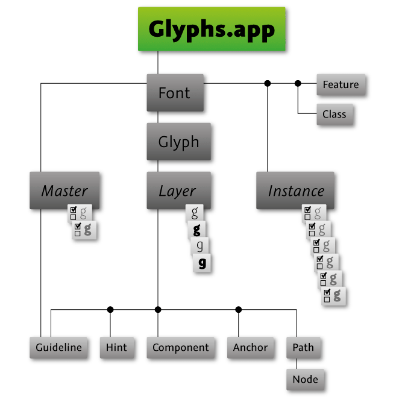

.. Glyphs documentation master file, created by
	sphinx-quickstart on Sat Apr 17 17:11:16 2010.
	You can adapt this file completely to your liking, but it should at least
	contain the root `toctree` directive.

.. highlight:: python
	 :linenothreshold: 500

.. _module:: Glyphs
	:synopsis: The Glyphs.app Python Scripting API Documentation.

.. moduleauthor:: Georg Seifert <info@schriftgestaltung.de>

.. toctree::
	:maxdepth: 0
	:hidden:

Glyphs.app Python Scripting API Documentation
=============================================

This is the documentation for the Python Scripting API for Glyphs.app (`glyphsapp.com <http://glyphsapp.com/>`_)

About this Document
===================

This document covers all methods that are implemented in the Python wrapper. There are many more functions and objects available via the PyObjC bridge. For more details, please have a look at the Core part of the documentation.

Changes in the API
==================

These changes could possibly break your code, so you need to keep track of them. Please see :attr:`GSApplication.versionNumber` for how to check for the app version in your code. Really, read it. There’s a catch.

:mod:`GSApplication`
===============================================================================

The mothership. Everything starts here.

.. code-block:: python

	print(Glyphs)

.. code-block:: python

	<Glyphs.app>

.. class:: GSApplication()

	Properties

	.. autosummary::
		currentDocument
		documents
		font
		fonts
		reporters
		activeReporters
		filters
		defaults
		scriptAbbreviations
		scriptSuffixes
		languageScripts
		languageData
		unicodeRanges
		editViewWidth
		handleSize
		versionString
		versionNumber
		buildNumber
		menu

	Functions

	.. autosummary::

		open()
		showMacroWindow()
		clearLog()
		showGlyphInfoPanelWithSearchString()
		glyphInfoForName()
		glyphInfoForUnicode()
		niceGlyphName()
		productionGlyphName()
		ligatureComponents()
		addCallback()
		removeCallback()
		redraw()
		showNotification()
		localize()
		activateReporter()
		deactivateReporter()

	**Properties**

	.. attribute:: currentDocument

		The active :class:`GSDocument` object or None.

		:type: :class:`GSDocument`

		.. code-block:: python

			# topmost open document
			document = Glyphs.currentDocument

	.. attribute:: documents

		An array of open :class:`GSDocument` objects.

		:type: list

	.. attribute:: font

		The active :class:`GSFont` object or None.

		:type: :class:`GSFont`

	.. attribute:: fonts

		Be aware that the order is defined by last used font. Append and extend generally don't insert at the end of the list.

		:type: list

		.. code-block:: python

			# access all open fonts
			for font in Glyphs.fonts:
			    print(font.familyName)

			# add a font
			font = GSFont()
			font.familyName = "My New Font"
			Glyphs.fonts.append(font)

	.. attribute:: reporters

		List of available reporter plug-ins (same as bottom section in the 'View' menu). These are the actual objects. You can get hold of their names using `object.__class__.__name__`.

		Also see :meth:`GSApplication.activateReporter()` and :meth:`GSApplication.deactivateReporter()` methods below to activate/deactivate them.

		:type: list

		.. code-block:: python

			# List of all reporter plug-ins
			print(Glyphs.reporters)
			
			# Individual plug-in class names
			for reporter in Glyphs.reporters:
			    print(reporter.__class__.__name__)
			
			# Activate a plugin
			Glyphs.activateReporter(Glyphs.reporters[0]) # by object
			Glyphs.activateReporter('GlyphsMasterCompatibility') # by class name

	.. attribute:: activeReporters

		List of activated reporter plug-ins.

		:type: list

		.. code-block:: python

			# Activate a plugin
			Glyphs.activateReporter(Glyphs.reporters[0])

			# list of currently active reporter plug-ins
			activeReporters = Glyphs.activeReporters

	.. attribute:: filters

		List of available filters (same as 'Filter' menu). These are the actual objects.

		Below sample code shows how to get hold of a particular filter and use it. You invoke it using the `processFont_withArguments_()` function for old plugins, or the `filter()` function for newer plugins.
		As arguments you use the list obtained by clicking on 'Copy Custom Parameter' button in the filter’s dialog (gear icon) and convert it to a list.
		In the `include` option you can supply a comma-separated list of glyph names.

		:type: list

		.. code-block:: python

			# Helper function to get filter by its class name
			def filterForName(name):
			    for filter in Glyphs.filters:
			        if filter.__class__.__name__ == name:
			            return filter

			# Get the filter
			offsetCurveFilter = filterForName('GlyphsFilterOffsetCurve')

			# Run the filter (old plugins)
			# The arguments came from the 'Copy Custom Parameter' as:
			# Filter = "GlyphsFilterOffsetCurve;10;10;1;0.5;"
			offsetCurveFilter.processFont_withArguments_(font, ['GlyphsFilterOffsetCurve', '10', '10', '1', '0.5', 'include:%s' % glyph.name])

			# If the plugin were a new filter, the same call would look like this:
			# (run on a specific layer, not the first layer glyphs in the include-list)
			# The arguments list is a dictionary with either incrementing integers as keys or names (as per 'Copy Custom Parameter' list)
			offsetCurveFilter.filter(layer, False, {0: 10, 1: 10, 2: 1, 3: 0.5})

		.. versionadded:: After 2.4.2

	.. attribute:: defaults

		A dict like object for storing preferences. You can get and set key-value pairs.

		Please be careful with your keys. Use a prefix that uses the reverse domain name. e.g. :samp:`com.MyName.foo.bar`.

		:type: dict

		.. code-block:: python

			# Check for whether or not a preference exists
			if "com.MyName.foo.bar" in Glyphs.defaults:
			    # do stuff

			# Get and set values
			value = Glyphs.defaults["com.MyName.foo.bar"]
			Glyphs.defaults["com.MyName.foo.bar"] = newValue

			# Remove value
			# This will restore the default value
			del Glyphs.defaults["com.MyName.foo.bar"]

	.. attribute:: boolDefaults

		Access to default settings cast to a bool.

		:type: bool

		.. code-block:: python

			if Glyphs.boolDefaults["com.MyName.foo.bar"]:
			    print('"com.MyName.foo.bar" is set')

	.. attribute:: scriptAbbreviations

		A dictionary with script name to tag mapping, e.g., 'arabic': 'arab' or 'devanagari': 'dev2'

		:type: dict

	.. attribute:: scriptSuffixes

		A dictionary with glyphs name suffixes for scripts and their respective script names, e.g., 'cy': 'cyrillic'

		:type: dict

	.. attribute:: languageScripts

		A dictionary with language tag to script tag mapping, e.g., 'ENG': 'latn'

		:type: dict

	.. attribute:: languageData

		A list of dictionaries with more detailed language informations.

		:type: list

	.. attribute:: unicodeRanges

		Names of unicode ranges.

		:type: list

	.. attribute:: editViewWidth

		Width of glyph Edit view. Corresponds to the "Width of editor" setting from the Preferences.

		:type: int

	.. attribute:: handleSize

		Size of Bezier handles in Glyph Edit view. Possible value are 0–2. Corresponds to the ‘Handle size’ setting from the Preferences.

		To use the handle size for drawing in reporter plugins, you need to convert the handle size to a point size, and divide by the view’s scale factor. See example below.

		:type: int

		.. code-block:: python

			# Calculate handle size
			handSizeInPoints = 5 + Glyphs.handleSize * 2.5 # (= 5.0 or 7.5 or 10.0)
			scaleCorrectedHandleSize = handSizeInPoints / Glyphs.font.currentTab.scale

			# Draw point in size of handles
			point = NSPoint(100, 100)
			NSColor.redColor.set()
			rect = NSRect((point.x - scaleCorrectedHandleSize * 0.5, point.y - scaleCorrectedHandleSize * 0.5), (scaleCorrectedHandleSize, scaleCorrectedHandleSize))
			bezierPath = NSBezierPath.bezierPathWithOvalInRect_(rect)
			bezierPath.fill()

	.. attribute:: versionString

		String containing Glyph.app’s version number. May contain letters also, like ‘2.3b’. To check for a specific version, use :attr:`Glyphs.versionNumber <GSApplication.versionNumber>` below.

		:type: string

	.. attribute:: versionNumber

		Glyph.app’s version number. Use this to check for version in your code.

		:type: float

	.. attribute:: buildNumber

		Glyph.app’s build number.

		Especially if you’re using preview builds, this number may be more important to you than the version number. The build number increases with every released build and is the most significant evidence of new Glyphs versions, while the version number is set arbitrarily and stays the same until the next stable release.

		:type: float

	.. attribute:: menu

		Add menu items to Glyphs’ main menus.

		Following constants for accessing the menus are defined:
		:const:`APP_MENU`, :const:`FILE_MENU`, :const:`EDIT_MENU`, :const:`GLYPH_MENU`, :const:`PATH_MENU`, :const:`FILTER_MENU`, :const:`VIEW_MENU`, :const:`SCRIPT_MENU`, :const:`WINDOW_MENU`, :const:`HELP_MENU`

		.. code-block:: python

			def doStuff(sender):
			    # do stuff

			newMenuItem = NSMenuItem('My menu title', doStuff)
			Glyphs.menu[EDIT_MENU].append(newMenuItem)

	**Functions**

	.. function:: open(Path, [showInterface=True])

		Opens a document

		:param Path: The path where the document is located.
		:type Path: str
		:param showInterface: If a document window should be opened. Default: True
		:type showInterface: bool
		:return: The opened document object or None.
		:rtype: :class:`GSFont`

	.. function:: showMacroWindow

		Opens the macro window

	.. function:: clearLog

		Deletes the content of the console in the macro window

	.. function:: showGlyphInfoPanelWithSearchString(String)

		Shows the Glyph Info window with a preset search string

		:param String: The search term

	.. function:: glyphInfoForName(name, [font=None])

		Generates :class:`GSGlyphInfo` object for a given glyph name.

		:param name: Glyph name
		:param font: if you add a font, and the font has a local glyph info, it will be used instead of the global info data.
		:return: :class:`GSGlyphInfo`

	.. function:: glyphInfoForUnicode(Unicode, [font=None])

		Generates :class:`GSGlyphInfo` object for a given hex unicode.

		:param Unicode: Hex unicode
		:param font: if you add a font, and the font has a local glyph info, it will be used instead of the global info data.
		:return: :class:`GSGlyphInfo`

	.. function:: niceGlyphName(name, [font=None])

		Converts glyph name to nice, human-readable glyph name (e.g. afii10017 or uni0410 to A-cy)

		:param name: glyph name
		:param font: if you add a font, and the font has a local glyph info, it will be used instead of the global info data.
		:return: string

	.. function:: productionGlyphName(name, [font=None])

		Converts glyph name to production glyph name (e.g. afii10017 or A-cy to uni0410)

		:param name: glyph name
		:param font: if you add a font, and the font has a local glyph info, it will be used instead of the global info data.
		:return: string

	.. function:: ligatureComponents(String, [font=None])

		If defined as a ligature in the glyph database, this function returns a list of glyph names that this ligature could be composed of.

		:param string: glyph name
		:param font: if you add a font, and the font has a local glyph info, it will be used instead of the global info data.
		:rtype: list

		.. code-block:: python

			print(Glyphs.ligatureComponents('allah-ar'))

			>> (
			    "alef-ar",
			    "lam-ar.init",
			    "lam-ar.medi",
			    "heh-ar.fina"
			)

	.. function:: addCallback(function, hook)

		Add a user-defined function to the glyph window’s drawing operations, in the foreground and background for the active glyph as well as in the inactive glyphs.

		The function names are used to add/remove the functions to the hooks, so make sure to use unique function names.

		Your function needs to accept two values: `layer` which will contain the respective :class:`GSLayer` object of the layer we’re dealing with and `info` which is a dictionary and contains the value `Scale` (for the moment).

		For the hooks these constants are defined: `DRAWFOREGROUND`, `DRAWBACKGROUND`, `DRAWINACTIVE`, `DOCUMENTWASSAVED`, `DOCUMENTOPENED`, `TABDIDOPEN`, `TABWILLCLOSE`, `UPDATEINTERFACE`, `MOUSEMOVED`. For more information check the constants section.

		.. code-block:: python

			def drawGlyphIntoBackground(layer, info):

			    # Due to internal Glyphs.app structure, we need to catch and print exceptions
			    # of these callback functions with try/except like so:
			    try:
			        # Your drawing code here
			        NSColor.redColor().set()
			        layer.bezierPath.fill()
			    # Error. Print exception.
			    except:
			        import traceback
			        print(traceback.format_exc())

			# add your function to the hook
			Glyphs.addCallback(drawGlyphIntoBackground, DRAWBACKGROUND)

	.. function:: removeCallback(function)

		Remove the function you’ve previously added.

		.. code-block:: python

			# remove your function from the hook
			Glyphs.removeCallback(drawGlyphIntoBackground)

	.. function:: redraw()

		Redraws all Edit views and Preview views.

	.. function:: showNotification(title, message)

		Shows the user a notification in Mac’s Notification Center.

		.. code-block:: python

			Glyphs.showNotification('Export fonts', 'The export of the fonts was successful.')

	.. function:: localize(localization)

		Return a string in the language of Glyphs.app’s UI locale, which must be supplied as a dictionary using language codes as keys.

		The argument is a dictionary in the `languageCode: translatedString` format.

		You don’t need to supply strings in all languages that the Glyphs.app UI supports. A subset will do. Just make sure that you add at least an English string to default to next to all your other translated strings. Also don’t forget to mark strings as unicode strings (:samp:`'öäüß'`) when they contain non-ASCII content for proper encoding, and add a `# encoding: utf-8` to the top of all your .py files.

		Tip: You can find Glyphs’ localized languages here :samp:`Glyphs.defaults["AppleLanguages"]`.

		.. code-block:: python

			print(Glyphs.localize({
			    'en': 'Hello World',
			    'de': 'Hallöle Welt',
			    'fr': 'Bonjour tout le monde',
			    'es': 'Hola Mundo',
			}))

			# Given that your Mac’s system language is set to German
			# and Glyphs.app UI is set to use localization (change in app settings),
			# it will print:
			>> Hallöle Welt

	.. function:: activateReporter(reporter)

		Activate a reporter plug-in by its object (see Glyphs.reporters) or class name.

		.. code-block:: python

			Glyphs.activateReporter('GlyphsMasterCompatibility')

	.. function:: deactivateReporter(reporter)

		Deactivate a reporter plug-in by its object (see Glyphs.reporters) or class name.

		.. code-block:: python

			Glyphs.deactivateReporter('GlyphsMasterCompatibility')

:mod:`GSDocument`
===============================================================================

The document class

.. class:: GSDocument()

	Properties

	.. autosummary::

		font
		filePath

	**Properties**

	.. attribute:: font

		The active :class:`GSFont`

		:type: GSFont

	.. attribute:: filePath

		The last save location

		:type: str

:mod:`GSFont`
===============================================================================

Implementation of the font object. This object is host to the :class:`masters <GSFontMaster>` used for interpolation. Even when no interpolation is involved, for the sake of object model consistency there will still be one master and one instance representing a single font.

Also, the :class:`glyphs <GSGlyph>` are attached to the Font object right here, not one level down to the masters. The different masters’ glyphs are available as :class:`layers <GSLayer>` attached to the glyph objects which are attached here.

.. class:: GSFont()

	Properties

	.. autosummary::

		parent
		masters
		axes
		properties
		stems
		instances
		glyphs
		classes
		features
		featurePrefixes
		copyright
		copyrights
		license
		licenses
		designer
		designers
		designerURL
		manufacturer
		manufacturers
		manufacturerURL
		familyNames
		trademark
		trademarks
		sampleText
		sampleTexts
		description
		descriptions
		compatibleFullName
		compatibleFullNames
		versionMajor
		versionMinor
		date
		familyName
		upm
		note
		kerning
		userData
		grid
		gridSubDivision
		gridLength
		keyboardIncrement
		keyboardIncrementBig
		keyboardIncrementHuge
		snapToObjects
		disablesNiceNames
		customParameters
		selection
		selectedLayers
		selectedFontMaster
		masterIndex
		currentText
		tabs
		fontView
		currentTab
		filepath
		tool
		tools
		appVersion

	Functions

	.. autosummary::

		save()
		close()
		show()
		disableUpdateInterface()
		enableUpdateInterface()
		kerningForPair()
		setKerningForPair()
		removeKerningForPair()
		newTab()
		updateFeatures()
		compileFeatures()

	**Properties**

	.. attribute:: parent

		Returns the internal NSDocument document. Read-only.

		:type: NSDocument

	.. attribute:: masters

		Collection of :class:`GSFontMaster` objects.

		:type: list

	.. attribute:: instances

		Collection of :class:`GSInstance` objects.

		.. code-block:: python

			for instance in font.instances:
			    print(instance)

			# to add a new instance
			instance = GSInstance()
			instance.name = "Some Instance"
			font.instances.append(instance)

			# to delete an instances
			del font.instances[0]

			font.instances.remove(someInstance)

		:type: list

	.. attribute:: axes

		Collection of :class:`GSAxis`:

		.. code-block:: python

			for axis in font.axes:
			    print(axis)

			# to add a new axis
			axis = GSAxis()
			axis.name = "Some custom Axis"
			axis.axisTag = "SCAX"
			font.axes.append(axis)

			# to delete an axis
			del font.axes[0]

			font.axes.remove(someAxis)

		:type: list

		.. versionadded:: 2.5
		.. versionchanged:: 3

	.. attribute:: properties

		Holds the fonts info properties. Can be instances of :class:`GSFontInfoValueSingle` and :class:`GSFontInfoValueLocalized`.

		The localized values use language tags defined in the middle column of `Language System Tags table`: <https://docs.microsoft.com/en-us/typography/opentype/spec/languagetags>.

		The names are listed in the constants: `Info Property Keys`_

		.. code-block:: python

			# To find specific values:
			font.propertyForName_(name)
			# or
			font.propertyForName_languageTag_(name, languageTag).

			# To add an entry:
			font.setProperty_value_languageTag_(GSPropertyNameFamilyNamesKey, "SomeName", None)

		:type: list

		.. versionadded:: 3

	.. attribute:: metrics

		a list of all :class:`GSMetric` objects.

		:type: list

		.. code-block:: python

			# to add a new metric
			metric = GSMetric(GSMetricsTypexHeight)
			font.metrics.append(metric)
			metricValue = master.metricValues[metric.id]
			metricValue.position = 543
			metricValue.overshoot = 17

	.. attribute:: stems

		The stems. A list of :class:`GSMetric` objects. For each metric, there is a metricsValue in the masters, linked by the `id`.

		:type: list, dict

		.. code-block:: python

			font.stems[0].horizontal = False

			# add a stem
			stem = GSMetric()
			stem.horizontal = False # or True
			stem.name = "Some Name"
			font.stems.append(stem)
			master.stems[stem.name] = 123

	.. attribute:: numbers

		The numbers. A list of :class:`GSMetric` objects. For each number, there is a metricsValue in the masters, linked by the `id`.

		:type: list, dict

		.. code-block:: python

			print(font.numbers[0].name)

			# add a number
			number = GSMetric()
			number.horizontal = False # or True
			number.name = "Some Name"
			font.numbers.append(number)
			master.numbers[number.name] = 123

	.. attribute:: glyphs

		Collection of :class:`GSGlyph` objects. Returns a list, but you may also call glyphs using index or glyph name or character as key.

		:type: list, dict

		.. code-block:: python

			# Access all glyphs
			for glyph in font.glyphs:
			    print(glyph)
			>> <GSGlyph "A" with 4 layers>
			>> <GSGlyph "B" with 4 layers>
			>> <GSGlyph "C" with 4 layers>
			...

			# Access one glyph
			print(font.glyphs['A'])
			>> <GSGlyph "A" with 4 layers>

			# Access a glyph by character (new in v2.4.1)
			print(font.glyphs['Ư'])
			>> <GSGlyph "Uhorn" with 4 layers>

			# Access a glyph by unicode (new in v2.4.1)
			print(font.glyphs['01AF'])
			>> <GSGlyph "Uhorn" with 4 layers>

			# Access a glyph by index
			print(font.glyphs[145])
			>> <GSGlyph "Uhorn" with 4 layers>

			# Add a glyph
			font.glyphs.append(GSGlyph('adieresis'))

			# Duplicate a glyph under a different name
			newGlyph = font.glyphs['A'].copy()
			newGlyph.name = 'A.alt'
			font.glyphs.append(newGlyph)

			# Delete a glyph
			del font.glyphs['A.alt']

	.. function:: characterForGlyph(glyph)

		The (internal) character that is used in the edit view. It the glyph has a unicode, that is used, otherwiese a temporary code is assined. That can change over time, so don’t rely on it. This is mostly useful for constructing a string for see :attr:`tab.text <GSEditViewController.text>`

		.. versionadded:: 3.1

	.. attribute:: classes

		Collection of :class:`GSClass` objects, representing OpenType glyph classes.

		:type: list

		.. code-block:: python

			# add a class
			font.classes.append(GSClass('uppercaseLetters', 'A B C D E'))

			# access all classes
			for class in font.classes:
			    print(class.name)

			# access one class
			print(font.classes['uppercaseLetters'].code)

			# delete a class
			del font.classes['uppercaseLetters']

	.. attribute:: features

		Collection of :class:`GSFeature` objects, representing OpenType features.

		:type: list

		.. code-block:: python

			# add a feature
			font.features.append(GSFeature('liga', 'sub f i by fi;'))

			# access all features
			for feature in font.features:
			    print(feature.code)

			# access one feature
			print(font.features['liga'].code)

			# delete a feature
			del font.features['liga']

	.. attribute:: featurePrefixes

		Collection of :class:`GSFeaturePrefix` objects, containing stuff that needs to be outside of the OpenType features.

		:type: list

		.. code-block:: python

			# add a prefix
			font.featurePrefixes.append(GSFeaturePrefix('LanguageSystems', 'languagesystem DFLT dflt;'))

			# access all prefixes
			for prefix in font.featurePrefixes:
			    print(prefix.code)

			# access one prefix
			print(font.featurePrefixes['LanguageSystems'].code)

			# delete
			del font.featurePrefixes['LanguageSystems']

	.. attribute:: copyright

		This accesses the default value only. The localisations can be accessed by :attr:`GSFont.properties`

		:type: str

	.. attribute:: copyrights

		This accesses all localized copyright values.
		For details :attr:`GSFont.properties`

		:type: dict

		.. code-block:: python

			font.copyrights["ENG"] = "All rights reserved"

		.. versionadded:: 3.0.3

	.. attribute:: license

		This accesses the default value only. The localisations can be accessed by :attr:`GSFont.properties`

		:type: str

		.. versionadded:: 3.0.3

	.. attribute:: licenses

		This accesses all localized license values.
		For details :attr:`GSFont.properties`

		:type: dict

		.. code-block:: python

			font.licenses["ENG"] = "This font may be installed on all of your machines and printers, but you may not sell or give these fonts to anyone else."

		.. versionadded:: 3.0.3

	.. attribute:: compatibleFullName

		This accesses the default value only. The localisations can be accessed by :attr:`GSFont.properties`

		:type: str

		.. versionadded:: 3.0.3

	.. attribute:: compatibleFullNames

		This accesses all localized designer values.
		For details :attr:`GSFont.properties`

		:type: dict

		.. code-block:: python

			font.compatibleFullNames["ENG"] = "MyFont Condensed Bold"

		.. versionadded:: 3.0.3

	.. attribute:: sampleText

		This accesses the default value only. The localisations can be accessed by :attr:`GSFont.properties`

		:type: str

		.. versionadded:: 3.0.3

	.. attribute:: sampleTexts

		This accesses all localized designer values.
		For details :attr:`GSFont.properties`

		:type: dict

		.. code-block:: python

			font.sampleTexts["ENG"] = "This is my sample text"

		.. versionadded:: 3.0.3

	.. attribute:: description

		This accesses the default value only. The localisations can be accessed by :attr:`GSFont.properties`

		:type: str

		.. versionadded:: 3.0.3

	.. attribute:: descriptions

		This accesses all localized designer values.
		For details :attr:`GSFont.properties`

		:type: dict

		.. code-block:: python

			font.descriptions["ENG"] = "This is my description"

		.. versionadded:: 3.0.3

	.. attribute:: designer

		This accesses the default value only. The localisations can be accessed by :attr:`GSFont.properties`

		:type: str

	.. attribute:: designers

		This accesses all localized designer values.
		For details :attr:`GSFont.properties`

		:type: dict

		.. code-block:: python

			font.designers["ENG"] = "John Smith"

		.. versionadded:: 3.0.3

	.. attribute:: trademark

		This accesses the default value only. The localisations can be accessed by :attr:`GSFont.properties`

		:type: str

		.. versionadded:: 3.0.3

	.. attribute:: trademarks

		This accesses all localized trademark values.
		For details :attr:`GSFont.properties`

		:type: dict

		.. code-block:: python

			font.trademarks["ENG"] = "ThisFont is a trademark by MyFoundry.com"

		.. versionadded:: 3.0.3

	.. attribute:: designerURL

		:type: str

	.. attribute:: manufacturer

		This accesses the default value only. The localisations can be accessed by :attr:`GSFont.properties`

		:type: str

	.. attribute:: manufacturers

		This accesses all localized manufacturer values.
		For details :attr:`GSFont.properties`

		:type: dict

		.. code-block:: python

			font.manufacturers["ENG"] = "My English Corporation"

		.. versionadded:: 3.0.3

	.. attribute:: manufacturerURL

		:type: str

	.. attribute:: versionMajor

		:type: int

	.. attribute:: versionMinor

		:type: int

	.. attribute:: date

		:type: datetime.datetime

		.. code-block:: python

			print(font.date)
			>> 2015-06-08 09:39:05

			# set date to now
			font.date = datetime.datetime.now()
			# using NSDate
			font.date = NSDate.date()
			# or in seconds since Epoch
			font.date = time.time()

	.. attribute:: familyName

		Family name of the typeface.

		:type: str

	.. attribute:: familyNames

		This accesses all localized family name values.
		For details :attr:`GSFont.properties`

		:type: dict

		.. code-block:: python

			font.familyNames["ENG"] = "MyFamilyName"

		.. versionadded:: 3.0.3

	.. attribute:: upm

		Units per Em

		:type: int

	.. attribute:: note

		:type: str

	.. attribute:: kerning

		Kerning for LTR writing
		A multi-level dictionary. The first level’s key is the :attr:`GSFontMaster.id` (each master has its own kerning), the second level’s key is the :attr:`GSGlyph.id` or class id (@MMK_L_XX) of the first glyph, the third level’s key is a glyph id or class id (@MMK_R_XX) for the second glyph. The values are the actual kerning values.

		To set a value, it is better to use the method :meth:`GSFont.setKerningForPair()`. This ensures a better data integrity (and is faster).

		:type: dict

	.. attribute:: kerningRTL

		Kerning for RTL writing
		A multi-level dictionary. The first level’s key is the :attr:`GSFontMaster.id` (each master has its own kerning), the second level’s key is the :attr:`GSGlyph.id` or class id (@MMK_L_XX) of the first glyph, the third level’s key is a glyph id or class id (@MMK_R_XX) for the second glyph. The values are the actual kerning values.

		To set a value, it is better to use the method :meth:`GSFont.setKerningForPair()`. This ensures a better data integrity (and is faster).

		:type: dict

	.. attribute:: kerningVertical

		Kerning for vertical writing
		A multi-level dictionary. The first level’s key is the :attr:`GSFontMaster.id` (each master has its own kerning), the second level’s key is the :attr:`GSGlyph.id` or class id (@MMK_L_XX) of the first glyph, the third level’s key is a glyph id or class id (@MMK_R_XX) for the second glyph. The values are the actual kerning values.

		To set a value, it is better to use the method :meth:`GSFont.setKerningForPair()`. This ensures a better data integrity (and is faster).

		:type: dict

	.. attribute:: userData

		A dictionary to store user data. Use a unique key and only use objects that can be stored in a property list (string, list, dict, numbers, NSData) otherwise the data will not be recoverable from the saved file.

		:type: dict

		.. code-block:: python

			# set value
			font.userData['rememberToMakeCoffee'] = True

			# delete value
			del font.userData['rememberToMakeCoffee']

	.. attribute:: tempData

		A dictionary to store data temporarily. Use a unique key. This will not be saved to file. If you need the data persistent, use layer.userData

		:type: dict

		.. code-block:: python

			# set value
			layer.tempData['rememberToMakeCoffee'] = True

			# delete value
			del layer.tempData['rememberToMakeCoffee']

	.. attribute:: disablesNiceNames

		Corresponds to the “Don't use nice names” setting from the Font Info dialog.

		:type: bool

	.. attribute:: customParameters

		The custom parameters. List of :class:`GSCustomParameter` objects. You can access them by name or by index.

		:type: list, dict

		.. code-block:: python

			# access all parameters
			for parameter in font.customParameters:
			    print(parameter)

			# set a parameter
			font.customParameters['glyphOrder'] = ["a", "b", "c"]

			# add multiple parameters:
			parameter = GSCustomParameter("Name Table Entry", "1 1;"font name")
			font.customParameters.append(parameter)
			parameter = GSCustomParameter("Name Table Entry", "2 1;"style name")
			font.customParameters.append(parameter)

			# delete a parameter
			del font.customParameters['glyphOrder']

	.. attribute:: grid

		Corresponds to the “Grid spacing” setting from the Info dialog.

		:type: int

	.. attribute:: gridSubDivision

		Corresponds to the “Grid sub divisions” setting from the Info dialog.

		:type: int

	.. attribute:: gridLength

		Ready calculated size of grid for rounding purposes. Result of division of grid with gridSubDivisions.

		:type: float

	.. attribute:: disablesAutomaticAlignment

		:type: bool

	.. attribute:: keyboardIncrement

		Distance of movement by arrow keys. Default:1

		:type: float

	.. attribute:: keyboardIncrementBig

		Distance of movement by arrow plus Shift key. Default:10

		:type: float

		.. versionadded:: 3.0

	.. attribute:: keyboardIncrementHuge

		Distance of movement by arrow plus Command key. Default:100

		:type: float

		.. versionadded:: 3.0

	.. attribute:: snapToObjects

		disable snapping to nodes and background

		:type: bool

		.. versionadded:: 3.0.1

	.. attribute:: previewRemoveOverlap

		disable preview remove overlap

		:type: bool

		.. versionadded:: 3.0.1

	.. attribute:: selection

		Returns a list of all selected glyphs in the Font View.

		:type: list

	.. attribute:: selectedLayers

		Returns a list of all selected layers in the active tab.

		If a glyph is being edited, it will be the only glyph returned in this list. Otherwise the list will contain all glyphs selected with the Text tool.

		:type: list

	.. attribute:: selectedFontMaster

		Returns the active master (selected in the toolbar).

		:type: :class:`GSFontMaster`

	.. attribute:: masterIndex

		Returns the index of the active master (selected in the toolbar).

		:type: int

	.. attribute:: currentText

		The text of the current Edit view.

		Unencoded and none ASCII glyphs will use a slash and the glyph name. (e.g: /a.sc). Setting unicode strings works.

		:type: str

	.. attribute:: tabs

		List of open Edit view tabs in UI, as list of :class:`GSEditViewController` objects.

		:type: list

		.. code-block:: python

			# open new tab with text
			font.newTab('hello')

			# access all tabs
			for tab in font.tabs:
			    print(tab)

			# close last tab
			font.tabs[-1].close()

	.. attribute:: fontView

		:type: :class:`GSFontViewController`

	.. attribute:: currentTab

		Active Edit view tab.

		:type: :class:`GSEditViewController`

	.. attribute:: filepath

		On-disk location of GSFont object.

		:type: str

	.. attribute:: tool

		Name of tool selected in toolbar.

		For available names including third-party plug-ins that come in the form of selectable tools, see `GSFont.tools` below.

		:type: string

		.. code-block:: python

			font.tool = 'SelectTool' # Built-in tool
			font.tool = 'GlyphsAppSpeedPunkTool' # Third party plug-in

	.. attribute:: tools

		Returns a list of available tool names, including third-party plug-ins.

		:type: list, string

	.. attribute:: appVersion

		Returns the version that the file was last saved

		.. versionadded:: 2.5

	.. attribute:: formatVersion

		The file-format the font should be written. possible values are '2' and '3'

		:type: int

		.. versionadded:: 3

	**Functions**

	.. function:: save([path=None, formatVersion=3, makeCopy=False])

		Saves the font.

		If no path is given, it saves to the existing location.

		:param path: Optional file path. When the font is loaded directly (`GSFont(path)`), the path argument is required.
		:type path: str
		:param formatVersion: the format of the file
		:type formatVersion: int
		:param makeCopy: saves a new file without changeing the documents file paths. So it always need a `path` argument
		:type makeCopy: bool

	.. function:: close([ignoreChanges=True])

		Closes the font.

		:param ignoreChanges: Optional. Ignore changes to the font upon closing
		:type ignoreChanges: bool

	.. function:: disableUpdateInterface()

		Disables interface updates and thus speeds up glyph processing. Call this before you do big changes to the font, or to its glyphs. Make sure that you call :meth:`font.enableUpdateInterface() <GSFont.enableUpdateInterface()>` when you are done.

	.. function:: enableUpdateInterface()

		This re-enables the interface update. Only makes sense to call if you have disabled it earlier.

	.. function:: show()

		Makes font visible in the application, either by bringing an already open font window to the front or by appending a formerly invisible font object (such as the result of a `copy()` operation) as a window to the application.

		.. versionadded:: 2.4.1

	.. function:: kerningForPair(fontMasterId, leftKey, rightKey [, direction=LTR])

		This returns the kerning value for the two specified glyphs (leftKey or rightKey is the glyph name) or a kerning group key (@MMK_X_XX).

		:param fontMasterId: The id of the FontMaster
		:type fontMasterId: str
		:param leftKey: either a glyph name or a class name
		:type leftKey: str
		:param rightKey: either a glyph name or a class name
		:type rightKey: str
		:param direction: optional writing direction (see Constants; 'LTR' (0) or 'RTLTTB'). Default is LTR.
		:type direction: int
		:return: The kerning value
		:rtype: float

		.. code-block:: python

			# print(kerning between w and e for currently selected master)
			font.kerningForPair(font.selectedFontMaster.id, 'w', 'e')
			>> -15.0

			# print(kerning between group T and group A for currently selected master)
			# ('L' = left side of the pair and 'R' = left side of the pair)
			font.kerningForPair(font.selectedFontMaster.id, '@MMK_L_T', '@MMK_R_A')
			>> -75.0

			# in the same font, kerning between T and A would be zero, because they use group kerning instead.
			font.kerningForPair(font.selectedFontMaster.id, 'T', 'A')
			>> None

	.. function:: setKerningForPair(fontMasterId, leftKey, rightKey, value [, direction=GSLTR])

		This sets the kerning for the two specified glyphs (leftKey or rightKey is the glyphname) or a kerning group key (@MMK_X_XX).

		:param fontMasterId: The id of the FontMaster
		:type fontMasterId: str
		:param leftKey: either a glyph name or a class name
		:type leftKey: str
		:param rightKey: either a glyph name or a class name
		:type rightKey: str
		:param value: kerning value
		:type value: float
		:param direction: optional writing direction (see Constants). Default is GSLTR.
		:type direction: str

		.. code-block:: python

			# set kerning for group T and group A for currently selected master
			# ('L' = left side of the pair and 'R' = left side of the pair)
			font.setKerningForPair(font.selectedFontMaster.id, '@MMK_L_T', '@MMK_R_A', -75)

	.. function:: removeKerningForPair(fontMasterId, leftKey, rightKey, direction=GSLTR)

		Removes the kerning for the two specified glyphs (LeftKey or RightKey is the glyphname) or a kerning group key (@MMK_X_XX).

		:param FontMasterId: The id of the FontMaster
		:type FontMasterId: str
		:param leftKey: either a glyph name or a class name
		:type leftKey: str
		:param rightKey: either a glyph name or a class name
		:type rightKey: str
		:param direction: optional writing direction (see Constants; 'GSLTR' (0) or 'GSVertical'). Default is GSLTR. (added in 2.6.6)
		:type direction: int

		.. code-block:: python

			# remove kerning for group T and group A for all masters
			# ('L' = left side of the pair and 'R' = left side of the pair)
			for master in font.masters:
			    font.removeKerningForPair(master.id, '@MMK_L_T', '@MMK_R_A')

	.. function:: newTab([tabText])

		Opens a new tab in the current document window, optionally with text, and return that tab object

		:param tabText: Text or glyph names escaped with '/' OR list of layers

		.. code-block:: python

			# open new tab
			tab = font.newTab('abcdef')
			print(tab)

			# or
			tab = font.newTab([layer1, layer2])
			print(tab)

	.. function:: updateFeatures()

		Updates all OpenType features and classes at once, including generating necessary new features and classes. Equivalent to the "Update" button in the features panel. This already includes the compilation of the features (see :meth:`font.compileFeatures() <GSFont.compileFeatures()>`).

		.. versionadded:: 2.4

	.. function:: compileFeatures()

		Compiles the features, thus making the new feature code functionally available in the editor. Equivalent to the "Compile" button in the features panel.

		.. versionadded:: 2.5

:mod:`GSAxis`
===============================================================================

Implementation of the axis object.

.. class:: GSAxis()

	Properties

	.. autosummary::

		name
		axisTag
		id
		hidden
		font

	**Properties**

	.. attribute:: font

		Reference to the :class:`GSFont` object that contains the axis. Normally that is set by the app.

		:type: GSFont

	.. attribute:: name

		The name of the axis

		:type: str

	.. attribute:: axisTag

		The axisTag. this is a four letter string. see `OpenType Design-Variation Axis Tag Registry <https://docs.microsoft.com/en-us/typography/opentype/spec/dvaraxisreg>`_.

		:type: str

	.. attribute:: id

		The id to link the values in the masters

		:type: str

	.. attribute:: hidden

		If the axis should be shown to the user

		:type: bool

:mod:`GSMetric`
===============================================================================

Implementation of the metric object. It is used to link the metrics and stems in the masters.

.. class:: GSMetric()

	Properties

	.. autosummary::

		font
		name
		id
		title
		filter
		type
		horizontal

	**Properties**

	.. attribute:: font

		Reference to the :class:`GSFont` object that contains the metric. Normally that is set by the app.

		:type: GSFont

	.. attribute:: name

		The name of the metric or stem

		:type: str

	.. attribute:: id

		The id to link the values in the masters

		:type: str

	.. attribute:: title

		The title as shown in the UI. It is readonly as it is computed by the name, type and filter.

		:type: str

	.. attribute:: type

		The metrics type

		:type: int

	.. attribute:: filter

		A filter to limit the scope of the metric.

		:type: NSPredicate

	.. attribute:: horizontal

		This is used for stem metrics. so only use this for font.stems

		:type: bool

:mod:`GSFontMaster`
===============================================================================

Implementation of the master object. This corresponds with the "Masters" pane in the Font Info. In Glyphs.app, the glyphs of each master are reachable not here, but as :class:`layers <GSLayer>` attached to the :class:`glyphs <GSGlyph>` attached to the :class:`font <GSFont>` object. See the infographic on top for better understanding.

.. class:: GSFontMaster()

	.. autosummary::

		id
		name
		internalAxesValues
		externalAxesValues
		properties
		metrics
		ascender
		capHeight
		xHeight
		descender
		italicAngle
		alignmentZones
		blueValues
		otherBlues
		guides
		stems
		numbers
		userData
		customParameters
		font
		iconName

	**Properties**

	.. attribute:: id

		Used to identify :class:`Layers` in the Glyph

		see :attr:`GSGlyph.layers`

		:type: str

		.. code-block:: python

			# ID of first master
			print(font.masters[0].id)
			>> 3B85FBE0-2D2B-4203-8F3D-7112D42D745E

			# use this master to access the glyph’s corresponding layer
			print(glyph.layers[font.masters[0].id])
			>> <GSLayer "Light" (A)>

	.. attribute:: font

		Reference to the :class:`GSFont` object that contains the master. Normally that is set by the app, only if the instance is not actually added to the font, then set this manually.

		:type: GSFont

		.. versionadded:: 2.5.2

	.. attribute:: name

		The human-readable identification of the master, e.g., "Bold Condensed".

		:type: string

	.. attribute:: iconName

		The name of the icon

		:type: string

	.. attribute:: axes

		List of floats specifying the positions for each axis

		:type: list

		.. code-block:: python

			# setting a value for a specific axis
			master.axes[2] = 12
			# setting all values at once
			master.axes = [100, 12, 3.5]

		.. versionadded:: 2.5.2
		.. deprecated:: 3.2

	.. attribute:: internalAxesValues

		List of floats specifying the positions for each axis

		:type: list

		.. code-block:: python

			# setting a value for a specific axis
			master.internalAxesValues[2] = 12
			# or more precisely
			master.internalAxesValues[axis.axisId] = 12
			# setting all values at once
			master.internalAxesValues = [100, 12, 3.5]

		.. versionadded:: 3.2

	.. attribute:: externalAxesValues

		List of floats specifying the positions for each axis for the user facing values

		:type: list

		.. code-block:: python

			# setting a value for a specific axis
			master.externalAxesValues[2] = 12
			# or more precisely
			master.externalAxesValues[axis.axisId] = 12
			# setting all values at once
			master.externalAxesValues = [100, 12, 3.5]

		.. versionadded:: 3.2

	.. attribute:: properties

		Holds the fonts info properties. Can be instances of :class:`GSFontInfoValueSingle` and :class:`GSFontInfoValueLocalized`

		The localized values use language tags defined in the middle column of `Language System Tags table`: <https://docs.microsoft.com/en-us/typography/opentype/spec/languagetags>.

		To find specific values, use master.propertyForName_(name) or master.propertyForName_languageTag_(name, languageTag).

		:type: list

		.. versionadded:: 3

	.. attribute:: metrics

		a dict of all :class:`GSMetricValue` objects. Keys are font.metrics[].id

		:type: dict

		.. code-block:: python

			for metric in Font.metrics:
			    if metric.type == GSMetricsTypexHeight and metric.filter is None:
			        metricValue = master.metricValues[metric.id]
			        metricValue.position = 543
			        metricValue.overshoot = 17

		.. versionadded:: 3

	.. attribute:: ascender

		This is the default ascender of the master. There might be other values that are for specific glyphs. See :attr:`master.metrics <GSFontMaster.metrics>` and :attr:`layer.metrics <GSLayer.metrics>`

		:type: float

	.. attribute:: capHeight

		This is the default capHeight of the master. There might be other values that are for specific glyphs. See :attr:`master.metrics <GSFontMaster.metrics>` and :attr:`layer.metrics <GSLayer.metrics>`

		:type: float

	.. attribute:: xHeight

		This is the default xHeight of the master. There might be other values that are for specific glyphs. See :attr:`master.metrics <GSFontMaster.metrics>` and :attr:`layer.metrics <GSLayer.metrics>`

		:type: float

	.. attribute:: descender

		This is the default descender of the master. There might be other values that are for specific glyphs. See :attr:`master.metrics <GSFontMaster.metrics>` and :attr:`layer.metrics <GSLayer.metrics>`

		:type: float

	.. attribute:: italicAngle

		:type: float

	.. attribute:: stems

		The stems. This is a list of numbers.

		:type: list

		.. code-block:: python

			font.masters[0].stems = [10, 11, 20]

			print(master.stems[0])

			master.stems[0] = 12

			master.stems["stemName"] = 12

	.. attribute:: numbers

		The numbers. This is a list of numbers.

		:type: list

		.. code-block:: python

			font.masters[0].numbers = [10, 11, 20]

			print(master.numbers[0])

			master.numbers[0] = 12

			master.numbers["numberName"] = 12

	.. versionadded:: 3.1

	.. attribute:: alignmentZones

		Collection of :class:`GSAlignmentZone` objects. Read-only.

		:type: list

	.. attribute:: blueValues

		PS hinting Blue Values calculated from the master’s alignment zones. Read-only.

		:type: list

	.. attribute:: otherBlues

		PS hinting Other Blues calculated from the master’s alignment zones. Read-only.

		:type: list

	.. attribute:: guides

		Collection of :class:`GSGuide` objects. These are the font-wide (actually master-wide) red guidelines. For glyph-level guidelines (attached to the layers) see :attr:`GSLayer.guides`

		:type: list

	.. attribute:: userData

		A dictionary to store user data. Use a unique key, and only use objects that can be stored in a property list (bool, string, list, dict, numbers, NSData), otherwise the data will not be recoverable from the saved file.

		:type: dict

		.. code-block:: python

			# set value
			font.masters[0].userData['rememberToMakeTea'] = True

			# delete value
			del font.masters[0].userData['rememberToMakeTea']

	.. attribute:: customParameters

		The custom parameters. List of :class:`GSCustomParameter` objects. You can access them by name or by index.

		:type: list, dict

		.. code-block:: python

			# access all parameters
			for parameter in font.masters[0].customParameters:
			    print(parameter)

			# set a parameter
			font.masters[0].customParameters['underlinePosition'] = -135

			# add multiple parameters:
			parameter = GSCustomParameter("CJK Guide", 10)
			font.customParameters.append(parameter)
			parameter = GSCustomParameter("CJK Guide", 20)
			font.customParameters.append(parameter)

			# delete a parameter
			del font.masters[0].customParameters['underlinePosition']

:mod:`GSAlignmentZone`
===============================================================================

Implementation of the alignmentZone object.

There is no distinction between Blue Zones and Other Zones. All negative zones (except the one with position 0) will be exported as Other Zones.

The zone for the baseline should have position 0 (zero) and a negative width.

.. class:: GSAlignmentZone([pos, size])

	:param pos: The position of the zone
	:param size: The size of the zone

	Properties

	.. autosummary::

		position
		size

	**Properties**

	.. attribute:: position

		:type: float

	.. attribute:: size

		:type: float

:mod:`GSInstance`
===============================================================================

Implementation of the instance object. This corresponds with the "Instances" pane in the Font Info.

.. class:: GSInstance()

	Properties

	.. autosummary::

		active
		name
		type
		visible
		weightClass
		widthClass
		axes
		properties
		isItalic
		isBold
		linkStyle
		preferredFamily
		preferredSubfamilyName
		windowsFamily
		windowsStyle
		windowsLinkedToStyle
		fontName
		fullName
		compatibleFullName
		compatibleFullNames
		copyright
		copyrights
		description
		descriptions
		designer
		designers
		designerURL
		familyName
		familyNames
		license
		licenses
		manufacturer
		manufacturers
		manufacturerURL
		preferredFamilyName
		preferredFamilyNames
		preferredSubfamilyName
		preferredSubfamilyNames
		sampleText
		sampleTexts
		styleMapFamilyName
		styleMapFamilyNames
		styleMapStyleName
		styleMapStyleNames
		styleName
		styleNames
		trademark
		trademarks
		variableStyleName
		variableStyleNames
		font
		customParameters
		instanceInterpolations
		manualInterpolation
		interpolatedFontProxy
		interpolatedFont
		lastExportedFilePath

	Functions

	.. autosummary::

		generate()
		addAsMaster()

	**Properties**

	.. attribute:: exports

		:type: bool

	.. attribute:: visible

		if visible in the preview in edit view

		:type: bool

	.. attribute:: name

		Name of instance. Corresponds to the "Style Name" field in the font info. This is used for naming the exported fonts.

		:type: string

	.. attribute:: type

		the type of the instance. Can be either INSTANCETYPESINGLE or INSTANCETYPEVARIABLE.

		:type: int

	.. attribute:: weightClass

		Weight class, as set in Font Info, as an integer. Values from 1 to 1000 are supported but 100–900 is recommended.

		For actual position in interpolation design space, use GSInstance.axes.

		:type: int

	.. attribute:: weightClassName

		Human readable name corresponding to the value of GSInstance.weightClass. This attribute is read-only.

		Can be None if GSInstance.weightClass is not a multiple of 100.

		:type: string

	.. attribute:: widthClass

		Width class, as set in Font Info, as an integer. Values from 1 to 9 are supported.

		For actual position in interpolation design space, use GSInstance.axes.

		:type: int

	.. attribute:: widthClassName

		Human readable name corresponding to the value of GSInstance.widthClass. This attribute is read-only.

		:type: string

	.. attribute:: axes

		List of floats specifying the positions for each axis

		:type: list

		.. code-block:: python

			# setting a value for a specific axis
			instance.axes[2] = 12
			# setting all values at once
			instance.axes = [100, 12, 3.5] # make sure that the count of numbers matches the count of axes

		.. versionadded:: 2.5.2
		.. deprecated:: 3.2

	.. attribute:: internalAxesValues

		List of floats specifying the positions for each axis

		:type: list

		.. code-block:: python

			# setting a value for a specific axis
			instance.internalAxesValues[2] = 12
			# or more precisely
			instance.internalAxesValues[axis.axisId] = 12
			# setting all values at once
			instance.internalAxesValues = [100, 12, 3.5]

		.. versionadded:: 3.2

	.. attribute:: externalAxesValues

		List of floats specifying the positions for each axis for the user facing values

		:type: list

		.. code-block:: python

			# setting a value for a specific axis
			instance.externalAxesValues[2] = 12
			# or more precisely
			instance.externalAxesValues[axis.axisId] = 12
			# setting all values at once
			instance.externalAxesValues = [100, 12, 3.5]

		.. versionadded:: 3.2

	.. attribute:: properties

		Holds the fonts info properties. Can be instances of :class:`GSFontInfoValueSingle` and :class:`GSFontInfoValueLocalized`

		The localized values use language tags defined in the middle column of `Language System Tags table`: <https://docs.microsoft.com/en-us/typography/opentype/spec/languagetags>.

		The names are listed in the constants: `Info Property Keys`_

		.. code-block:: python

			# To find specific values:
			instance.propertyForName_(name)
			# or
			instance.propertyForName_languageTag_(name, languageTag).

			# To add an entry:
			instance.setProperty_value_languageTag_(GSPropertyNameFamilyNamesKey, "SomeName", None)

		:type: list

		.. versionadded:: 3

	.. attribute:: isItalic

		Italic flag for style linking

		:type: bool

	.. attribute:: isBold

		Bold flag for style linking

		:type: bool

	.. attribute:: linkStyle

		Linked style

		:type: string

	.. attribute:: preferredFamily

		preferredFamily

		:type: string

	.. attribute:: windowsFamily

		windowsFamily

		:type: string

	.. attribute:: windowsStyle

		This is computed from "isBold" and "isItalic". Read-only.

		:type: string

	.. attribute:: windowsLinkedToStyle

		windowsLinkedToStyle. Read-only.

		:type: string

	.. attribute:: fontName

		fontName (postscriptFontName)

		:type: string

	.. attribute:: fullName

		fullName (postscriptFullName)

		:type: string

	.. attribute:: compatibleFullName

		This accesses the default value only. The localisations can be accessed by :attr:`GSInstance.properties`

		:type: str

		.. versionadded:: 3.0.3

	.. attribute:: compatibleFullNames

		This accesses all localized compatibleFullNames values.
		For details :attr:`GSInstance.properties`

		:type: dict

		.. code-block:: python

			instance.compatibleFullNames["ENG"] = "MyFont Condensed Bold"

		.. versionadded:: 3.0.3

	.. attribute:: copyright

		This accesses the default value only. The localisations can be accessed by :attr:`GSInstance.properties`

		:type: str

		.. versionadded:: 3.0.2

	.. attribute:: copyrights

		This accesses all localized copyright values.
		For details :attr:`GSInstance.properties`

		:type: dict

		.. code-block:: python

			instance.copyrights["ENG"] = "All rights reserved"

		.. versionadded:: 3.0.3

	.. attribute:: description

		This accesses the default value only. The localisations can be accessed by :attr:`GSInstance.properties`

		:type: str

		.. versionadded:: 3.0.3

	.. attribute:: descriptions

		This accesses all localized description values.
		For details :attr:`GSInstance.properties`

		:type: dict

		.. code-block:: python

			instance.descriptions["ENG"] = "This is my description"

		.. versionadded:: 3.0.3

	.. attribute:: designer

		This accesses the default value only. The localisations can be accessed by :attr:`GSInstance.properties`

		:type: str

		.. versionadded:: 3.0.2

	.. attribute:: designerURL

		:type: str

		.. versionadded:: 3.0.2

	.. attribute:: designers

		This accesses all localized designer values.
		For details :attr:`GSInstance.properties`

		:type: dict

		.. code-block:: python

			instance.designers["ENG"] = "John Smith"

		.. versionadded:: 3.0.3

	.. attribute:: familyName

		familyName

		:type: string

	.. attribute:: familyNames

		This accesses all localized family name values.
		For details :attr:`GSInstance.properties`

		:type: dict

		.. code-block:: python

			instance.familyNames["ENG"] = "MyFamilyName"

		.. versionadded:: 3.0.3

	.. attribute:: license

		This accesses the default value only. The localisations can be accessed by :attr:`GSInstance.properties`

		:type: str

		.. versionadded:: 3.0.3

	.. attribute:: licenses

		This accesses all localized family name values.
		For details :attr:`GSInstance.properties`

		:type: dict

		.. code-block:: python

			instance.licenses["ENG"] = "This font may be installed on all of your machines and printers, but you may not sell or give these fonts to anyone else."

		.. versionadded:: 3.0.3

	.. attribute:: manufacturer

		This accesses the default value only. The localisations can be accessed by :attr:`GSInstance.properties`

		:type: str

		.. versionadded:: 3.0.2

	.. attribute:: manufacturers

		This accesses all localized family name values.
		For details :attr:`GSInstance.properties`

		:type: dict

		.. code-block:: python

			instance.manufacturers["ENG"] = "My English Corporation"

		.. versionadded:: 3.0.3

	.. attribute:: preferredFamilyName

		This accesses the default value only. The localisations can be accessed by :attr:`GSInstance.properties`

		:type: str

		.. versionadded:: 3.0.3

	.. attribute:: preferredFamilyNames

		This accesses all localized designer values.
		For details :attr:`GSInstance.properties`

		:type: dict

		.. code-block:: python

			instance.preferredFamilyNames["ENG"] = "MyFamilyName"

		.. versionadded:: 3.0.3

	.. attribute:: preferredSubfamilyName

		preferredSubfamilyName

		:type: string

	.. attribute:: preferredSubfamilyNames

		This accesses all localized designer values.
		For details :attr:`GSInstance.properties`

		:type: dict

		.. code-block:: python

			instance.preferredSubfamilyNames["ENG"] = "Regular"

		.. versionadded:: 3.0.3

	.. attribute:: sampleText

		This accesses the default value only. The localisations can be accessed by :attr:`GSInstance.properties`

		:type: str

		.. versionadded:: 3.0.3

	.. attribute:: sampleTexts

		This accesses all localized designer values.
		For details :attr:`GSInstance.properties`

		:type: dict

		.. code-block:: python

			instance.sampleTexts["ENG"] = "This is my sample text"

		.. versionadded:: 3.0.3

	.. attribute:: styleMapFamilyName

		This accesses the default value only. The localisations can be accessed by :attr:`GSInstance.properties`

		:type: str

		.. versionadded:: 3.0.3

	.. attribute:: styleMapFamilyNames

		This accesses all localized designer values.
		For details :attr:`GSInstance.properties`

		:type: dict

		.. code-block:: python

			instance.styleMapFamilyNames["ENG"] = "MyFamily Bold"

		.. versionadded:: 3.0.3

	.. attribute:: styleMapStyleName

		This accesses the default value only. The localisations can be accessed by :attr:`GSInstance.properties`

		:type: str

		.. versionadded:: 3.0.3

	.. attribute:: styleMapStyleNames

		This accesses all localized designer values.
		For details :attr:`GSInstance.properties`

		:type: dict

		.. code-block:: python

			instance.styleMapStyleNames["ENG"] = "Bold"

		.. versionadded:: 3.0.3

	.. attribute:: styleName

		This accesses the default value only. The localisations can be accessed by :attr:`GSInstance.properties`

		:type: str

		.. versionadded:: 3.0.3

	.. attribute:: styleNames

		This accesses all localized styleName values.
		For details :attr:`GSInstance.properties`

		:type: dict

		.. code-block:: python

			instance.styleNames["ENG"] = "Regular"

		.. versionadded:: 3.0.3

	.. attribute:: trademark

		This accesses the default value only. The localisations can be accessed by :attr:`GSInstance.properties`

		:type: str

		.. versionadded:: 3.0.3

	.. attribute:: trademarks

		This accesses all localized trademark values.
		For details :attr:`GSInstance.properties`

		:type: dict

		.. code-block:: python

			instance.trademarks["ENG"] = "ThisFont is a trademark by MyFoundry.com"

		.. versionadded:: 3.0.3

	.. attribute:: variableStyleName

		This accesses the default value only. The localisations can be accessed by :attr:`GSInstance.properties`

		:type: str

		.. versionadded:: 3.0.3

	.. attribute:: variableStyleNames

		This accesses all localized variableStyleName values.
		For details :attr:`GSInstance.properties`

		:type: dict

		.. code-block:: python

			instance.variableStyleNames["ENG"] = "Roman"

		.. versionadded:: 3.0.3

	.. attribute:: manufacturerURL

		:type: str

		.. versionadded:: 3.0.2

	.. attribute:: font

		Reference to the :class:`GSFont` object that contains the instance. Normally that is set by the app, only if the instance is not actually added to the font, then set this manually.

		:type: GSFont

		.. versionadded:: 2.5.1

	.. attribute:: customParameters

		The custom parameters. List of :class:`GSCustomParameter` objects. You can access them by name or by index.

		:type: list, dict

		.. code-block:: python

			# access all parameters
			for parameter in font.instances[0].customParameters:
			    print(parameter)

			# set a parameter
			font.instances[0].customParameters['hheaLineGap'] = 10

			# add multiple parameters:
			parameter = GSCustomParameter("Name Table Entry", "1 1;"font name")
			font.customParameters.append(parameter)
			parameter = GSCustomParameter("Name Table Entry", "2 1;"style name")
			font.customParameters.append(parameter)

			# delete a parameter
			del font.instances[0].customParameters['hheaLineGap']

	.. attribute:: userData

		A dictionary to store user data. Use a unique key and only use objects that can be stored in a property list (string, list, dict, numbers, NSData) otherwise the data will not be recoverable from the saved file.

		:type: dict

		.. code-block:: python

			# set value
			instance.userData['rememberToMakeCoffee'] = True

			# delete value
			del instance.userData['rememberToMakeCoffee']

	.. attribute:: tempData

		A dictionary to store data temporarily. Use a unique key. This will not be saved to file. If you need the data persistent, use instance.userData

		:type: dict

		.. code-block:: python

			# set value
			instance.tempData['rememberToMakeCoffee'] = True

			# delete value
			del instance.tempData['rememberToMakeCoffee']

	.. attribute:: instanceInterpolations

		A dict that contains the interpolation coefficients for each master.
		This is automatically updated if you change interpolationWeight, interpolationWidth, interpolationCustom. It contains FontMaster IDs as keys and coefficients for that master as values.
		Or, you can set it manually if you set manualInterpolation to True. There is no UI for this, so you need to do that with a script.

		:type: dict
	

	.. attribute:: manualInterpolation

		Disables automatic calculation of instanceInterpolations
		This allows manual setting of instanceInterpolations.

		:type: bool
	

	.. attribute:: interpolatedFontProxy

		a proxy font that acts similar to a normal font object but only interpolates the glyphs you ask it for.

		It is not properly wrapped yet. So you need to use the ObjectiveC methods directly.

	.. attribute:: interpolatedFont

		Returns a ready interpolated :class:`GSFont` object representing this instance. Other than the source object, this interpolated font will contain only one master and one instance.

		Note: When accessing several properties of such an instance consecutively, it is advisable to create the instance once into a variable and then use that. Otherwise, the instance object will be completely interpolated upon each access. See sample below.

		:type: :class:`GSFont`

		.. code-block:: python

			# create instance once
			interpolated = Glyphs.font.instances[0].interpolatedFont

			# then access it several times
			print(interpolated.masters)
			>> (<GSFontMaster "Light" width 100.0 weight 75.0>)
			print(interpolated.instances)
			>> (<GSInstance "Web" width 100.0 weight 75.0>)

	**Functions**

	.. function:: generate([format, fontPath, autoHint, removeOverlap, useSubroutines, useProductionNames, containers, decomposeSmartStuff])

		Exports the instance. All parameters are optional.

		:param str format: The format of the outlines: :const:`OTF` or :const:`TTF`. Default: OTF
		:param str fontPath: The destination path for the final fonts. If None, it uses the default location set in the export dialog
		:param bool autoHint: If autohinting should be applied. Default: True
		:param bool removeOverlap: If overlaps should be removed. Default: True
		:param bool useSubroutines: If to use subroutines for CFF. Default: True
		:param bool useProductionNames: If to use production names. Default: True
		:param list containers: list of container formats. Use any of the following constants: :const:`PLAIN`, :const:`WOFF`, :const:`WOFF2`, :const:`EOT`. Default: PLAIN
		:param bool decomposeSmartStuff: If smart components should be decomposed. Default: True
		:return: On success, True; on failure, error message.
		:rtype: bool/list

		.. code-block:: python

			# export all instances as OpenType (.otf) and WOFF2 to user’s font folder

			exportFolder = '/Users/myself/Library/Fonts'

			for instance in Glyphs.font.instances:
			    instance.generate(FontPath=exportFolder, Containers=[PLAIN, WOFF2])

			Glyphs.showNotification('Export fonts', 'The export of %s was successful.' % (Glyphs.font.familyName))

	.. attribute:: lastExportedFilePath

		Returns a ready interpolated :class:`GSFont` object representing this instance. Other than the source object, this interpolated font will contain only one master and one instance.

		Note: When accessing several properties of such an instance consecutively, it is advisable to create the instance once into a variable and then use that. Otherwise, the instance object will be completely interpolated upon each access. See sample below.

		:type: str

		.. code-block:: python

			# create instance once
			interpolated = Glyphs.font.instances[0].interpolatedFont

			# then access it several times
			print(interpolated.masters)
			>> (<GSFontMaster "Light" width 100.0 weight 75.0>)
			print(interpolated.instances)
			>> (<GSInstance "Web" width 100.0 weight 75.0>)

	

	.. function:: addAsMaster()

		Add this instance as a new master to the font. Identical to "Instance as Master" menu item in the Font Info’s Instances section.

		.. versionadded:: 2.6.2

:mod:`GSCustomParameter`
===============================================================================

Implementation of the Custom Parameter object. It stores a name/value pair.

You can append GSCustomParameter objects for example to GSFont.customParameters, but this way you may end up with duplicates.
It is best to access the custom parameters through its dictionary interface like this:

.. code-block:: python

	# access all parameters
	for parameter in font.customParameters:
	    print(parameter)

	# set a parameter
	font.customParameters['trademark'] = 'ThisFont is a trademark by MyFoundry.com'

	# add multiple parameters:
	parameter = GSCustomParameter("Name Table Entry", "1 1;"font name")
	font.customParameters.append(parameter)
	parameter = GSCustomParameter("Name Table Entry", "2 1;"style name")
	font.customParameters.append(parameter)

	# delete a parameter
	del font.customParameters['trademark']

.. class:: GSCustomParameter([name, value])

	:param name: The name
	:param value: The value

	Properties

	.. autosummary::

		name
		value

	**Properties**

	.. attribute:: name

		:type: str

	.. attribute:: value

		:type: str, list, dict, int, float

	.. attribute:: active

		If the the parameter should be used or not

		:type: bool

	.. attribute:: parent

		:type: GSFont, GSFontMaster or GSInstance

:mod:`GSClass`
===============================================================================

Implementation of the class object. It is used to store OpenType classes.

For details on how to access them, please look at :class:`GSFont.classes`

.. class:: GSClass([tag, code])

	:param tag: The class name
	:param code: A list of glyph names, separated by space or newline

	.. autosummary::

		name
		code
		automatic
		active

	**Properties**

	.. attribute:: name

		The class name

		:type: str

	.. attribute:: code

		A string with space separated glyph names.

		:type: str

	.. attribute:: automatic

		Define whether this class should be auto-generated when pressing the 'Update' button in the Font Info.

		:type: bool

	.. attribute:: active

		:type: bool

		.. versionadded:: 2.5

	.. attribute:: tempData

		A dictionary to store data temporarily. Use a unique key. This will not be saved to file. If you need the data persistent, use class.userData

		:type: dict

		.. code-block:: python

			# set value
			class.tempData['rememberToMakeCoffee'] = True

			# delete value
			del class.tempData['rememberToMakeCoffee']

:mod:`GSFeaturePrefix`
===============================================================================

Implementation of the featurePrefix object. It is used to store things that need to be outside of a feature like standalone lookups.

For details on how to access them, please look at :class:`GSFont.featurePrefixes`

.. class:: GSFeaturePrefix([tag, code])

	:param tag: The Prefix name
	:param code: The feature code in Adobe FDK syntax

	.. autosummary::

		name
		code
		automatic
		active

	**Properties**

	.. attribute:: name

		The FeaturePrefix name

		:type: str

	.. attribute:: code

		A String containing feature code.

		:type: str

	.. attribute:: automatic

		Define whether this should be auto-generated when pressing the 'Update' button in the Font Info.

		:type: bool

	.. attribute:: active

		:type: bool

		.. versionadded:: 2.5

:mod:`GSFeature`
===============================================================================

Implementation of the feature object. It is used to implement OpenType Features in the Font Info.

For details on how to access them, please look at :class:`GSFont.features`

.. class:: GSFeature([tag, code])

	:param tag: The feature name
	:param code: The feature code in Adobe FDK syntax

	Properties

	.. autosummary::

		name
		code
		automatic
		notes
		active
		layers

	Functions

	.. autosummary::

		update()

	**Properties**

	.. attribute:: name

		The feature name

		:type: str

	.. attribute:: code

		The Feature code in Adobe FDK syntax.

		:type: str

	.. attribute:: automatic

		Define whether this feature should be auto-generated when pressing the 'Update' button in the Font Info.

		:type: bool

	.. attribute:: notes

		Some extra text. Is shown in the bottom of the feature window. Contains the stylistic set name parameter

		:type: str

	.. attribute:: active

		:type: bool

		.. versionadded:: 2.5

	**Functions**

	.. function:: update()

		Calls the automatic feature code generator for this feature.
		You can use this to update all OpenType features before export.

		.. code-block:: python

			# first update all features
			for feature in font.features:
			    if feature.automatic:
			        feature.update()

			# then export fonts
			for instance in font.instances:
			    if instance.active:
			        instance.generate()

	.. attribute:: labels

		List of Feature names for stylistic set featurs

		:type: list

	.. attribute:: tempData

		A dictionary to store data temporarily. Use a unique key. This will not be saved to file. If you need the data persistent, use feature.userData

		:type: dict

		.. code-block:: python

			# set value
			feature.tempData['rememberToMakeCoffee'] = True

			# delete value
			del feature.tempData['rememberToMakeCoffee']

:mod:`GSGlyph`
===============================================================================

Implementation of the glyph object.

For details on how to access these glyphs, please see :class:`GSFont.glyphs`

.. class:: GSGlyph([name, autoName=True])

	:param name: The glyph name
	:param autoName: if the name should be converted to nice name

	Properties

	.. autosummary::

		parent
		layers
		name
		unicode
		string
		id
		category
		storeCategory
		subCategory
		storeSubCategory
		case
		storeCase
		script
		storeScript
		productionName
		storeProductionName
		sortName
		sortNameKeep
		storeSortName
		glyphInfo
		leftKerningGroup
		rightKerningGroup
		leftKerningKey
		topKerningGroup
		bottomKerningKey
		rightKerningKey
		topKerningKey
		bottomKerningKey
		leftMetricsKey
		rightMetricsKey
		widthMetricsKey
		export
		color
		colorObject
		note
		selected
		mastersCompatible
		userData
		smartComponentAxes
		tags
		lastChange

	Functions

	.. autosummary::

		beginUndo()
		endUndo()
		updateGlyphInfo()
		duplicate()

	**Properties**

	.. attribute:: parent

		Reference to the :class:`GSFont` object.

		:type: :class:`GSFont`

	.. attribute:: layers

		The layers of the glyph, collection of :class:`GSLayer` objects. You can access them either by index or by layer ID, which can be a :attr:`GSFontMaster.id`.
		The layer IDs are usually a unique string chosen by Glyphs.app and not set manually. They may look like this: 3B85FBE0-2D2B-4203-8F3D-7112D42D745E

		:type: list, dict

		.. code-block:: python

			# get active layer
			layer = font.selectedLayers[0]

			# get glyph of this layer
			glyph = layer.parent

			# access all layers of this glyph
			for layer in glyph.layers:
			    print(layer.name)

			# access layer of currently selected master of active glyph ...
			# (also use this to access a specific layer of glyphs selected in the Font View)
			layer = glyph.layers[font.selectedFontMaster.id]

			# directly access 'Bold' layer of active glyph
			for master in font.masters:
			    if master.name == 'Bold':
			        id = master.id
			        break
			layer = glyph.layers[id]

			# add a new layer
			newLayer = GSLayer()
			newLayer.name = '{125, 100}' # (example for glyph-level intermediate master)
			# you may set the master ID that this layer will be associated with, otherwise the first master will be used
			newLayer.associatedMasterId = font.masters[-1].id # attach to last master
			font.glyphs['a'].layers.append(newLayer)

			# duplicate a layer under a different name
			newLayer = font.glyphs['a'].layers[0].copy()
			newLayer.name = 'Copy of layer'
			# FYI, this will still be the old layer ID (in case of duplicating) at this point
			print(newLayer.layerId)
			font.glyphs['a'].layers.append(newLayer)
			# FYI, the layer will have been assigned a new layer ID by now, after having been appended
			print(newLayer.layerId)

			# replace the second master layer with another layer
			newLayer = GSLayer()
			newLayer.layerId = font.masters[1].id # Make sure to sync the master layer ID
			font.glyphs['a'].layers[font.masters[1].id] = newLayer

			# delete last layer of glyph
			# (Also works for master layers. They will be emptied)
			del font.glyphs['a'].layers[-1]

			# delete currently active layer
			del font.glyphs['a'].layers[font.selectedLayers[0].layerId]

	.. attribute:: name

		The name of the glyph. It will be converted to a "nice name" (afii10017 to A-cy) (you can disable this behavior in font info or the app preference)

		:type: str

	.. attribute:: unicode

		String with the hex Unicode value of glyph, if encoded.

		:type: str

	.. attribute:: unicodes

		List of Strings‚ with the hex Unicode values of glyph, if encoded.

		:type: list

	.. attribute:: string

		String representation of glyph, if encoded.
		This is similar to the string representation that you get when copying glyphs into the clipboard.

		:type: str

	.. attribute:: id

		An unique identifier for each glyph

		:type: string

	.. attribute:: locked

		If the glyph is locked
		TODO

		:type: bool

	.. attribute:: category

		The category of the glyph. e.g. ‘Letter’, ‘Symbol’
		Setting only works if :attr:`GSGlyph.storeCategory` is set (see below).

		:type: str

	.. attribute:: storeCategory

		Set to True in order to manipulate the :attr:`GSGlyph.category` of the glyph (see above).
		Makes it possible to ship custom glyph data inside a .glyphs file without a separate GlyphData file. Same as Cmd-Alt-i dialog in UI.

		:type: bool

	.. attribute:: subCategory

		The subCategory of the glyph. e.g. ‘Currency’, ‘Math’
		Setting it only works if :attr:`GSGlyph.storeSubCategory` is set (see below).

		:type: str

	.. attribute:: storeSubCategory

		Set to True in order to manipulate the :attr:`GSGlyph.subCategory` of the glyph (see above).
		Makes it possible to ship custom glyph data inside a .glyphs file without a separate GlyphData file. Same as Cmd-Alt-i dialog in UI.

		:type: bool

	.. attribute:: case

		e.g: GSUppercase, GSLowercase, GSSmallcaps

		:type: int

		.. versionadded:: 3

	.. attribute:: storeCase

		Set to True in order to manipulate the :attr:`GSGlyph.case` of the glyph (see above).
		Makes it possible to ship custom glyph data inside a .glyphs file without a separate GlyphData file. Same as Cmd-Alt-i dialog in UI.

		:type: bool

		.. versionadded:: 3

	.. attribute:: direction

		Writing direction.

		See `Writing Directions`_

		:type: integer

		.. code-block:: python

			glyph.direction = GSRTL

		.. versionadded:: 3

	.. attribute:: storeDirection

		Set to True in order to manipulate the :attr:`GSGlyph.direction` of the glyph (see above).
		Makes it possible to ship custom glyph data inside a .glyphs file without a separate GlyphData file. Same as Cmd-Alt-i dialog in UI.

		:type: bool

		.. versionadded:: 3

	.. attribute:: script

		The script of the glyph, e.g., 'latin', 'arabic'.
		Setting only works if :attr:`GSGlyph.storeScript` is set (see below).

		:type: str

	.. attribute:: storeScript

		Set to True in order to manipulate the :attr:`GSGlyph.script` of the glyph (see above).
		Makes it possible to ship custom glyph data inside a .glyphs file without a separate GlyphData file. Same as Cmd-Alt-i dialog in UI.

		:type: bool

	.. attribute:: productionName

		The productionName of the glyph.
		Setting only works if :attr:`GSGlyph.storeProductionName` is set (see below).

		:type: str

	.. attribute:: storeProductionName

		Set to True in order to manipulate the :attr:`GSGlyph.productionName` of the glyph (see above).
		Makes it possible to ship custom glyph data inside a .glyphs file without a separate GlyphData file. Same as Cmd-Alt-i dialog in UI.

		:type: bool

	.. attribute:: tags

		store strings that can be used to filter glyphs or build OT-classes with token filters

		:type: list

	.. attribute:: glyphInfo

		:class:`GSGlyphInfo` object for this glyph with detailed information.

		:type: :class:`GSGlyphInfo`

	.. attribute:: sortName

		Alternative name of glyph used for sorting in UI.

		:type: str

	.. attribute:: sortNameKeep

		Alternative name of glyph used for sorting in UI, when using 'Keep Alternates Next to Base Glyph' from Font Info.
		see :attr:`GSGlyph.storeSortName`
		:type: str

	.. attribute:: storeSortName

		Set to True in order to manipulate the :attr:`GSGlyph.sortName` and :attr:`GSGlyph.sortNameKeep` of the glyph (see above).
		Makes it possible to ship custom glyph data inside a .glyphs file without a separate GlyphData file. Same as Cmd-Alt-i dialog in UI.

		:type: bool

	.. attribute:: leftKerningGroup

		The leftKerningGroup of the glyph. All glyphs with the same text in the kerning group end up in the same kerning class.

		:type: str

	.. attribute:: rightKerningGroup

		The rightKerningGroup of the glyph. All glyphs with the same text in the kerning group end up in the same kerning class.

		:type: str

	.. attribute:: topKerningGroup

		The topKerningGroup of the glyph. All glyphs with the same text in the kerning group end up in the same kerning class.

		:type: str

	.. attribute:: bottomKerningGroup

		The bottomKerningGroup of the glyph. All glyphs with the same text in the kerning group end up in the same kerning class.

		:type: str

	.. attribute:: leftKerningKey

		The key to be used with the kerning functions (:meth:`GSFont.kerningForPair()`, :meth:`GSFont.setKerningForPair()`, :meth:`GSFont.removeKerningForPair()`).

		If the glyph has a :attr:`leftKerningGroup <GSGlyph.leftKerningGroup>` attribute, the internally used `@MMK_R_xx` notation will be returned (note that the R in there stands for the right side of the kerning pair for LTR fonts, which corresponds to the left kerning group of the glyph). If no group is given, the glyph’s name will be returned.

		:type: string

		.. code-block:: python

			# Set kerning for 'T' and all members of kerning class 'a'
			# For LTR fonts, always use the .rightKerningKey for the first (left) glyph of the pair, .leftKerningKey for the second (right) glyph.
			font.setKerningForPair(font.selectedFontMaster.id, font.glyphs['T'].rightKerningKey, font.glyphs['a'].leftKerningKey, -60)

			# which corresponds to:
			font.setKerningForPair(font.selectedFontMaster.id, 'T', '@MMK_R_a', -60)

	.. attribute:: rightKerningKey

		The key to be used with the kerning functions (:meth:`GSFont.kerningForPair()`, :meth:`GSFont.setKerningForPair()`:meth:`GSFont.removeKerningForPair()`).

		If the glyph has a :attr:`rightKerningGroup <GSGlyph.rightKerningGroup>` attribute, the internally used `@MMK_L_xx` notation will be returned (note that the L in there stands for the left side of the kerning pair for LTR fonts, which corresponds to the right kerning group of the glyph). If no group is given, the glyph’s name will be returned.

		See above for an example.

		:type: string

		.. versionadded:: 2.4

	.. attribute:: topKerningKey

		The key to be used with the kerning functions (:meth:`GSFont.kerningForPair()`, :meth:`GSFont.setKerningForPair()`, :meth:`GSFont.removeKerningForPair()`).

		.. versionadded:: 3

	.. attribute:: bottomKerningKey

		The key to be used with the kerning functions (:meth:`GSFont.kerningForPair()`, :meth:`GSFont.setKerningForPair()`, :meth:`GSFont.removeKerningForPair()`).

		.. versionadded:: 3

	.. attribute:: leftMetricsKey

		The leftMetricsKey of the glyph. This is a reference to another glyph by name or formula. It is used to synchronize the metrics with the linked glyph.

		:type: str

	.. attribute:: rightMetricsKey

		The rightMetricsKey of the glyph. This is a reference to another glyph by name or formula. It is used to synchronize the metrics with the linked glyph.

		:type: str

	.. attribute:: widthMetricsKey

		The widthMetricsKey of the glyph. This is a reference to another glyph by name or formula. It is used to synchronize the metrics with the linked glyph.

		:type: str

	.. attribute:: export

		Defines whether glyph will export upon font generation

		:type: bool

	.. attribute:: color

		Color marking of glyph in UI

		:type: int

		.. code-block:: python

			glyph.color = 0		# red
			glyph.color = 1		# orange
			glyph.color = 2		# brown
			glyph.color = 3		# yellow
			glyph.color = 4		# light green
			glyph.color = 5		# dark green
			glyph.color = 6		# light blue
			glyph.color = 7		# dark blue
			glyph.color = 8		# purple
			glyph.color = 9		# magenta
			glyph.color = 10	# light gray
			glyph.color = 11	# charcoal
			glyph.color = None	# not colored, white (before version 1235, use -1)

	.. attribute:: colorObject

		NSColor object of glyph color, useful for drawing in plugins.

		:type: NSColor

		.. code-block:: python

			# use glyph color to draw the outline
			glyph.colorObject.set()

			# Get RGB (and alpha) values (as float numbers 0..1, multiply with 256 if necessary)
			R, G, B, A = glyph.colorObject.colorUsingColorSpace_(NSColorSpace.genericRGBColorSpace()).getRed_green_blue_alpha_(None, None, None, None)

			print(R, G, B)
			>> 0.617805719376 0.958198726177 0.309286683798

			print(round(R * 256), int(G * 256), int(B * 256))
			>> 158 245 245

			# Draw layer
			glyph.layers[0].bezierPath.fill()

			# set the glyph color.

			glyph.colorObject = NSColor.colorWithDeviceRed_green_blue_alpha_(247.0 / 255.0, 74.0 / 255.0, 62.9 / 255.0, 1)
			# or:
			glyph.colorObject = (247.0, 74.0, 62.9) # max 255.0
			# or:
			glyph.colorObject = (247.0, 74.0, 62.9, 1) # with alpha
			# or:
			glyph.colorObject = (0.968, 0.29, 0.247, 1) # max 1.0

	.. attribute:: note

		:type: str

	.. attribute:: selected

		Return True if the Glyph is selected in the Font View.
		This is different to the property font.selectedLayers which returns the selection from the active tab.

		:type: bool

		.. code-block:: python

			# access all selected glyphs in the Font View
			for glyph in font.glyphs:
			    if glyph.selected:
			        print(glyph)

	.. attribute:: mastersCompatible

		Return True when all layers in this glyph are compatible (same components, anchors, paths etc.)

		:type: bool

	.. attribute:: userData

		A dictionary to store user data. Use a unique key and only use objects that can be stored in a property list (string, list, dict, numbers, NSData) otherwise the data will not be recoverable from the saved file.

		:type: dict

		.. code-block:: python

			# set value
			glyph.userData['rememberToMakeCoffee'] = True

			# delete value
			del glyph.userData['rememberToMakeCoffee']

	.. attribute:: smartComponentAxes

		A list of :class:`GSSmartComponentAxis` objects.

		These are the axis definitions for the interpolations that take place within the Smart Components. Corresponds to the ‘Properties’ tab of the glyph’s ‘Show Smart Glyph Settings’ dialog.

		Also see https://glyphsapp.com/tutorials/smart-components for reference.

		:type: list

		.. code-block:: python

			# Adding two interpolation axes to the glyph

			axis1 = GSSmartComponentAxis()
			axis1.name = 'crotchDepth'
			axis1.topValue = 0
			axis1.bottomValue = -100
			g.smartComponentAxes.append(axis1)

			axis2 = GSSmartComponentAxis()
			axis2.name = 'shoulderWidth'
			axis2.topValue = 100
			axis2.bottomValue = 0
			g.smartComponentAxes.append(axis2)

			# Deleting one axis
			del g.smartComponentAxes[1]

	.. attribute:: lastChange

		Change date when glyph was last changed as datetime.

		Check Python’s :mod:`time` module for how to use the timestamp.

	**Functions**

	.. function:: beginUndo()

		Call this before you do a longer running change to the glyph. Be extra careful to call :meth:`glyph.endUndo() <GSGlyph.endUndo()>` when you are finished.

	.. function:: endUndo()

		This closes a undo group that was opened by a previous call of :meth:`glyph.beginUndo() <GSGlyph.beginUndo()>` Make sure that you call this for each `beginUndo()` call.

	.. function:: updateGlyphInfo(changeName = True)

		Updates all information like name, unicode etc. for this glyph.

	.. function:: duplicate([name])

		Duplicate the glyph under a new name and return it.

		If no name is given, .00n will be appended to it.

:mod:`GSLayer`
===============================================================================

Implementation of the layer object.

For details on how to access these layers, please see :attr:`GSGlyph.layers`

.. class:: GSLayer()

	Properties

	.. autosummary::

		parent
		name
		master
		associatedMasterId
		layerId

		attributes

		color
		colorObject
		shapes
		guides
		annotations
		hints
		anchors
		components
		paths
		selection
		LSB
		RSB
		TSB
		BSB
		width
		vertWidth
		leftMetricsKey
		rightMetricsKey
		widthMetricsKey
		bounds
		selectionBounds
		background
		backgroundImage
		bezierPath
		openBezierPath
		userData
		smartComponentPoleMapping
		isSpecialLayer
		isMasterLayer
		italicAngle
		visible

	Functions

	.. autosummary::

		decomposeComponents()
		decomposeCorners()
		compareString()
		connectAllOpenPaths()
		copyDecomposedLayer()
		syncMetrics()
		correctPathDirection()
		removeOverlap()
		roundCoordinates()
		addNodesAtExtremes()
		beginChanges()
		endChanges()
		cutBetweenPoints()
		intersections()
		intersectionsBetweenPoints()
		addMissingAnchors()
		clearSelection()
		clear()
		swapForegroundWithBackground()
		reinterpolate()
		applyTransform()
		transform()

	**Properties**

	.. attribute:: parent

		Reference to the :class:`glyph <GSGlyph>` object that this layer is attached to.

		:type: :class:`GSGlyph`

	.. attribute:: name

		Name of layer

		:type: str

	.. attribute:: master

		Master that this layer is connected to. Read only.

		:type: GSFontMaster

	.. attribute:: associatedMasterId

		The ID of the :class:`fontMaster <GSFontMaster>` this layer belongs to, in case this isn't a master layer. Every layer that isn't a master layer needs to be attached to one master layer.

		.. code-block:: python

			# add a new layer
			newLayer = GSLayer()
			newLayer.name = '{125, 100}' # (example for glyph-level intermediate master)

			# you may set the master ID that this layer will be associated with, otherwise the first master will be used
			newLayer.associatedMasterId = font.masters[-1].id # attach to last master
			font.glyphs['a'].layers.append(newLayer)

		:type: str

	.. attribute:: layerId

		The unique layer ID is used to access the layer in the :class:`glyphs <GSGlyph>` layer dictionary.

		For master layers this should be the id of the :class:`fontMaster <GSFontMaster>`.
		It could look like this: :samp:`FBCA074D-FCF3-427E-A700-7E318A949AE5`

		:type: str

		.. code-block:: python

			# see ID of active layer
			id = font.selectedLayers[0].layerId
			print(id)
			>> FBCA074D-FCF3-427E-A700-7E318A949AE5

			# access a layer by this ID
			layer = font.glyphs["a"].layers[id]
			layer = font.glyphs["a"].layers['FBCA074D-FCF3-427E-A700-7E318A949AE5']

			# for master layers, use ID of masters
			layer = font.glyphs["a"].layers[font.masters[0].id]

	.. attribute:: attributes

		layer attributes like :samp:`axisRules`, :samp:`coordinates`, :samp:`colorPalette`, :samp:`sbixSize`, :samp:`color`, :samp:`svg`

		.. code-block:: python

			axis = font.axes[0]

			layer.attributes["axisRules"] = {axis.axisId: {'min': 100}}

			layer.attributes["coordinates"] = {axis.axisId: 99}

			layer.attributes["colorPalette"] = 2  # This makes the layer a CPAL layer for color index 2

		:type: dict

	.. attribute:: color

		Color marking of glyph in UI

		:type: int

		.. code-block:: python

			glyph.color = 0     # red
			glyph.color = 1     # orange
			glyph.color = 2     # brown
			glyph.color = 3     # yellow
			glyph.color = 4     # light green
			glyph.color = 5     # dark green
			glyph.color = 6     # light blue
			glyph.color = 7     # dark blue
			glyph.color = 8     # purple
			glyph.color = 9     # magenta
			glyph.color = 10    # light gray
			glyph.color = 11    # charcoal
			glyph.color = None  # not colored, white (before version 1235, use -1)

	.. attribute:: colorObject

		NSColor object of layer color, useful for drawing in plugins.

		:type: NSColor

		.. code-block:: python

			# use layer color to draw the outline
			layer.colorObject.set()

			# Get RGB (and alpha) values (as float numbers 0..1, multiply with 256 if necessary)
			R, G, B, A = layer.colorObject.colorUsingColorSpace_(NSColorSpace.genericRGBColorSpace()).getRed_green_blue_alpha_(None, None, None, None)

			print(R, G, B)
			>> 0.617805719376 0.958198726177 0.309286683798

			print(round(R * 256), int(G * 256), int(B * 256))
			>> 158 245 245

			# Draw layer
			layer.bezierPath.fill()

			# set the layer color.
			layer.colorObject = NSColor.colorWithDeviceRed_green_blue_alpha_(247.0 / 255.0, 74.0 / 255.0, 62.9 / 255.0, 1)

	.. attribute:: components

		Collection of :class:`GSComponent` objects. This is only a helper proxy to iterate all components (without paths). To add/remove items, use :attr:`GSLayer.shapes`.

		:type: list

		.. code-block:: python

			for component in layer.components:
			    print(component)

	.. attribute:: guides

		List of :class:`GSGuide` objects.

		:type: list

		.. code-block:: python

			# access all guides
			for guide in layer.guides:
			    print(guide)

			# add guide
			newGuide = GSGuide()
			newGuide.position = NSPoint(100, 100)
			newGuide.angle = -10.0
			layer.guides.append(newGuide)

			# delete guide
			del layer.guides[0]

			# copy guides from another layer
			import copy
			layer.guides = copy.copy(anotherlayer.guides)

	.. attribute:: annotations

		List of :class:`GSAnnotation` objects.

		:type: list

		.. code-block:: python

			# access all annotations
			for annotation in layer.annotations:
			    print(annotation)

			# add new annotation
			newAnnotation = GSAnnotation()
			newAnnotation.type = TEXT
			newAnnotation.text = 'Fuck, this curve is ugly!'
			layer.annotations.append(newAnnotation)

			# delete annotation
			del layer.annotations[0]

			# copy annotations from another layer
			import copy
			layer.annotations = copy.copy(anotherlayer.annotations)

	.. attribute:: hints

		List of :class:`GSHint` objects.

		:type: list

		.. code-block:: python

			# access all hints
			for hint in layer.hints:
			    print(hint)

			# add a new hint
			newHint = GSHint()
			# change behaviour of hint here, like its attachment nodes
			layer.hints.append(newHint)

			# delete hint
			del layer.hints[0]

			# copy hints from another layer
			import copy
			layer.hints = copy.copy(anotherlayer.hints)
			# remember to reconnect the hints’ nodes with the new layer’s nodes

	.. attribute:: anchors

		List of :class:`GSAnchor` objects.

		:type: list, dict

		.. code-block:: python

			# access all anchors:
			for a in layer.anchors:
			    print(a)

			# add a new anchor
			layer.anchors['top'] = GSAnchor()

			# delete anchor
			del layer.anchors['top']

			# copy anchors from another layer
			import copy
			layer.anchors = copy.copy(anotherlayer.anchors)

	.. attribute:: shapes

		List of :class:`GSShape` objects. That are most likely :class:`GSPath` or :class:`GSComponent`

		:type: list

		.. code-block:: python

			# access all shapes
			for shape in layer.shapes:
			    print(shape)

			# delete shape
			del layer.shapes[0]

			# copy shapes from another layer
			import copy
			layer.shapes = copy.copy(anotherlayer.shapes)

	.. attribute:: paths

		List of :class:`GSPath` objects. This is only a helper proxy to iterate all paths (without components). To add/remove items, use :attr:`GSLayer.shapes`.

		:type: list

		.. code-block:: python

			# access all paths
			for path in layer.paths:
			    print(path)

	.. attribute:: selection

		List of all selected objects in the glyph.

		This list contains **all selected items**, including **nodes**, **anchors**, **guides** etc.
		If you want to work specifically with nodes, for instance, you may want to cycle through the nodes (or anchors etc.) and check whether they are selected. See example below.

		:type: list

		.. code-block:: python

			# access all selected nodes
			for path in layer.paths:
			    for node in path.nodes: # (or path.anchors etc.)
			        print(node.selected)

			# clear selection
			layer.clearSelection()

	.. attribute:: LSB

		Left sidebearing

		:type: float

	.. attribute:: RSB

		Right sidebearing

		:type: float

	.. attribute:: TSB

		Top sidebearing

		:type: float

	.. attribute:: BSB

		Bottom sidebearing

		:type: float

	.. attribute:: width

		Layer width

		:type: float

	.. attribute:: vertWidth

		Layer vertical width

		set it to None to reset it to default

		:type: float

		.. versionadded:: 2.6.2

	.. attribute:: vertOrigin

		Layer vertical origin

		set it to None to reset it to default

		:type: float

		.. versionadded:: 2.6.2

	.. attribute:: ascender

		The ascender for this layer.

		:type: float

		.. versionadded:: 3.0.2

	.. attribute:: descender

		The descender for this layer.

		:type: float

		.. versionadded:: 3.0.2

	.. attribute:: leftMetricsKey

		The leftMetricsKey of the layer. This is a reference to another glyph by name or formula. It is used to synchronize the metrics with the linked glyph.

		:type: str

	.. attribute:: rightMetricsKey

		The rightMetricsKey of the layer. This is a reference to another glyph by name or formula. It is used to synchronize the metrics with the linked glyph.

		:type: str

	.. attribute:: widthMetricsKey

		The widthMetricsKey of the layer. This is a reference to another glyph by name or formula. It is used to synchronize the metrics with the linked glyph.

		:type: str

	.. attribute:: bounds

		Bounding box of whole glyph as NSRect. Read-only.

		:type: NSRect

		.. code-block:: python

			# origin
			print(layer.bounds.origin.x, layer.bounds.origin.y)

			# size
			print(layer.bounds.size.width, layer.bounds.size.height)

	.. attribute:: selectionBounds

		Bounding box of the layer’s selection (nodes, anchors, components etc). Read-only.

		:type: NSRect

	.. attribute:: metrics

		The metrics layer are a list of horizontal metrics filtered specifically for this layer. Use this instead of :attr:`master.alignmentZones <GSFontMaster.alignmentZones>`.

		:type: :class:`GSMetricValue`

		.. versionadded:: 3.0.1

	.. attribute:: background

		The background layer

		:type: :class:`GSLayer`

		.. code-block:: python

			# copy layer to its background
			layer.background = layer.copy()

			# remove background layer
			layer.background = None

	.. attribute:: backgroundImage

		The background image. It will be scaled so that 1 em unit equals 1 of the image’s pixels.

		:type: :class:`GSBackgroundImage`

		.. code-block:: python

			# set background image
			layer.backgroundImage = GSBackgroundImage('/path/to/file.jpg')

			# remove background image
			layer.backgroundImage = None

	.. attribute:: bezierPath

		The layer as an NSBezierPath object. Useful for drawing glyphs in plug-ins.

		:type: NSBezierPath

		.. code-block:: python

			# draw the path into the Edit view
			NSColor.redColor().set()
			layer.bezierPath.fill()

	.. attribute:: openBezierPath

		All open paths of the layer as an NSBezierPath object. Useful for drawing glyphs as outlines in plug-ins.

		:type: NSBezierPath

		.. code-block:: python

			# draw the path into the Edit view
			NSColor.redColor().set()
			layer.openBezierPath.stroke()

	.. attribute:: completeBezierPath

		The layer as an NSBezierPath object including paths from components. Useful for drawing glyphs in plug-ins.

		:type: NSBezierPath

		.. code-block:: python

			# draw the path into the Edit view
			NSColor.redColor().set()
			layer.completeBezierPath.fill()

	.. attribute:: completeOpenBezierPath

		All open paths of the layer as an NSBezierPath object including paths from components. Useful for drawing glyphs as outlines in plugins.

		:type: NSBezierPath

		.. code-block:: python

			# draw the path into the Edit view
			NSColor.redColor().set()
			layer.completeOpenBezierPath.stroke()

	.. attribute:: isAligned

		Indicates if the components are auto aligned.

		:type: bool

	.. attribute:: isSpecialLayer

		If the layer is a brace, bracket or a smart component layer

		:type: bool

	.. attribute:: isMasterLayer

		If it is a master layer

		:type: bool

	.. attribute:: italicAngle

		The italic angle that applies to this layer

		:type: float

	.. attribute:: visible

		if the layer is visble (the eye icon in the layer panel)

		:type: bool

	.. attribute:: userData

		A dictionary to store user data. Use a unique key and only use objects that can be stored in a property list (string, list, dict, numbers, NSData) otherwise the data will not be recoverable from the saved file.

		:type: dict

		.. code-block:: python

			# set value
			layer.userData['rememberToMakeCoffee'] = True

			# delete value
			del layer.userData['rememberToMakeCoffee']

	.. attribute:: tempData

		A dictionary to store data temporarily. Use a unique key. This will not be saved to file. If you need the data persistent, use layer.userData

		:type: dict

		.. code-block:: python

			# set value
			layer.tempData['rememberToMakeCoffee'] = True

			# delete value
			del layer.tempData['rememberToMakeCoffee']

	.. attribute:: smartComponentPoleMapping

		Maps this layer to the poles on the interpolation axes of the Smart Glyph. The dictionary keys are the names of the :class:`GSSmartComponentAxis` objects. The values are 1 for bottom pole and 2 for top pole. Corresponds to the 'Layers' tab of the glyph’s ‘Show Smart Glyph Settings’ dialog.

		Also see https://glyphsapp.com/tutorials/smart-components for reference.

		:type: dict, int

		.. code-block:: python

			# Map layers to top and bottom poles:
			crotchDepthAxis = glyph.smartComponentAxes['crotchDepth']
			shoulderWidthAxis = glyph.smartComponentAxes['shoulderWidth']

			for layer in glyph.layers:

			    # Regular layer
			    if layer.name == 'Regular':
			        layer.smartComponentPoleMapping[crotchDepthAxis.id] = 2
			        layer.smartComponentPoleMapping[shoulderWidthAxis.id] = 2

			    # NarrowShoulder layer
			    elif layer.name == 'NarrowShoulder':
			        layer.smartComponentPoleMapping[crotchDepthAxis.id] = 2
			        layer.smartComponentPoleMapping[shoulderWidthAxis.id] = 1

			    # LowCrotch layer
			    elif layer.name == 'LowCrotch':
			        layer.smartComponentPoleMapping[crotchDepthAxis.id] = 1
			        layer.smartComponentPoleMapping[shoulderWidthAxis.id] = 2

	**Functions**

	.. function:: decomposeComponents()

		Decomposes all components of the layer at once.

	.. function:: decomposeCorners()

		Decomposes all corners of the layer at once.

		.. versionadded:: 2.4

	.. function:: compareString()

		Returns a string representing the outline structure of the glyph, for compatibility comparison.

		:return: The comparison string

		:rtype: string

		.. code-block:: python

			print(layer.compareString())
			>> oocoocoocoocooc_oocoocoocloocoocoocoocoocoocoocoocooc_

	.. function:: connectAllOpenPaths()

		Closes all open paths when end points are further than 1 unit away from each other.

	.. function:: copyDecomposedLayer()

		Returns a copy of the layer with all components decomposed.

		:return: A new layer object

		:rtype: :class:`GSLayer`

	.. function:: syncMetrics()

		Take over LSB and RSB from linked glyph.

		.. code-block:: python

			# sync metrics of all layers of this glyph
			for layer in glyph.layers:
			    layer.syncMetrics()

	.. function:: correctPathDirection()

		Corrects the path direction.

	.. function:: removeOverlap([checkSelection=False])

		Joins all contours.

		:param checkSelection: If the selection will be considered. Default: False

	.. function:: roundCoordinates()

		Round the positions of all coordinates to the grid (size of which is set in the Font Info).

	.. function:: addNodesAtExtremes([force=False, checkSelection=False])

		Add nodes at layer’s extrema, e.g., top, bottom etc.

		:param force: if points are always added, even if that would distort the shape
		:param checkSelection: only process selected segments

	.. function:: applyTransform(transform)

		Apply a transformation matrix to the layer.

		.. code-block:: python

			layer.applyTransform([
			    0.5, # x scale factor
			    0.0, # x skew factor
			    0.0, # y skew factor
			    0.5, # y scale factor
			    0.0, # x position
			    0.0  # y position
			])

			from Foundation import NSAffineTransform, NSMidX, NSMidY
			bounds = Layer.bounds
			transform = NSAffineTransform.new()
			transform.translateXBy_yBy_(NSMidX(bounds), NSMidY(bounds))
			transform.rotateByDegrees_(-30)
			transform.translateXBy_yBy_(-NSMidX(bounds), -NSMidY(bounds))
			Layer.applyTransform(transform)

		:param transform: a list of 6 numbers, a NSAffineTransform or a NSAffineTransformStruct

	.. function:: transform(transform, [selection=False, components=True])

		Apply a :attr:`NSAffineTransform` to the layer.

		:param transform: A :attr:`NSAffineTransform`
		:param selection: check selection
		:param components: if components should be transformed

		.. code-block:: python

			transformation = NSAffineTransform()
			transformation.rotate(45, (200, 200))
			layer.transform(transformation)

	.. function:: beginChanges()

		Call this before you do bigger changes to the Layer.
		This will increase performance and prevent undo problems.
		Always call layer.endChanges() if you are finished.

	.. function:: endChanges()

		Call this if you have called layer.beginChanges before. Make sure to group bot calls properly.

	.. function:: cutBetweenPoints(Point1, Point2)

		Cuts all paths that intersect the line from Point1 to Point2

		:param Point1: one point
		:param Point2: the other point

		.. code-block:: python

			# cut glyph in half horizontally at y=100
			layer.cutBetweenPoints(NSPoint(0, 100), NSPoint(layer.width, 100))

	.. function:: intersections()

		returns a list of all intersections between overlapiung paths in the layer.

	.. function:: intersectionsBetweenPoints(Point1, Point2, components=False)

		Return all intersection points between a measurement line and the paths in the layer. This is basically identical to the measurement tool in the UI.

		Normally, the first returned point is the starting point, the last returned point is the end point. Thus, the second point is the first intersection, the second last point is the last intersection.

		:param Point1: one point
		:param Point2: the other point
		:param components: if components should be measured. Default: False
		:param ignoreLocked: ignore locked or unfocused paths. Default: False

		.. code-block:: python

			# show all intersections with glyph at y=100
			intersections = layer.intersectionsBetweenPoints((-1000, 100), (layer.width+1000, 100))
			print(intersections)

			# left sidebearing at measurement line
			print(intersections[1].x)

			# right sidebearing at measurement line
			print(layer.width - intersections[-2].x)

	.. function:: addMissingAnchors()

		Adds missing anchors defined in the glyph database.

	.. function:: clearSelection()

		Unselect all selected items in this layer.

	.. function:: clear()

		Remove all elements from layer.

	.. function:: swapForegroundWithBackground()

		Swap Foreground layer with Background layer.

	.. function:: reinterpolate()

		Re-interpolate a layer according the other layers and its interpolation values.

		Applies to both master layers as well as brace layers and is equivalent to the 'Re-Interpolate' command from the Layers palette.

:mod:`GSAnchor`
===============================================================================

Implementation of the anchor object.

For details on how to access them, please see :attr:`GSLayer.anchors`

.. class:: GSAnchor([name, pt])

	:param name: the name of the anchor
	:param pt: the position of the anchor

	Properties

	.. autosummary::

		position
		name
		selected
		orientation

	**Properties**

	.. attribute:: position

		The position of the anchor

		:type: NSPoint

		.. code-block:: python

			# read position
			print(layer.anchors['top'].position.x, layer.anchors['top'].position.y)

			# set position
			layer.anchors['top'].position = NSPoint(175, 575)

			# increase vertical position by 50 units
			layer.anchors['top'].position = NSPoint(layer.anchors['top'].position.x, layer.anchors['top'].position.y + 50)

	.. attribute:: name

		The name of the anchor

		:type: str

	.. attribute:: selected

		Selection state of anchor in UI.

		.. code-block:: python

			# select anchor
			layer.anchors[0].selected = True

			# log selection state
			print(layer.anchors[0].selected)

		:type: bool

	.. attribute:: orientation

		If the position of the anchor is relaive to the LSB (0), center (2) or RSB (1).

		:type: int

	.. attribute:: userData

		A dictionary to store user data. Use a unique key and only use objects that can be stored in a property list (string, list, dict, numbers, NSData) otherwise the data will not be recoverable from the saved file.

		:type: dict

		.. code-block:: python

			# set value
			anchor.userData['rememberToMakeCoffee'] = True

			# delete value
			del component.userData['rememberToMakeCoffee']

		.. versionadded:: 3

:mod:`GSComponent`
===============================================================================

Implementation of the component object.
For details on how to access them, please see :attr:`GSLayer.components`

.. class:: GSComponent(glyph [, position])

	:param glyph: a :class:`GSGlyph` object or the glyph name
	:param position: the position of the component as NSPoint

	Properties

	.. autosummary::

		position
		scale
		rotation
		componentName
		componentMasterId
		component
		layer
		transform
		bounds
		automaticAlignment
		anchor
		selected
		smartComponentValues
		bezierPath
		userData

	Functions

	.. autosummary::

		decompose()
		applyTransform()

	**Properties**

	.. attribute:: position

		The position of the component.

		:type: NSPoint

	.. attribute:: scale

		Scale factor of the component.

		A tuple containing the horizontal and vertical scale.

		:type: tuple

	.. attribute:: rotation

		Rotation angle of the component.

		:type: float

	.. attribute:: componentName

		The glyph name the component is pointing to.

		:type: str

	.. attribute:: name

		The glyph name the component is pointing to.

		:type: str

		.. versionadded:: 2.5

	.. attribute:: componentMasterId

		The ID of the master to component is pointing to.

		:type: str

		.. versionadded:: 3.1

	.. attribute:: component

		The :class:`GSGlyph` the component is pointing to. This is read-only. In order to change the referenced base glyph, set :attr:`componentName <GSComponent.componentName>` to the new glyph name.

		:type: :class:`GSGlyph`

	.. attribute:: componentLayer

		The :class:`GSLayer` the component is pointing to. This is read-only. In order to change the referenced base glyph, set :attr:`componentName <GSComponent.componentName>` to the new glyph name.

		For Smart Components, the `componentLayer` contains the interpolated result.

		:type: :class:`GSLayer`

		.. versionadded:: 2.5

	.. attribute:: transform

		Transformation matrix of the component.
		If Glyphs 3, this is computed from the scale, rotation and position.

		:type: NSAffineTransformStruct

		.. code-block:: python

			component.transform = ((
			    0.5, # x scale factor
			    0.0, # x skew factor
			    0.0, # y skew factor
			    0.5, # y scale factor
			    0.0, # x position
			    0.0  # y position
			))

	.. attribute:: bounds

		Bounding box of the component, read-only

		:type: NSRect

		.. code-block:: python

			component = layer.components[0] # first component

			# origin
			print(component.bounds.origin.x, component.bounds.origin.y)

			# size
			print(component.bounds.size.width, component.bounds.size.height)

	.. attribute:: automaticAlignment

		Defines whether the component is automatically aligned.

		:type: bool

	.. attribute:: alignment

		.. versionadded:: 2.5

	TODO

	.. attribute:: locked

		.. versionadded:: 2.5

		If the component is locked
		TODO

		:type: bool

	.. attribute:: anchor

		If more than one anchor/_anchor pair would match, this property can be used to set the anchor to use for automatic alignment

		This can be set from the anchor button in the component info box in the UI

		:type: str

	.. attribute:: selected

		Selection state of component in UI.

		:type: bool

		.. code-block:: python

			# select component
			layer.components[0].selected = True

			# print(selection state)
			print(layer.components[0].selected)

	.. attribute:: attributes

		attributes attributes like :samp:`mask` or :samp:`reversePaths`

		.. code-block:: python

			component.attributes['mask'] = True

			component.attributes['reversePaths'] = True

		:type: dict

	.. attribute:: smartComponentValues

		Dictionary of interpolations values of the Smart Component. Key are the axis.id, values are between the top and the bottom value of the corresponding :class:`GSSmartComponentAxis` objects. Corresponds to the values of the ‘Smart Component Settings’ dialog. Returns None if the component is not a Smart Component.

		For newly setup smart glyhs, the axis.id is a random string. After saving and re-opening the file, the name and id is the same. As long as you don't change the name. So it is saver to always go through the smart glyphs > axis > id (as explained in the code sample below.

		Also see https://glyphsapp.com/tutorials/smart-components for reference.

		:type: dict, int

		.. code-block:: python

			component = glyph.layers[0].shapes[1]
			widthAxis = component.component.smartComponentAxes['Width']  # get the width axis from the smart glyph
			components.smartComponentValues[widthAxis.id] = 45

			# Check whether a component is a smart component
			for component in layer.components:
			    if component.smartComponentValues is not None:
			        # do stuff

	.. attribute:: bezierPath

		The component as an NSBezierPath object. Useful for drawing glyphs in plugins.

		:type: NSBezierPath

		.. code-block:: python

			# draw the path into the Edit view
			NSColor.redColor().set()
			layer.components[0].bezierPath.fill()

	.. attribute:: userData

		A dictionary to store user data. Use a unique key and only use objects that can be stored in a property list (string, list, dict, numbers, NSData) otherwise the data will not be recoverable from the saved file.

		:type: dict

		.. code-block:: python

			# set value
			component.userData['rememberToMakeCoffee'] = True

			# delete value
			del component.userData['rememberToMakeCoffee']

		.. versionadded:: 2.5

	.. attribute:: tempData

		A dictionary to store data temporarily. Use a unique key. This will not be saved to file. If you need the data persistent, use component.userData

		:type: dict

		.. code-block:: python

			# set value
			component.tempData['rememberToMakeCoffee'] = True

			# delete value
			del component.tempData['rememberToMakeCoffee']

	**Functions**

	.. function:: decompose([doAnchors=True, doHints=True])

		Decomposes the component.

		:param doAnchors: get anchors from components
		:param doHints: get hints from components

	.. function:: applyTransform

		Apply a transformation matrix to the component.

		.. code-block:: python

			component = layer.components[0]

			component.applyTransform((
			    0.5, # x scale factor
			    0.0, # x skew factor
			    0.0, # y skew factor
			    0.5, # y scale factor
			    0.0, # x position
			    0.0  # y position
			))

:mod:`GSGlyphReference`
===============================================================================

a small helper class to store a reference to a glyph in userData that will keep track of changes to the glyph name.

.. versionadded:: 3.0.4

.. class:: GSGlyphReference()

	Properties

	.. autosummary::

		glyph

	**Properties**

	.. attribute:: glyph

	the GSGlyph to keep track of

	:type: GSGlyph

	.. code-block:: python

		glyphReference = GSGlyphReference(font.glyphs["A"])

:mod:`GSSmartComponentAxis`
===============================================================================

Implementation of the Smart Component interpolation axis object.
For details on how to access them, please see :attr:`GSGlyph.smartComponentAxes`

.. versionadded:: 2.3

.. class:: GSSmartComponentAxis()

	Properties

	.. autosummary::

		name
		topValue
		bottomValue

	**Properties**

	.. attribute:: name

		Name of the axis. The name is for display purpose only.

		:type: str

	.. attribute:: id

		Id of the axis. This Id will be used to map the Smart Glyph’s layers to the poles of the interpolation. See :attr:`GSLayer.smartComponentPoleMapping`

		:type: str

		.. versionadded:: 2.5

	.. attribute:: topValue

		Top end (pole) value on interpolation axis.

		:type: int, float

	.. attribute:: bottomValue

		Bottom end (pole) value on interpolation axis.

		:type: int, float

:mod:`GSShape`
===============================================================================

Implementation of the shape object.

For details on how to access them, please see :attr:`GSLayer.shapes`

.. class:: GSShape()

	**Properties**

	.. autosummary::

		position
		locked
		shapeType

	.. attribute:: locked

		Locked

		:type: bool

	.. attribute:: shapeType

		the type of the shapes. can be GSShapeTypePath or GSShapeTypeComponent

		:type: int

:mod:`GSPath`
===============================================================================

Implementation of the path object.

For details on how to access them, please see :attr:`GSLayer.paths`

If you build a path in code, make sure that the structure is valid. A curve node has to be preceded by two off-curve nodes. And an open path has to start with a line node.

.. class:: GSPath()

	Properties

	.. autosummary::

		parent
		nodes
		segments
		closed
		direction
		bounds
		selected
		bezierPath

		attributes

		tempData

	Functions

	.. autosummary::

		reverse()
		addNodesAtExtremes()
		applyTransform()

	**Properties**

	.. attribute:: parent

		Reference to the :class:`layer <GSLayer>` object.

		:type: :class:`GSLayer`

	.. attribute:: nodes

		A list of :class:`GSNode` objects

		:type: list

		.. code-block:: python

			# access all nodes
			for path in layer.paths:
			    for node in path.nodes:
			        print(node)

	.. attribute:: segments

		A list of segments as NSPoint objects. Two objects represent a line, four represent a curve. Start point of the segment is included.

		:type: list

		.. code-block:: python

			# access all segments
			for path in layer.paths:
			    for segment in path.segments:
			        print(segment)

	.. attribute:: closed

		Returns True if the the path is closed

		:type: bool

	.. attribute:: direction

		Path direction. -1 for counter clockwise, 1 for clockwise.

		:type: int

	.. attribute:: bounds

		Bounding box of the path, read-only

		:type: NSRect

		.. code-block:: python

			path = layer.paths[0] # first path

			# origin
			print(path.bounds.origin.x, path.bounds.origin.y)

			# size
			print(path.bounds.size.width, path.bounds.size.height)

	.. attribute:: selected

		Selection state of path in UI.

		:type: bool

		.. code-block:: python

			# select path
			layer.paths[0].selected = True

			# print(selection state)
			print(layer.paths[0].selected)

	.. attribute:: bezierPath

		The same path as an NSBezierPath object. Useful for drawing glyphs in plugins.

		:type: NSBezierPath

		.. code-block:: python

			# draw the path into the Edit view
			NSColor.redColor().set()
			layer.paths[0].bezierPath.fill()

	**Functions**

	.. function:: reverse()

		Reverses the path direction

	.. attribute:: attributes

		path attributes like :samp:`fill`, :samp:`mask`, :samp:`strokeWidth`, :samp:`strokeHeight`, :samp:`strokeColor'`, :samp:`strokePos`

		.. code-block:: python

			# in B/W layers:

			path.attributes['fill'] = True

			path.attributes['mask'] = True

			path.attributes['strokeWidth'] = 100

			path.attributes['strokeHeight'] = 80

			# in color layers:

			path.attributes['strokeColor'] = NSColor.redColor()

			path.attributes['fillColor'] = NSColor.blueColor()

			path.attributes['strokePos'] = 1 # or 0, -1

		:type: dict

	.. attribute:: tempData

		A dictionary to store data temporarily. Use a unique key. This will not be saved to file. If you need the data persistent, use path.userData

		:type: dict

		.. code-block:: python

			# set value
			path.tempData['rememberToMakeCoffee'] = True

			# delete value
			del path.tempData['rememberToMakeCoffee']

draw the object with a fontTools pen

	.. function:: addNodesAtExtremes([force=False, checkSelection=False])

		Add nodes at path’s extrema, e.g., top, bottom etc.

		:param force: if points are always added, even if that would distort the shape
		:param checkSelection: only process selected segments

	.. function:: applyTransform

		Apply a transformation matrix to the path.

		.. code-block:: python

			path = layer.paths[0]

			path.applyTransform((
			    0.5, # x scale factor
			    0.0, # x skew factor
			    0.0, # y skew factor
			    0.5, # y scale factor
			    0.0, # x position
			    0.0  # y position
			))

:mod:`GSNode`
===============================================================================

Implementation of the node object.

For details on how to access them, please see :attr:`GSPath.nodes`

.. class:: GSNode([pt, type = type])

	:param pt: The position of the node.
	:param type: The type of the node, LINE, CURVE or OFFCURVE

	Properties

	.. autosummary::

		position
		type
		connection
		selected
		index
		nextNode
		prevNode
		name
		orientation

	Functions

	.. autosummary::

		makeNodeFirst()
		toggleConnection()

	**Properties**

	.. attribute:: position

		The position of the node.

		:type: NSPoint

	.. attribute:: type

		The type of the node, LINE, CURVE or OFFCURVE

		Always compare against the constants, never against the actual value.

		:type: str

	.. attribute:: smooth

		If it is a smooth connection or not

		:type: BOOL

	.. attribute:: connection

		The type of the connection, SHARP or SMOOTH

		:type: string

		.. deprecated:: 2.3
			Use :attr:`smooth <GSNode.smooth>` instead.

	.. attribute:: selected

		Selection state of node in UI.

		:type: bool

		.. code-block:: python

			# select node
			layer.paths[0].nodes[0].selected = True

			# print(selection state)
			print(layer.paths[0].nodes[0].selected)

	.. attribute:: index

		Returns the index of the node in the containing path or maxint if it is not in a path.

		:type: int

	.. attribute:: nextNode

		Returns the next node in the path.

		Please note that this is regardless of the position of the node in the path and will jump across the path border to the beginning of the path if the current node is the last.

		If you need to take into consideration the position of the node in the path, use the node’s index attribute and check it against the path length.

		:type: GSNode

		.. code-block:: python

			print(layer.paths[0].nodes[0].nextNode # returns the second node in the path (index 0 + 1))
			print(layer.paths[0].nodes[-1].nextNode # returns the first node in the path (last node >> jumps to beginning of path))

			# check if node is last node in path (with at least two nodes)
			print(layer.paths[0].nodes[0].index == (len(layer.paths[0].nodes) - 1)) # returns False for first node
			print(layer.paths[0].nodes[-1].index == (len(layer.paths[0].nodes) - 1)) # returns True for last node

	.. attribute:: prevNode

		Returns the previous node in the path.

		Please note that this is regardless of the position of the node in the path, and will jump across the path border to the end of the path if the current node is the first.

		If you need to take into consideration the position of the node in the path, use the node’s index attribute and check it against the path length.

		:type: GSNode

		.. code-block:: python

			print(layer.paths[0].nodes[0].prevNode) # returns the last node in the path (first node >> jumps to end of path)
			print(layer.paths[0].nodes[-1].prevNode) # returns second last node in the path

			# check if node is first node in path (with at least two nodes)
			print(layer.paths[0].nodes[0].index == 0) # returns True for first node
			print(layer.paths[0].nodes[-1].index == 0) # returns False for last node

	.. attribute:: name

		Attaches a name to a node.

		:type: str

	.. attribute:: orientation

		If the position of the node is relaive to the LSB (0), center (2) or RSB (1).

		:type: int

	.. attribute:: userData

		A dictionary to store user data. Use a unique key and only use objects that can be stored in a property list (string, list, dict, numbers, NSData) otherwise the data will not be recoverable from the saved file.

		:type: dict

		.. code-block:: python

			# set value
			node.userData['rememberToMakeCoffee'] = True

			# delete value
			del node.userData['rememberToMakeCoffee']

		.. versionadded:: 2.4.1

	**Functions**

	.. function:: makeNodeFirst()

		Turn this node into the start point of the path.

	.. function:: toggleConnection()

		Toggle between sharp and smooth connections.

:mod:`GSPathSegment`
===============================================================================

Implementation of the segment object.

For details on how to access them, please see :attr:`GSPath.segments`

.. class:: GSPathSegment()

	Properties

	.. autosummary::

		type
		bounds
		length

	Functions

	.. autosummary::

		reverse()
		middlePoint()
		lastPoint()
		inflectionPoints()
		curvatureAtTime_()
		pointAtTime_()
		normalAtTime_()
		tangentAtTime_()
		extremePoints()
		extremeTimes()
		normalizeHandles()

	.. attribute:: bounds

		Bounding box of the segment as NSRect. Read-only.

		:type: NSRect

		.. code-block:: python

			bounds = segment.bounds
			# origin
			print(bounds.origin.x, bounds.origin.y)

			# size
			print(bounds.size.width, bounds.size.height)

	.. attribute:: type

		The type of the node, LINE, CURVE or QCURVE

		Always compare against the constants, never against the actual value.

		:type: str

	.. function:: reverse()

		reverses the segments

	.. function:: middlePoint()

		the point at t=0.5

	.. function:: lastPoint()

		the ending point of the segment

	.. function:: inflectionPoints()

		a list of "t" values of inflection points on the segment

	.. function:: curvatureAtTime_(t)

		the curvature at "t"

	.. function:: pointAtTime_(t)

		the point a "t"

	.. function:: normalAtTime_(t)

		the normal vector at "t"

	.. function:: tangentAtTime_(t)

		the tanget at "t"

	.. function:: extremePoints()

		a list of extreme points

	.. function:: extremeTimes()

		a list of "t" value for the extreme points

	.. function:: normalizeHandles()

		balances the length of the handle while trying to keep the shape as good as possible

:mod:`GSGuide`
===============================================================================

Implementation of the guide object.

For details on how to access them, please see :attr:`GSLayer.guides`

.. class:: GSGuide()

	**Properties**

	.. autosummary::

		position
		angle
		name
		filter
		showMeasurement
		selected
		locked
		userData

	.. attribute:: lockAngle

		locks the angle

		:type: bool

	.. attribute:: angle

		Angle

		:type: float

	.. attribute:: name

		a optional name

		:type: str

	.. attribute:: selected

		Selection state of guide in UI.

		:type: bool

		.. code-block:: python

			# select guide
			layer.guides[0].selected = True

			# print(selection state)
			print(layer.guides[0].selected)

	.. attribute:: locked

		Locked

		:type: bool

	.. attribute:: filter

		A filter to only show the guide in certain glyphs. Only relevant in global guides

		:type: NSPredicate

	.. attribute:: showMeasurement

		If the guide is showing measurments

		:type: bool

		.. versionadded:: 3.1

	.. attribute:: userData

		A dictionary to store user data. Use a unique key and only use objects that can be stored in a property list (string, list, dict, numbers, NSData) otherwise the data will not be recoverable from the saved file.

		:type: dict

		.. code-block:: python

			# set value
			guide.userData['rememberToMakeCoffee'] = True

			# delete value
			del guide.userData['rememberToMakeCoffee']

:mod:`GSAnnotation`
===============================================================================

Implementation of the annotation object.

For details on how to access them, please see :class:`GSLayer.annotations`

.. class:: GSAnnotation()

	.. autosummary::

		position
		type
		text
		angle
		width

	**Properties**

	.. attribute:: position

		The position of the annotation.

		:type: NSPoint

	.. attribute:: type

		The type of the annotation.

		Available constants are:
		:const:`TEXT`
		:const:`ARROW`
		:const:`CIRCLE`
		:const:`PLUS`
		:const:`MINUS`

		:type: int

	.. attribute:: text

		The content of the annotation. Only useful if type == TEXT

		:type: str

	.. attribute:: angle

		The angle of the annotation.

		:type: float

	.. attribute:: width

		The width of the annotation.

		:type: float

:mod:`GSHint`
===============================================================================

Implementation of the hint object.

For details on how to access them, please see :class:`GSLayer.hints`

.. class:: GSHint()

	.. autosummary::

		parent
		originNode
		targetNode
		otherNode1
		otherNode2
		originIndex
		targetIndex
		otherIndex1
		otherIndex2
		type
		horizontal
		selected
		isTrueType
		isPostScript
		isCorner
		name
		stem

	**Properties**

	.. attribute:: parent

		Parent layer of hint.

		:type: GSLayer

	.. attribute:: originNode

		The first node the hint is attached to.

		:type: :class:`GSNode` or :class:`GSHandle` (e.g. when attached to intersections)

	.. attribute:: targetNode

		The the second node this hint is attached to. In the case of a ghost hint, this value will be empty.

		:type: :class:`GSNode` or :class:`GSHandle` (e.g. when attached to intersections)

	.. attribute:: otherNode1

		A third node this hint is attached to. Used for Interpolation or Diagonal hints.

		:type: :class:`GSNode` or :class:`GSHandle` (e.g. when attached to intersections)

	.. attribute:: otherNode2

		A fourth node this hint is attached to. Used for Diagonal hints.

		:type: :class:`GSNode` or :class:`GSHandle` (e.g. when attached to intersections)

	.. attribute:: originIndex

		The indexPath to the first node the hint is attached to.

		:type: :class:`NSIndexPath`

	.. attribute:: targetIndex

		The indexPath to the second node this hint is attached to. In the case of a ghost hint, this value will be empty.

		:type: :class:`NSIndexPath`

	.. attribute:: otherIndex1

		A indexPath to the third node this hint is attached to. Used for Interpolation or Diagonal hints.

		:type: :class:`NSIndexPath`

	.. attribute:: otherIndex2

		A indexPath to the fourth node this hint is attached to. Used for Diagonal hints.

		:type: :class:`NSIndexPath`

	.. attribute:: type

		See `Hint Types`_

		:type: int

	.. attribute:: options

		Stores extra options for the hint. For TT hints, that might be the rounding settings.

		See `Hint Option`_

		For corner components, it stores the alingment settings: left = 0, center = 2, right = 1, auto (for caps) = alignment | 8

		:type: int

	.. attribute:: horizontal

		True if hint is horizontal, False if vertical.

		:type: bool

	.. attribute:: selected

		Selection state of hint in UI.

		:type: bool

		.. code-block:: python

			# select hint
			layer.hints[0].selected = True

			# print(selection state)
			print(layer.hints[0].selected)

	.. attribute:: name

		Name of the hint. This is the referenced glyph for corner and cap components.

		:type: string

	.. attribute:: stem

		Index of TrueType stem that this hint is attached to. The stems are defined in the custom parameter "TTFStems" per master.

		For no stem, value is -1.

		For automatic, value is -2.

		:type: int

	.. attribute:: isTrueType

		if it is a TrueType instruction

		:type: bool

		.. versionadded:: 3

	.. attribute:: isPostScript

		if it is a PostScript hint

		:type: bool

		.. versionadded:: 3

	.. attribute:: isCorner

		if it is a Corner (or Cap, Brush...) component

		:type: bool

		.. versionadded:: 3

	.. attribute:: tempData

		A dictionary to store data temporarily. Use a unique key. This will not be saved to file. (If you need the data persistent, use hint.settings() (not documented, yet))

		:type: dict

		.. code-block:: python

			# set value
			hint.tempData['rememberToMakeCoffee'] = True

			# delete value
			del hint.tempData['rememberToMakeCoffee']

:mod:`GSBackgroundImage`
===============================================================================

Implementation of background image.

For details on how to access it, please see :class:`GSLayer.backgroundImage`

.. class:: GSBackgroundImage([path])

	:param path: Initialize with an image file (optional)

	Properties

	.. autosummary::

		path
		image
		crop
		locked
		position
		scale
		rotation
		transform
		alpha

	Functions

	.. autosummary::

		resetCrop()
		scaleWidthToEmUnits()
		scaleHeightToEmUnits()

	**Properties**

	.. attribute:: path

		Path to image file.

		:type: str

	.. attribute:: image

		:class:`NSImage` object of background image, read-only (as in: not settable)

		:type: :class:`NSImage`

	.. attribute:: crop

		Crop rectangle. This is relative to the image size in pixels, not the font’s em units (just in case the image is scaled to something other than 100%).

		:type: :class:`NSRect`

		.. code-block:: python

			# change cropping
			layer.backgroundImage.crop = NSRect(NSPoint(0, 0), NSPoint(1200, 1200))

	.. attribute:: locked

		Defines whether image is locked for access in UI.

		:type: bool

	.. attribute:: alpha

		Defines the transparence of the image in the Edit view. Default is 50%, possible values are 10–100.

		To reset it to default, set it to anything other than the allowed values.

		:type: int

	.. attribute:: position

		Position of image in font units.

		:type: :class:`NSPoint`

	.. code-block:: python

		# change position
		layer.backgroundImage.position = NSPoint(50, 50)

	.. attribute:: scale

		Scale factor of image.

		A scale factor of 1.0 (100%) means that 1 font unit is equal to 1 point.

		Set the scale factor for x and y scale simultaneously with an integer or a float value. For separate scale factors, please use a tuple.

		:type: tuple

		.. code-block:: python

			# change scale
			layer.backgroundImage.scale = 1.2 # changes x and y to 120%
			layer.backgroundImage.scale = (1.1, 1.2) # changes x to 110% and y to 120%

	.. attribute:: rotation

		Rotation angle of image.

		:type: float

	.. attribute:: transform

		Transformation matrix.

		:type: :class:`NSAffineTransformStruct`

		.. code-block:: python

			# change transformation
			layer.backgroundImage.transform = ((
			    1.0, # x scale factor
			    0.0, # x skew factor
			    0.0, # y skew factor
			    1.0, # y scale factor
			    0.0, # x position
			    0.0  # y position
			))

	**Functions**

	.. function:: resetCrop

		Resets the cropping to the image’s original dimensions.

	.. function:: scaleWidthToEmUnits

		Scale the image’s cropped width to a certain em unit value, retaining its aspect ratio.

		.. code-block:: python

			# fit image in layer’s width
			layer.backgroundImage.scaleWidthToEmUnits(layer.width)

	.. function:: scaleHeightToEmUnits

		Scale the image’s cropped height to a certain em unit value, retaining its aspect ratio.

		.. code-block:: python

			# position image’s origin at descender line
			layer.backgroundImage.position = NSPoint(0, font.masters[0].descender)

			# scale image to UPM value
			layer.backgroundImage.scaleHeightToEmUnits(font.upm)

:mod:`GSGradient`
===============================================================================

Implementation of the gradient object.

.. class:: GSGradient()

	Properties

	.. autosummary::

		colors
		type
		start
		end
		absoluteStart
		absoluteEnd

	**Properties**

	.. attribute:: colors

		A list of colors. Each is an list contaning a NSColor and and position between 0.0 and 1.0.

		:type: list

	.. attribute:: type

		The gradient type.
		Linear = 0, Circular = 1

		:type: int

	.. attribute:: start

		A NSPoint that relatively to the shapes bounding box defines the starting point of the gradient

		:type: NSPoint

	.. attribute:: end

		A NSPoint that relatively to the shapes bounding box defines the ending point of the gradient

		:type: NSPoint

	.. attribute:: absoluteStart

		A NSPoint of the absoltue starting point of the gradient

		:type: NSPoint

	.. attribute:: absoluteEnd

		A NSPoint of the absoltue ending point of the gradient

		:type: NSPoint

:mod:`GSEditViewController`
===============================================================================

Implementation of the GSEditViewController object, which represents Edit tabs in the UI.

For details on how to access them, please look at :class:`GSFont.tabs`

.. class:: GSEditViewController()

	Properties

	.. autosummary::

		parent
		text
		layers
		composedLayers
		scale
		viewPort
		bounds
		selectedLayerOrigin
		textCursor
		textRange
		direction
		features
		previewInstances
		previewHeight
		bottomToolbarHeight
		masterIndex
		tempData

	Functions

	.. autosummary::

		close()
		saveToPDF()
		redraw()

	**Properties**

	.. attribute:: parent

		The :class:`GSFont` object that this tab belongs to.

		:type: :class:`GSFont`

	.. attribute:: text

		The text of the tab, either as text, or slash-escaped glyph names, or mixed. OpenType features will be applied after the text has been changed.

		:type: str

		.. code-block:: python

			string = ""
			for l in font.selectedLayers:
			    string += "/"+l.parent.name
			tab = font.tabs[-1]
			tab.text = string

	.. attribute:: string

		The plain underlying string of the tab

		:type: str

		.. code-block:: python

			string = ""
			for l in font.selectedLayers:
			    char = font.characterForGlyph(l.parent)
			    string += chr(char)
			tab = font.tabs[-1]
			tab.text = string

		.. versionadded:: 3.2

	.. attribute:: masterIndex

		The index of the active master (selected in the toolbar).

		:type: int

		.. versionadded:: 2.6.1

	.. attribute:: layers

		Alternatively, you can set (and read) a list of :class:`GSLayer` objects. These can be any of the layers of a glyph.

		:type: list

		.. code-block:: python

			layers = []

			# display all layers of one glyph next to each other
			for layer in font.glyphs['a'].layers:
			    layers.append(layer)

			# append line break
			layers.append(GSControlLayer(10)) # 10 being the ASCII code of the new line character (\n)

			font.tabs[0].layers = layers

	.. attribute:: composedLayers

		Similar to the above, but this list contains the :class:`GSLayer` objects after the OpenType features have been applied (see :class:`GSEditViewController.features`). Read-only.

		Deprecated. .layers behave like this now.

		:type: list

		.. versionadded:: 2.4

	.. attribute:: scale

		Scale (zoom factor) of the Edit view. Useful for drawing activity in plugins.

		The scale changes with every zoom step of the Edit view. So if you want to draw objects (e.g. text, stroke thickness etc.) into the Edit view at a constant size relative to the UI (e.g. constant text size on screen), you need to calculate the object’s size relative to the scale factor. See example below.

		:type: float

		.. code-block:: python

			print(font.currentTab.scale)
			>> 0.414628537193

			# Calculate text size
			desiredTextSizeOnScreen = 10 #pt
			scaleCorrectedTextSize = desiredTextSizeOnScreen / font.currentTab.scale

			print(scaleCorrectedTextSize)
			>> 24.1179733255

	.. attribute:: viewPort

		The visible area of the Edit view in screen pixel coordinates (view coordinates).

		The NSRect’s origin value describes the top-left corner (top-right for RTL, both at ascender height) of the combined glyphs’ bounding box (see :attr:`bounds <GSEditViewController.bounds>`), which also serves as the origin of the view plane.

		The NSRect’s size value describes the width and height of the visible area.

		When using drawing methods such as the view-coordinate-relative method in the Reporter Plugin, use these coordinates.

		:type: NSRect

		.. code-block:: python

			# The far corners of the Edit view:

			# Lower left corner of the screen
			x = font.currentTab.viewPort.origin.x
			y = font.currentTab.viewPort.origin.y

			# Top left corner of the screen
			x = font.currentTab.viewPort.origin.x
			y = font.currentTab.viewPort.origin.y + font.currentTab.viewPort.size.height

			# Top right corner of the screen
			x = font.currentTab.viewPort.origin.x + font.currentTab.viewPort.size.width
			y = font.currentTab.viewPort.origin.y + font.currentTab.viewPort.size.height

			# Bottom right corner of the screen
			x = font.currentTab.viewPort.origin.x + font.currentTab.viewPort.size.width
			y = font.currentTab.viewPort.origin.y

	.. attribute:: bounds

		Bounding box of all glyphs in the Edit view in view coordinate values.

		:type: NSRect

	.. attribute:: selectedLayerOrigin

		Position of the active layer’s origin (0,0) relative to the origin of the view plane (see :attr:`bounds <GSEditViewController.bounds>`), in view coordinates.

		:type: NSPoint

	.. attribute:: textCursor

		Position of text cursor in text, starting with 0.

		:type: integer

	.. attribute:: textRange

		Amount of selected glyphs in text, starting at cursor position (see above).

		:type: integer

	.. attribute:: layersCursor

		Position of cursor in the layers list, starting with 0.

		.. seealso:: `GSEditViewController.layers`

		:type: integer

		.. versionadded:: 2.4

	.. attribute:: direction

		Writing direction.

		See `Writing Directions`_

		:type: integer

		.. code-block:: python

			font.currentTab.direction = GSRTL

	.. attribute:: features

		List of OpenType features applied to text in Edit view.

		:type: list

	.. code-block:: python

		font.currentTab.features = ['locl', 'ss01']

	.. attribute:: tempData

		A dictionary to store data temporarily. Use a unique key. This will not be saved to file. If you need the data persistent, use layer.userData

		:type: dict

		.. code-block:: python

			# set value
			layer.tempData['rememberToMakeCoffee'] = True

			# delete value
			del layer.tempData['rememberToMakeCoffee']

	.. attribute:: previewInstances

		Instances to show in the Preview area.

		Values are ``'live'`` for the preview of the current content of the Edit view, ``'all'`` for interpolations of all instances of the current glyph, or individual GSInstance objects.

		:type: string/GSInstance

		.. code-block:: python

			# Live preview of Edit view
			font.currentTab.previewInstances = 'live'

			# Text of Edit view shown in particular Instance interpolation (last defined instance)
			font.currentTab.previewInstances = font.instances[-1]

			# All instances of interpolation
			font.currentTab.previewInstances = 'all'

	.. attribute:: previewHeight

		Height of the preview panel in the Edit view in pixels.

		Needs to be set to 16 or higher for the preview panel to be visible at all. Will return 0 for a closed preview panel or the current size when visible.

		:type: float

	.. attribute:: bottomToolbarHeight

		Height of the little toolbar at the very bottom of the window. Read-only.

		:type: float

		.. versionadded:: 2.4

	**Functions**

	.. function:: close()

		Close this tab.

	.. function:: saveToPDF(path[, rect])

		Save the view to a PDF file.

		:param path: Path to the file
		:param rect: Optional. NSRect defining the view port. If omitted, :attr:`GSEditViewController.viewPort` will be used.

		.. versionadded:: 2.4

	.. function:: redraw()

		forces a update of the edit view

:mod:`GSGlyphInfo`
===============================================================================

Implementation of the GSGlyphInfo object.

This contains valuable information from the glyph database. See :class:`GSGlyphsInfo` for how to create these objects.

.. class:: GSGlyphInfo()

	Properties

	.. autosummary::

		name
		productionName
		category
		subCategory
		components
		accents
		anchors
		unicode
		unicode2
		script
		index
		sortName
		sortNameKeep
		desc
		altNames
		direction
		desc

	**Properties**

	.. attribute:: name

		Human-readable name of glyph ("nice name").

		:type: str

	.. attribute:: productionName

		Production name of glyph. Will return a value only if production name differs from nice name, otherwise None.

		:type: str

	.. attribute:: category

		This is mostly from the UnicodeData.txt file from unicode.org. Some corrections have been made (Accents, ...)
		e.g: "Letter", "Number", "Punctuation", "Mark", "Separator", "Symbol", "Other"

		:type: str

	.. attribute:: subCategory

		This is mostly from the UnicodeData.txt file from unicode.org. Some corrections and additions have been made.
		e.g: "Nonspacing", "Ligature", "Decimal Digit", ...

		:type: str

	.. attribute:: case

		e.g: GSUppercase, GSLowercase, GSSmallcaps

		:type: int

	.. attribute:: components

		This glyph may be composed of the glyphs returned as a list of :class:`GSGlyphInfo` objects.

		:type: list

	.. attribute:: accents

		This glyph may be combined with these accents, returned as a list of glyph names.

		:type: list

	.. attribute:: anchors

		Anchors defined for this glyph, as a list of anchor names.

		:type: list

	.. attribute:: unicode

		Unicode value

		:type: str

	.. attribute:: unicode2

		a second unicode value it present

		:type: str

	.. attribute:: script

		Script of glyph, e.g: "latin", "cyrillic", "greek".

		:type: str

	.. attribute:: index

		Index of glyph in database. Used for sorting in UI.

		:type: str

	.. attribute:: sortName

		Alternative name of glyph used for sorting in UI.

		:type: str

	.. attribute:: sortNameKeep

		Alternative name of glyph used for sorting in UI, when using 'Keep Alternates Next to Base Glyph' from Font Info.

		:type: str

	.. attribute:: desc

		Unicode description of glyph.

		:type: str

	.. attribute:: altNames

		Alternative names for glyphs that are not used, but should be recognized (e.g., for conversion to nice names).

		:type: str

	.. attribute:: direction

		Writing direction.

		See `Writing Directions`_

		:type: integer

		.. code-block:: python

			glyph.direction = GSRTL

		.. versionadded:: 3

:mod:`GSFontInfoValueLocalized`
===============================================================================

The GSFontInfoValueLocalized

.. class:: GSFontInfoValueLocalized()

	Properties

	.. autosummary::

		key
		values
		defaultValue

	**Properties**

	.. attribute:: key

		the key

		:type: str

	.. code-block:: python

		# searching for GSFontInfoValueLocalized with given "designers" key
		for fontInfo in font.properties:
		    if fontInfo.key == "designers":
		        print(fontInfo)

	.. attribute:: values

		A list of :class:`GSFontInfoValue` objects.

		:type: list

	.. code-block:: python

		# listing values of GSFontInfoValueLocalized
		for fontInfoValue in fontInfoValueLocalized.values:
		    print(fontInfoValue)

	.. attribute:: defaultValue

		the value that is considered the default (either the dflt or English entry)

		:type: str

	.. code-block:: python

		# prints the default value for given GSFontInfoValueLocalized instance
		print(fontInfoValueLocalized.defaultValue)

		# The print below will always return True, because
		# font.designer represent the same value

		fontInfoValueLocalized = None
		for fontInfo in font.properties:
		    if fontInfo.key == "designers":
		        fontInfoValueLocalized = fontInfo

		print(fontInfoValueLocalized.defaultValue == font.designer)

:mod:`GSFontInfoValueSingle`
===============================================================================

The GSFontInfoValueSingle

.. class:: GSFontInfoValueSingle()

	Properties

	.. autosummary::

		key
		value

	**Properties**

	.. attribute:: key

		the key

		:type: str

	.. code-block:: python

		# GSFontInfoValueSingle is stored in e.g. font.properties
		# one of the differences between GSFontInfoValueSingle and GSFontInfoValueLocalized

		# is that the first doesn't have "values" attribute

		for fontProperty in font.properties:
		    if not hasattr(fontProperty, "values"):
		        print(fontProperty.key)

	.. attribute:: value

		The value

		:type: str

	.. code-block:: python

		# GSFontInfoValueSingle is stored in e.g. font.properties
		# one of the differences between GSFontInfoValueSingle and GSFontInfoValueLocalized

		# is that the first doesn't have "values" attribute

		for fontProperty in font.properties:
		    if not hasattr(fontProperty, "values"):
		        print(fontProperty.value)

:mod:`GSFontInfoValue`
===============================================================================

The GSFontInfoValue

.. class:: GSFontInfoValue()

	Properties

	.. autosummary::

		key
		value
		languageTag

	**Properties**

	.. attribute:: key

		the key

		:type: str

	.. code-block:: python

		# GSFontInfoValue is stored in e.g. values attribute of font.properties

		for fontProperty in font.properties:

		    # not all of font.properties contains this attribute

		    # so we are going to look for those, that have it
		    if hasattr(fontProperty, "values"):
		        for fontInfoValue in fontProperty.values:

		            # this line prints out the key attribute of

		            # found GSFontInfoValue instance
		            print(fontInfoValue.key)

	.. attribute:: value

		The value

		:type: str

	.. code-block:: python

		# GSFontInfoValue is stored in e.g. values attribute of font.properties

		for fontProperty in font.properties:

		    # not all of font.properties contains this attribute

		    # so we are going to look for those, that have it
		    if hasattr(fontProperty, "values"):
		        for fontInfoValue in fontProperty.values:

		            # this line prints out the value attribute of

		            # found GSFontInfoValue instance
		            print(fontInfoValue.value)

	.. attribute:: languageTag

		The languageTag

		:type: str

	.. code-block:: python

		# GSFontInfoValue is stored in e.g. values attribute of font.properties

		for fontProperty in font.properties:

		    # not all of font.properties contains this attribute

		    # so we are going to look for those, that have it
		    if hasattr(fontProperty, "values"):
		        for fontInfoValue in fontProperty.values:

		            # this line prints out the languageTag attribute of

		            # found GSFontInfoValue instance
		            print(fontInfoValue.languageTag)

:mod:`GSMetricValue`
===============================================================================

The GSMetricValue objects represent vertical metrics values and theirs overshoots.

.. class:: GSMetricValue()

	Properties

	.. autosummary::

		position
		overshoot
		name
		filter
		metric

	**Properties**

	.. attribute:: position

		The y position of the metric.

		:type: float

	.. attribute:: overshoot

		Value of overshoot’s width.

		:type: float

	.. attribute:: name

		The name of the metric value. Eg. Descender, Small Cap, Cap Height etc.

		:type: str

	.. attribute:: filter

		A filter to limit the scope of the metric.

		:type: NSPredicate

	.. attribute:: metric

		Corresponding GSMetric object. see :attr:`GSFont.metrics`.

		:type: GSMetric

:mod:`PreviewTextWindow`
===============================================================================

The Text Preview Window

.. class:: PreviewTextWindow()

	Properties

	.. autosummary::

		text
		font
		instanceIndex
		fontSize

	Functions

	.. autosummary::

		open()
		close()

	**Properties**

	.. attribute:: font

		The font

		:type: GSFont

	.. attribute:: text

		The text

		:type: str

	.. attribute:: instanceIndex

		The index of the selected instance

		:type: int

	.. attribute:: fontSize

		The font size

		:type: int

	.. function:: open()
		opens the Preview Text Window

	.. code-block:: python

		# open PreviewTextWindow
		PreviewTextWindow.open()

		# setting instance in PreviewTextWindow to "Regular"
		font = PreviewTextWindow.font
		instanceNames = [instance.name for instance in font.instances]
		regularIndex = instanceNames.index("Regular")
		PreviewTextWindow.instanceIndex = regularIndex

		# setting text and font size value
		PreviewTextWindow.text = 'hamburgefontsiv'
		PreviewTextWindow.fontSize = 200

	.. function:: close()
		closes the Preview Text Window

:mod:`NSAffineTransform`
===============================================================================

The NSAffineTransform object.

.. class:: NSAffineTransform()

	Functions

	.. autosummary::

		shift
		scale
		rotate
		skew

	**Properties**
		transformStruct

	.. attribute:: shift

		shift by x, y

		:type: tuple or NSPoint

	.. attribute:: scale

		if a single number, scale uniformly, otherwise scale by x, y
		if center is given, that is used as the origin of the scale

		:type: int/float or tuple

	.. attribute:: rotate

		The angle of the rotation. In degree, positive angles are CCW
		if center is given, that is used as the origin of the rotation

		:type: int/float

	.. attribute:: skew

		if a single number, skew in x-direction otherwise skew by x, y
		if center is given, that is used as the origin of the skew

		:type: int/float or tuple

	.. attribute:: matrix

		The transformation matrix.

		:type: tuple

Methods
=======

.. autosummary::

	divideCurve()
	distance()
	addPoints()
	subtractPoints()
	scalePoint()
	removeOverlap()
	subtractPaths()
	intersectPaths()
	GetOpenFile()
	GetSaveFile()
	GetFolder()
	PickGlyphs()
	Message()
	LogToConsole()
	LogError()

.. function:: divideCurve(P0, P1, P2, P3, t)

	Divides the curve using the De Casteljau’s algorithm.

	:param P0: The Start point of the Curve (NSPoint)
	:param P1: The first off curve point
	:param P2: The second off curve point
	:param P3: The End point of the Curve
	:param t: The time parameter
	:return: A list of points that represent two curves. (Q0, Q1, Q2, Q3, R1, R2, R3). Note that the ‘middle’ point is only returned once.
	:rtype: list

.. function:: distance(P0, P1)

	calculates the distance between two NSPoints

	:param P0: a NSPoint
	:param P1: another NSPoint
	:return: The distance
	:rtype: float

.. function:: addPoints(P1, P2)

	Add the points.

	:param P0: a NSPoint
	:param P1: another NSPoint
	:return: The sum of both points
	:rtype: NSPoint

.. function:: subtractPoints(P1, P2)

	Subtracts the points.

	:param P0: a NSPoint
	:param P1: another NSPoint
	:return: The subtracted point
	:rtype: NSPoint

.. function:: scalePoint(P, scalar)

	Scaled a point.

	:param P: a NSPoint
	:param scalar: The multiplier
	:return: The multiplied point
	:rtype: NSPoint

.. function:: removeOverlap(paths)

	removes the overlaps from the list of paths

	.. code-block:: python

		paths = [path1, path2, path3]
		mergePaths = removeOverlap(paths)

	:param paths: A list of paths
	:return: The resulting list of paths
	:rtype: list

.. function:: subtractPaths(paths, subtract)

	removes the overlaps from the list of paths

	:param paths: a list of paths
	:param subtract: the subtracting paths
	:return: The resulting list of paths
	:rtype: list

.. function:: intersectPaths(paths, otherPaths)

	removes the overlaps from the list of paths

	:param paths: a list of paths
	:param otherPaths: the other paths
	:return: The resulting list of paths
	:rtype: list

.. function:: GetSaveFile(message=None, ProposedFileName=None, filetypes=None)

	Opens a file chooser dialog.

	:param message:
	:param filetypes:
	:param ProposedFileName:
	:return: The selected file or None
	:rtype: unicode

.. function:: GetOpenFile(message=None, allowsMultipleSelection=False, filetypes=None, path=None)

	Opens a file chooser dialog.

	:param message: A message string.
	:param allowsMultipleSelection: Boolean, True if user can select more than one file
	:param filetypes: list of strings indicating the filetypes, e.g., ["gif", "pdf"]
	:param path: The initial directory path
	:return: The selected file or a list of file names or None
	:rtype: unicode or list

.. function:: GetFolder(message=None, allowsMultipleSelection=False, path=None)

	Opens a folder chooser dialog.

	:param message:
	:param allowsMultipleSelection:
	:param path:
	:return: The selected folder or None
	:rtype: unicode

.. function:: Message(message, title="Alert", OKButton=None)

	Shows an alert panel.

	:param message: the string
	:param title: a title of the dialog
	:param OKButton: the label of the confirmation button

.. function:: AskString(message, value=None, title="Glyphs", OKButton=None, placeholder=None):

	AskString Dialog

	:param message: the string
	:param value: a default value
	:param title: a title of the dialog
	:param OKButton: the label of the confirmation button
	:param placeholder: a placeholder value that is displayed in gray when the text field is emtpy
	:return: the string
	:rtype: str

.. function:: PickGlyphs(content=None, masterID=None, searchString=None, defaultsKey=None):

	AskString Dialog

	:param content: a list of glyphs from with to pick from (e.g. filter for corner components)
	:param masterID: The master ID to use for the previews
	:param searchString: to prepopulate the search
	:param defaultsKey: The userdefaults to read and store the search key. Setting this will ignore the searchString

	:return: the list of selected glyphs and
	:rtype: tuple(list, str)

	.. versionadded:: 3.2

.. function:: LogToConsole(message)

	Write a message to the Mac’s Console.app for debugging.

	:param str message:

.. function:: LogError(message)

	Log an error message and write it to the Macro window’s output (in red).

	:param message:

Constants
=========

Node Types
==============

.. data:: LINE

	Line node.

.. data:: CURVE

	Curve node. Make sure that each curve node is preceded by two off-curve nodes.

.. data:: QCURVE

	Quadratic curve node. Make sure that each curve node is preceded by at least one off-curve node.

.. data:: OFFCURVE

	Off-curve node

Path attributes

==============

.. data:: FILL

	fill

.. data:: FILLCOLOR

	fillColor

.. data:: FILLPATTERNANGLE

	fillPatternAngle

.. data:: FILLPATTERNBLENDMODE

	fillPatternBlendMode

.. data:: FILLPATTERNFILE

	fillPatternFile

.. data:: FILLPATTERNOFFSET

	fillPatternOffset

.. data:: FILLPATTERNSCALE

	fillPatternScale

.. data:: STROKECOLOR

	strokeColor

.. data:: STROKELINECAPEND

	lineCapEnd

.. data:: STROKELINECAPSTART

	lineCapStart

.. data:: STROKELINEJOIN

	lineJoin

.. data:: STROKEPOSITION

	strokePos

.. data:: STROKEWIDTH

	strokeWidth

.. data:: STROKEHEIGHT

	strokeHeight

.. data:: GRADIENT

	gradient

.. data:: SHADOW

	shadow

.. data:: INNERSHADOW

	shadowIn

.. data:: MASK

	mask

File Format Versions
====================

A constant that is used when saving are reading .glyphs file but also for the clipboard.

.. data:: GSFormatVersion1

	The Format used by Glyphs 2

.. data:: GSFormatVersion3

	The Format used by Glyphs 3

.. data:: GSFormatVersionCurrent

	This will always return the format of the current app.

Export formats
==============

.. data:: OTF

	Write CFF based font

.. data:: TTF

	Write CFF based font

.. data:: VARIABLE

	Write Variable font

.. data:: UFO

	Write UFO based font

.. data:: WOFF

	Write WOFF

.. data:: WOFF2

	Write WOFF

.. data:: PLAIN

	do not package as webfont

.. data:: EOT

	Write EOT

.. versionadded:: 2.5

Info Property Keys
==================

.. data:: GSPropertyNameFamilyNamesKey

	Family Names

.. data:: GSPropertyNameDesignersKey

	Designers

.. data:: GSPropertyNameDesignerURLKey

	Designer URL

.. data:: GSPropertyNameManufacturersKey

	Manufacturers

.. data:: GSPropertyNameManufacturerURLKey

	Manufacturer URL

.. data:: GSPropertyNameCopyrightsKey

	Copyrights

.. data:: GSPropertyNameVersionStringKey

	Version String

.. data:: GSPropertyNameVendorIDKey

	VendorID

.. data:: GSPropertyNameUniqueIDKey

	UniqueID

.. data:: GSPropertyNameLicensesKey

	Licenses

.. data:: GSPropertyNameLicenseURLKey

	License URL

.. data:: GSPropertyNameTrademarksKey

	Trademarks

.. data:: GSPropertyNameDescriptionsKey

	Descriptions

.. data:: GSPropertyNameSampleTextsKey

	SampleTexts

.. data:: GSPropertyNamePostscriptFullNamesKey

	PostscriptFullNames

.. data:: GSPropertyNamePostscriptFontNameKey

	PostscriptFontName

.. data:: GSPropertyNameCompatibleFullNamesKey

	CompatibleFullNames

.. data:: GSPropertyNameStyleNamesKey

	StyleNames

.. data:: GSPropertyNameStyleMapFamilyNamesKey

	StyleMapFamilyNames

.. data:: GSPropertyNameStyleMapStyleNamesKey

	StyleMapStyleNames

.. data:: GSPropertyNamePreferredFamilyNamesKey

	PreferredFamilyNames

.. data:: GSPropertyNamePreferredSubfamilyNamesKey

	PreferredSubfamilyNames

.. data:: GSPropertyNameVariableStyleNamesKey

	VariableStyleNames

.. data:: GSPropertyNameWWSFamilyNameKey

	WWSFamilyName

.. data:: GSPropertyNameWWSSubfamilyNameKey

	WWSSubfamilyName

.. data:: GSPropertyNameVariationsPostScriptNamePrefixKey

	VariationsPostScriptNamePrefix

.. versionadded:: 3.1

Instance Types
==============

.. data:: INSTANCETYPESINGLE

	single interpolation instance

.. data:: INSTANCETYPEVARIABLE

	variable font setting

.. versionadded:: 3.0.1

Hint Types
==========

.. data:: TOPGHOST

	Top ghost for PS hints

.. data:: STEM

	Stem for PS hints

.. data:: BOTTOMGHOST

	Bottom ghost for PS hints

.. data:: TTSNAP

	Snap for TT hints

.. data:: TTSTEM

	Stem for TT hints

.. data:: TTSHIFT

	Shift for TT hints

.. data:: TTINTERPOLATE

	Interpolation for TT hints

.. data:: TTDIAGONAL

	Diagonal for TT hints

.. data:: TTDELTA

	Delta TT hints

.. data:: CORNER

	Corner Component

	.. code-block:: python

		path = Layer.shapes[0]
		brush = GSHint()
		brush.name = "_corner.test"
		brush.type = CORNER
		brush.originNode = path.nodes[1]
		Layer.hints.append(brush)

.. data:: CAP

	Cap Component

.. data:: BRUSH

	Brush Component

	.. versionadded:: 3.1

.. data:: SEGMENT

	Segment Component

	.. versionadded:: 3.1

Hint Option
===========

This is only used for TrueType hints.

.. data:: TTROUND

	Round to grid

.. data:: TTROUNDUP

	Round up

.. data:: TTROUNDDOWN

	Round down

.. data:: TTDONTROUND

	Don’t round at all

.. data:: TRIPLE = 128

	Indicates a triple hint group. There need to be exactly three horizontal TTStem hints with this setting to take effect.

Menu Tags
=========

This are tags to access the menu items in the apps main menu. Please see :attr:`GSApplication.menu` for details

.. data:: APP_MENU

	The 'Glyphs' menu

.. data:: FILE_MENU

	The File menu

.. data:: EDIT_MENU

	The Edit menu

.. data:: GLYPH_MENU

	The Glyph menu

.. data:: PATH_MENU

	The Path menu

.. data:: FILTER_MENU

	The Filter menu

.. data:: VIEW_MENU

	The View menu

.. data:: SCRIPT_MENU

	The Script menu

.. data:: WINDOW_MENU

	The Window menu

.. data:: HELP_MENU

	The Help menu

Menu States
===========

.. data:: ONSTATE

	The menu entry will have a checkbox

.. data:: OFFSTATE

	The menu entry will have no checkbox

.. data:: MIXEDSTATE

	The menu entry will have horizontal line

Callback Keys
=============

This are the available callbacks

.. data:: DRAWFOREGROUND

	to draw in the foreground

.. data:: DRAWBACKGROUND

	to draw in the background

.. data:: DRAWINACTIVE

	draw inactive glyphs

.. data:: DOCUMENTOPENED

	is called if a new document is opened

.. data:: DOCUMENTACTIVATED

	is called when the document becomes the active document

.. data:: DOCUMENTWASSAVED

	is called when the document is saved.
	The document itself is passed in notification.object()

.. data:: DOCUMENTEXPORTED

	if a font is exported. This is called for every instance and ``notification.object()`` will contain the path to the final font file.

	.. code-block:: python

		def exportCallback(info):
		    try:
		        print(info.object())
		    except:
		        # Error. Print exception.
		        import traceback
		        print(traceback.format_exc())

		# add your function to the hook
		Glyphs.addCallback(exportCallback, DOCUMENTEXPORTED)

.. data:: DOCUMENTCLOSED

	is called when the document is closed

	.. deprecated:: 3.0.4
		please use DOCUMENTWILLCLOSE

.. data:: DOCUMENTWILLCLOSE

	is called just before a document will be closed

	the info object contains the GSWindowController object

	.. versionadded:: 3.0.4

.. data:: DOCUMENTDIDCLOSE

	is called after a document was closed

	the info object contains the NSDocument object

	.. versionadded:: 3.0.4

.. data:: TABDIDOPEN

	if a new tab is opened

.. data:: TABWILLCLOSE

	if a tab is closed

.. data:: UPDATEINTERFACE

	if some thing changed in the edit view. Maybe the selection or the glyph data.

.. data:: MOUSEMOVED

	is called if the mouse is moved. If you need to draw something, you need to call :meth:`Glyphs.redraw() <GSApplication.redraw()>` and also register to one of the drawing callbacks.

.. data:: FILTER_FLAT_KERNING

	is called when exporting a kern table

	In a (general) plugin, implememt a method like this:

	.. code-block:: python

		@objc.typedSelector(b'@@:@o^@')
		def filterFlatKerning_error_(self, flattKerning, error):
			newKerning = list()
			for kern in flattKerning:
				name1 = kern[0]
				name2 = kern[1]
				if len(name1) > 1 and len(name2) > 1: # this is way oversiplified.
					continue
				if abs(kern[2]) < 10: # ignore small pairs
					continue
				newKerning.append(kern)
			return newKerning, None

	Register the callback like this:

	.. code-block:: python

		GSCallbackHandler.addCallback_forOperation_(self, FILTER_FLAT_KERNING) # self needs to be a subclass of NSObject (as all plugins are)

	.. versionadded:: 3.2

Writing Directions
==================

The writing directions of the Edit View.

.. data:: GSBIDI

	for characters that follow the main writing direction (like punctuation)

.. data:: GSLTR

	Left to Right (e.g. Latin)

.. data:: GSRTL

	Right to Left (e.g. Arabic, Hebrew)

.. data:: GSVertical

	Top to Bottom, Right to Left (e.g. Chinese, Japanese, Korean)

.. data:: GSVerticalToRight

	Top to Bottom, Left to Right (e.g. Mongolian)

Shape Type
==========

.. data:: GSShapeTypePath

	Path

.. data:: GSShapeTypeComponent

	Component

Annotation types
================

.. data:: TEXT

.. data:: ARROW

.. data:: CIRCLE

.. data:: PLUS

.. data:: MINUS

Inspector Sizes
===============

.. data:: GSInspectorSizeSmall

.. data:: GSInspectorSizeRegular

.. data:: GSInspectorSizeLarge

.. data:: GSInspectorSizeXLarge

Metrics Types
=============

metrics types are used in :attr:`GSFont.metrics`. see :attr:`GSMetric.type`

.. data:: GSMetricsTypeUndefined

.. data:: GSMetricsTypeAscender

.. data:: GSMetricsTypeCapHeight

.. data:: GSMetricsTypeSlantHeight

.. data:: GSMetricsTypexHeight

.. data:: GSMetricsTypeMidHeight

.. data:: GSMetricsTypeBodyHeight

.. data:: GSMetricsTypeDescender

.. data:: GSMetricsTypeBaseline

.. data:: GSMetricsTypeItalicAngle
