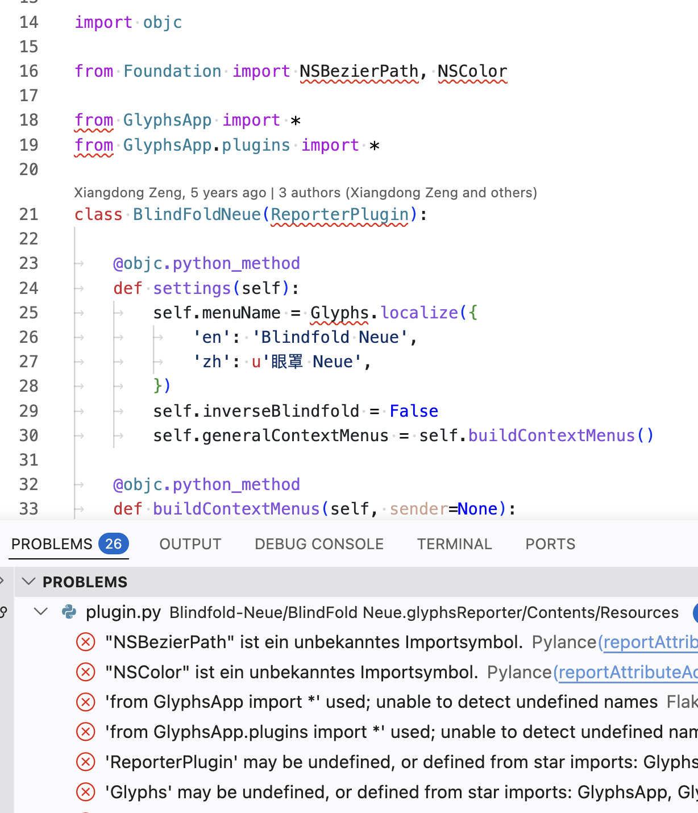

## Migrate python code to Glyphs 3

Glyphs 4 provides .pyi files for the python API but also for the most common symbols in pyobjc and vanilla. 
To use those I use flake8 in Visual Studio Code. Add a file `.vscode/settings.json` in the repository folder or the parent folder if you have more than one repo:
```
{
	"editor.insertSpaces": false,
	"editor.formatOnSaveMode": "file",
	"editor.formatOnSave": false,
	"editor.formatOnType": false,
	"flake8.args": [
		"--ignore=W191,E266,E501,E265,E722,W503,E302,E303,E741,E222,E262",
		"--verbose"
	],
	"python.analysis.extraPaths": [
		"/Applications/Glyphs 4.app/Contents/Scripts/typing/",
		"/Applications/Glyphs 4.app/Contents/Scripts/GlyphsApp/",
		"/Applications/Glyphs 4.app/Contents/Scripts/",
		"/Library/Frameworks/Python.framework/Versions/3.14/lib/python3.14/site-packages",
		"~/Library/Application Support/Glyphs 4/Scripts/"
	]
}
```

Edit the `--ignore` line to your liking. And adjust the python path to your current python installation.

Then in stall the `Flake8` extension in Visual Studio Code.

This can give you a lot of warnings and error like this:


The most common issues:
- `from GlyphsApp import *` is not recommended as flake8 can’t determine the available symbols. so change it to: `from GlyphsApp import Glyphs`. And as you go through the file, add all other GlyphsApp API you use (e.g. GSPath …).
- `from Foundation import NSBezierPath, NSColor` The Apple APIs are mostly in two frameworks, Foundation and AppKit. So import from the right one. Or use `from Cocoa import …` for all.