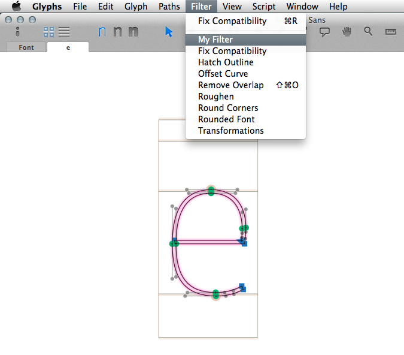
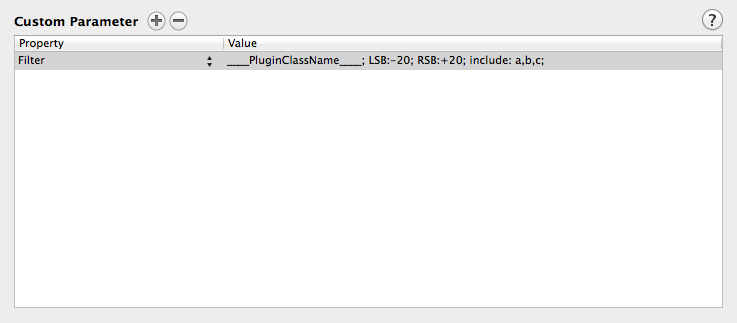

Welcome to Glyphs.app’s plug-in documentation! This document covers only some details of the process. If you are new to the subject, we recommend you start with [reading our tutorial](https://glyphsapp.com/tutorials/plugins), which points you back here at the appropriate moment.

## Filter Plug-in without Dialog

The filter plug-in (without dialog) gets called either from the Filter menu, or through Custom Parameters upon font export.



This is how you call the filter through Custom Parameters:
In the font’s Info dialog, for each *instance* add a `Custom Parameter` called `Filter`. 

The value should contain a semicolon-separated list of the following:
- The plug-in name (by its Python class name, so `____PluginClassName____` in the virgin plug-in)
- `include`: A list of glyphs to exercise the filter on. Only these glyphs will be used.
- `exclude`: A list of glyphs to exclude from the filter. All glyphs of the font except those will be used.
- Any other custom parameter of your choice in the `key:value` format.

If neither of the two `include`/`exclude` statements are provided, the Filter will be applied to all glyphs in the font.




# User code

A functional plug-in can be as small as this (in `Contents/Resources/plugin.py`):

```python
# encoding: utf-8
from __future__ import division, print_function, unicode_literals
from GlyphsApp.plugins import *

class ____PluginClassName____(FilterWithoutDialog):
	
	@objc.python_method
	def settings(self):
		self.menuName = 'My Filter'

	@objc.python_method
	def filter(self, layer, inEditView, customParameters):
		
		# Apply your filter code here
```


From there you can add the following methods:

#### settings()

In this method you set all attributes that describe the plug-in, such as its name etc.


```python
	@objc.python_method
	def settings(self):

		# The name as it will appear in the Filter menu
		# You may use a simple string or Glyphs.localize() for localizations (see http://docu.glyphsapp.com#localize)
		self.menuName = Glyphs.localize({'en': u'My Plugin', 'de': u'Mein Plugin'})

		# A keyboard shortcut for adctivating/deactivating the plug-in
		self.keyboardShortcut = 'p'
		# Set any combination of NSShiftKeyMask | NSControlKeyMask | NSCommandKeyMask | NSAlternateKeyMask
		self.keyboardShortcutModifier = NSShiftKeyMask | NSControlKeyMask
```

#### start()

This method gets called when the plug-in gets initialized upon Glyphs.app start.
You put all your initialization code here.

```python
	@objc.python_method
	def start(self):

		# Your init code goes here...
```

#### filter()

This is the main method that should contain your code to be executed on the glyphs. The actual filter.

- The argument `layer` will contain a `GSLayer` object to deal with.
- The argument `inEditView` is a boolean (`True`/`False`) and describes whether or not the user has called the filter through the filter menu while editing a single glyph in the Edit View.
- The argument `customParameters` contains a dictionary of values that came through the `Custom Parameters` field upon font export (other than the filter name and include/exclude statements). If these values were not defined in `key:value` format, but only `value` without a value name, the dictionary will contain integers starting with `0` as keys. You may use `len(customParameters)` to get hold of these keys for looping.

So there are three scenarios to consider:

##### 1. Call through Filter menu in Edit View

The user is editing a glyph in the Edit View and has clicked on the filter in the Filter menu.
`inEditView` will be set to `True` and `customParameters` will be empty and the `filter()` method will be called only once.

In this scenario, you could pay attention to what objects the user has selected in the Edit View using either `GSLayer.selection` (all objects such as paths, components, anchors) or the selectable object’s individual `.selected` attribute.

##### 2. Call through Filter menu in Font View

The user has selected several glyphs in the Font View and has clicked on the filter in the Filter menu.
`inEditView` will be set to `False` and `customParameters` will be empty and the `filter()` method will be called several times, each time containing a different `layer`.

##### 3. Call through Custom Parameters upon font export

The user is exporting a font whose instances contain Custom Parameters that call the plug-in.
`inEditView` will be set to `False` and `customParameters` will contain any custom parameter (other than the plug-in name, include and exclude statements) that the user has specified in the parameters. You will need to educate the users of your plug-in about what these parameters should look like. The `filter()` method will be called several times according to the results of the include/exclude statements, each time containing a different `layer`.

So when no additional custom parameters are specified, there is technically no difference between the scenarios 2 and 3.

##### Consider a UI dialog?

In the 3rd scenario (Call through Custom Parameters), the plug-in actually has a broader functionality through the existence of the custom parameters as opposed to being called through the Filter menu without the possibility of user input that influences the behaviour of the plug-in.

If you need a filter with user input even in the UI, please consider choosing the `Filter with dialog` plug-in that makes use of a dialog to collect user input.

If you don’t need a dialog and the custom parameters upon font export are sufficient for your case, then you’re good to go.

```python
	@objc.python_method
	def filter(self, layer, inEditView, customParameters):
		
		# Apply your filter code here
```
