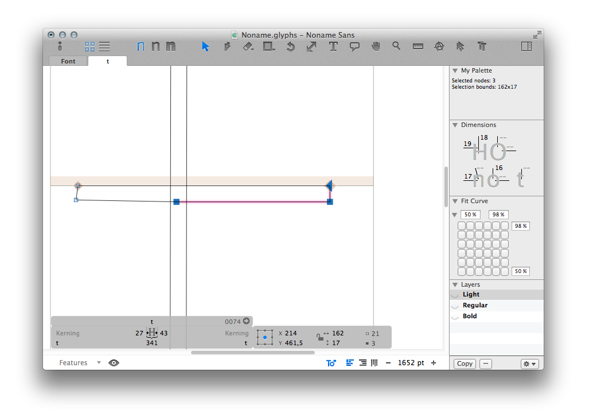

Welcome to Glyphs.app’s plug-in documentation! This document covers only some details of the process. If you are new to the subject, we recommend you start with [reading our tutorial](https://glyphsapp.com/tutorials/plugins), which points you back here at the appropriate moment.

# Palette Plug-in

The palette plug-in will show up as a dialog in Glyphs.app’s sidebar on the right edge of the application window. 

You may use it to display information about the glyphs or add controls to change them.
For displaying information, you would typically use callbacks that tie in with events being fired in Glyphs.app, such as the `GSUpdateInterface` event, which gets fired each time anything is being redrawn in the user interface. This can happen quite often, so be careful as to how complicated your code becomes.




# User code

A functional plug-in can be as small as this (in `Contents/Resources/plugin.py`):

```python
# encoding: utf-8
from __future__ import division, print_function, unicode_literals
from GlyphsApp.plugins import *

class ____PluginClassName____ (PalettePlugin):

	# The Xcode dialog
	dialog = objc.IBOutlet()

	# A text field to display information in that dialog
	textField = objc.IBOutlet()
	
	@objc.python_method
	def settings(self):
		self.name = Glyphs.localize({'en': u'My Palette', 'de': u'Meine Palette'})
		
		# Load .nib dialog (without .extension)
		self.loadNib('IBdialog', __file__)

	@objc.python_method
	def start(self):
		# Adding a callback for the 'GSUpdateInterface' event
		Glyphs.addCallback(self.update, UPDATEINTERFACE)

	@objc.python_method
	def update(self, sender):
		# Your code goes here...
	
	@objc.python_method
	def __del__(self):
		# Delete callbacks when Glyphs quits, otherwise it'll crash :(
		Glyphs.removeCallback(self.update)
```

From there you can add the following methods:

#### settings()

In this method you set all attributes that describe the plug-in, such as its name etc. Possible attributes are:

* `self.min` is the minimum height in pixels, e.g., `self.min=200`.
* `self.max` is the maximum height in pixels, e.g., `self.max=200`.
* `self.name` is the name of the plug-in. Can be a string (`"MyName"`), a Unicode string (`u"MyName"`), or a `Glyphs.localize()` function for multiple languages:

```python
	@objc.python_method
	def settings(self):

		# The name as it will appear in the sidebar
		# You may use a simple string or Glyphs.localize() for localizations (see http://docu.glyphsapp.com#localize)
		self.name = 'My Palette'
		# or:
		self.name = Glyphs.localize({'en': u'My Palette', 'de': u'Mein Palette'})

		# Load .nib dialog (without .extension)
		self.loadNib('IBdialog', __file__)
```

#### start()

This method gets called when the plug-in gets initialized upon Glyphs.app start.
You put all your initialization code here.
In our example, this would be adding the callbacks.

An observer needs a method to execute. In our example, we’ve used a method named `update()`, but you can name your methods otherwise.

```python
	@objc.python_method
	def start(self):
		# Adding a callback for the 'GSUpdateInterface' event
		Glyphs.addCallback(self.update, UPDATEINTERFACE)
```

Other possible observers: `DOCUMENTOPENED`, `DOCUMENTACTIVATED`, `DOCUMENTWASSAVED`, `DOCUMENTCLOSED`, `TABDIDOPEN`, `TABWILLCLOSE`, `MOUSEMOVED`

#### update()

In our example, this method gets called through the callbacks you may have added upon `start()`.

We’ve named this method `update()`, but you can name your methods otherwise.

```python
	@objc.python_method
	def update(self):
		# Your code goes here...
```

#### __del__()

This method gets called when the plug-in is unloaded, e.g., when Glyphs.app is being quitted.
You need to unload all callbacks here because Glyphs.app will otherwise crash.

```python
	@objc.python_method
	def __del__(self):
		# Unload callback
		Glyphs.removeCallback(self.update)
```

## Other Useful Functions

#### windowController()

`self.windowController()` returns the current window controller. Use `self.windowController().document().font` to drill down to the font which is open in the same window as the palette. In order to prevent a crash, make sure you always check that neither the window controller nor the font is `None`:

```python
windowController = self.windowController()
if windowController:
	thisFont = windowController.document().font
	if thisFont:
		pass # your code goes here
```
**Never** use `Glyphs.currentDocument` to access the font as that would only work with one open font.

## Resizing the palette

* Add a layout height constraint (in a .xib)
* Add an outlet to it.
* Set the constant property of the constraint to the desired height.

```python
	self.heightConstraint.setConstant_(height)
```

There is an option to animate the resizing. 

```python
	self.heightConstraint.animator().setConstant_(height)
```


## Use Vanilla for the dialog view

The sample code uses Xcode for the dialog, but you may use [Vanilla](https://vanilla.robotools.dev/en/) instead. Here is how:

As opposed to Xcode, dialogs get created entirely in code only using Vanilla, which might be advantageous for you if Xcode looks too daunting.

We need to create a so called [Group](https://vanilla.robotools.dev/en/latest/objects/Group.html) that contains a set of objects. Of this group, we can get hold of the wrapped `NSView` object to display in Glyphs. Note that due to Vanilla internals, we have to create a window first, although that window isn’t getting any attention anymore later on, and it must contain a `Group()` of the same size. Note that stretching the `Group` to the far corners of the windows using `(0, 0, -0, -0)` may not work, so explicitly define its size identical to the containing window.

Make sure that the .dialog gets defined in the `settings()` class, not at the class root.
Also, you may delete the two `IBdialog.xib/.nib` files from the `Resources` folder of the plug-in.


```python
# encoding: utf-8
from __future__ import division, print_function, unicode_literals
from GlyphsApp.plugins import *
from vanilla import *

class ____PluginClassName____(SelectTool):
	@objc.python_method
	def settings(self):
		self.name = 'My Select Tool'

		# Create Vanilla window and group with controls
		width = 150
		height = 80
		self.paletteView = Window((width, height))
		self.paletteView.group = Group((0, 0, width, height))
		self.paletteView.group.text = TextBox((10, 0, -10, -10), self.name, sizeStyle='small')

		# Set dialog to NSView
		self.dialog = self.paletteView.group.getNSView()

	@objc.python_method
	def update(self, sender):

		# ...
		# other code from example update() method goes here
		# ...
		
		# Change value of text field using Vanilla like this:
		self.paletteView.group.text.set('\n'.join(text))
```
