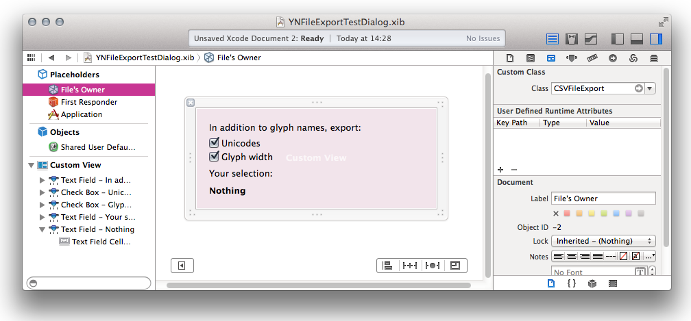

# Python templates

### Using the templates

Copy the template plugin into your Plugins folder, which is located at ~/Library/Application Support/Glyphs/Plugins (see ‘Installing and debugging’ below). And open it in your favorite text editor. It should display the internal folder structure of the plugin.

Make sure to go through the following files and replace all placeholders that have quadruple underscores (like `____placeholder____`):
* `Contents/Info.plist`
* `Contents/MacOS/____PluginFileName____` (just needs to be renamed)
* `Contents/Resources/____PluginFileName____.py`
* `Contents/Resources/__boot__.py`

Do *not* touch these files and folders:
* `Contents/MacOS/python`
* `Contents/PkgInfo`
* `Contents/Resources/lib/`
* `Contents/Resources/site.py`
* `Contents/Resources/__error__.sh`

For simplicity’s sake, and if it makes sense for your project, you can keep `____PluginClassName____`, `____PluginFileName____`, and `____PluginName____` the same throughout the whole project.

#### Edit Info.plist

Open `Contents/Info.plist` and customize the entries there. If you want to make sure your plugin works with the update mechanism built into Glyphs, always update the version numbers: Put a version number in dotted format into `CFBundleShortVersionString` (e.g, 1.2.3), and a release number into `CFBundleVersion` (a simple incremental number, e.g., 12).

You will probably re-use `____Developer____` for other projects, so put your name or twitter handle there. Put your name and year in `NSHumanReadableCopyright`. Glyphs will try to parse your name between the copyright and the year number, and display it in the Plugins section of the app preferences. `CFBundleIdentifier` should be a reverse domain name without spaces (e.g., com.myCompany.pluginName). In case you are making a filter with a custom parameter: `NSPrincipalClass` will be the filter trigger for the parameter value (i.e., the identifier before the first semicolon).

Still in `Contents/Info.plist`, replace `____PluginClassName____` with the name of the principal Python class in `Contents/Resources/____PluginFileName____.py`. No spaces, we recommend camelCase. These two entries and the name of the class in `____PluginFileName____.py` must be exactly the same.

Again, in `Contents/Info.plist`, replace `____PluginFileName____` in `CFBundleExecutable` and `CFBundleVersion` with the actual file name of `Contents/Resources/____PluginFileName____.py`, ignoring the `.py` extension. Rename `Contents/MacOS/____PluginFileName____` to the same file name, again ignoring the `.py` extension. The files and these two entries in `Contents/Info.plist` must carry the exact same name. We recommend to use a camel-cased file name without spaces.

##### Plugin update mechanism

Glyphs provides automatic update checks and notifications (not automatic installation) for installed plugins and will notify users in the user interface when a new version is available. It will once per day (or upon click in the preferences) check a URL that must contain a xml file very similar (or even identical) to this here Info.plist. This online xml file must contain at least the two fields `CFBundleVersion` and `productPageURL`. `CFBundleVersion` is checked against the installed plugin's version on the user's computer, and when a newer version is detected, the user may click to be directed to the URL given in `productPageURL` in the browser where he can download the new plugin.

In `UpdateFeedURL`, replace `____OnlineUrlToThisPlist____` with a deep link to this .plist file. This file can be your GitHub repository, or elsewhere. In `productPageURL`, replace `____ProductPageURL____` with a web page URL for the plugin. This can be your GitHub repository page or elsewhere. Finally, in `productReleaseNotes`, you may provide a short description of your latest changes, e.g., ‘New option X’. This will be displayed when the user checks for updates in the app preferences, and will motivate your users to keep your plugins up to date.

###### Dynamic version information

If you operate your own software distribution system, like an online shop, you can have your server output this Info.plist with dynamic information about the latest version of the plugin, instead of keeping the online Info.plist manually up to date. Please make sure that the file is delivered in the `application/xml` MIME-type.

Glyphs will add the URL parameters `glyphsUniqueID` (an anonymous ID identifiying unique Glyphs installations on people's computer's) and `glyphsVersion` (the Build number of that Glyphs installation) to the update check call (planned but not yet implemented: `pluginVersion` describing the version of your plugin installed within the user's Glyphs installation). You can use this information to keep anonymous track of the number of plugin installations out there and their version information and level of adoption.

Automagically (or, as it should), the interface language of Glyphs makes its way into the update check call via the HTTP headers. Therefore, you may choose to provide the `productReleaseNotes` in various languages.

A live example of all of this can be found for Yanone’s Speed Punk, with `productReleaseNotes` provided in English and German (if you click the following link here in your browser, your browser will send the preferred languages via the HTTP headers): https://yanone.de/buy/?page=versionInformation&product=speedpunkglyphs&format=GlyphsInfoPlist


#### Edit the boot file

In the last line of `Contents/Resources/__boot__.py`, the file name (`____PluginFileName____`), this time *with* the `.py` extension, must be mentioned.

#### Rename the MacOS executable

Rename `Contents/MacOS/____PluginFileName____`. Make sure it is exactly in sync with the `CFBundleExecutable` value in Info.plist, and with the name of the core Python file (except for the .py suffix). See below.

#### Rename and edit the core Python file

`Contents/Resources/____PluginFileName____.py` is where your actual code goes. Rename the file, and open it. You will find extensive step-by-step instructions in the comments. Have fun.

### Installing and debugging

To install a plugin, move it into the Plugins folder inside the Application Support folder of Glyphs (double click the plugin to let Glyphs do that for you). You can edit your code right there, but you need to restart the application for any changes to take effect.

Tip: right-click the Glyphs.app Dock icon, force quit it, and restart immediately with a click on the Dock icon. This will also immediately re-open any windows (you had open before the force quit) to their last state.

## Interface Builder: Adding GUI elements

The interaction between your Python script and a graphical user interface (GUI) requires the use of Interface Builder, which is part of Apple’s XCode software development environment. The work with Interface Builder can be a bit daunting, but we’ve written a step-by-step walkthrough here for you that will get you going quickly. After your first completed GUI interaction, the work will feel as all the rest.

You open and edit the .xib file in Interface Builder. After you're done, the file gets compiled to a .nib file and this file gets called by the Python code.

Your Python code communicates with the UI through
- IBOutlets (.py->GUI)
  Make UI elements available to your Python code. Then your code can change these elements (like the caption of a text field)
- IBActions (GUI->.py)
  Call methods in the Python code from actions in the UI (like the click of a button)

The two sample plugins here that use a UI, `File format` and `Filter with dialog`, are small functional plugins the make use of both IBOutlets and IBActions.

##### 1. IBOutlets: Make UI elements available to Python 

At the root of the plugin class, you define variables that will be linked to UI elements. In this example, we want to attach the `NSView` object (the window pane from Interface Builder) to the variable `settings_view`. (Glyphs then accesses the NSView object found in this variable in the function `exportSettingsView()`.

```python
class CSVFileExport (NSObject, GlyphsFileFormatProtocol):
	settings_view = objc.IBOutlet()
```

##### 2. IBActions: Let UI elements trigger Python functions

Functions to be triggered from the UI get defined by a `@objc.IBAction` just before the function definition.
The function names need to end with an underscore, e.g. setValue_().

```python
	@objc.IBAction
	def setExportUnicode_(self, sender):
		self.exportUnicode = sender.intValue()
		self.updateFeedBackTextField()
```

##### 3. Interface Builder



- Open the .xib file in XCode, and add and arrange interface elements.
- Add this .py file via File > Add Files... for Xcode to recognize all IBOutlets and IBACtions


For GUI elements, you will need to work with Interface Builder (IB). For this, you edit `.xib` files in XCode, and compile them to `.nib` files. To use `.xib` files, you need to add IBActions and IBOutlets in the principal controller class of your `____PluginFileName____.py`, like this:
```python
	_theOutlet = objc.IBOutlet()
```

... and start the respective UI action method (e.g., an action triggered by a button) with `@objc.IBAction`:
```python
	@objc.IBAction
	def buttonPressed_( self, sender ):
		print "The button was pressed!"
```

Then, still in Xcode, add the .py file with *File > Add Files...*. When you are done, and every time the `.xib` file is changed, it has to be compiled to a `.nib` file. Do so with this Terminal command:
`ibtool xxx.xib --compile xxx.nib`.

If this looks confusing at first, do not worry. You will find detailed step-by-step instructions in the comments of the .py file. And for a quick introduction to using Interface Builder with the PyObjC bridge, read:
http://blog.adamw523.com/os-x-cocoa-application-python-pyobjc/
