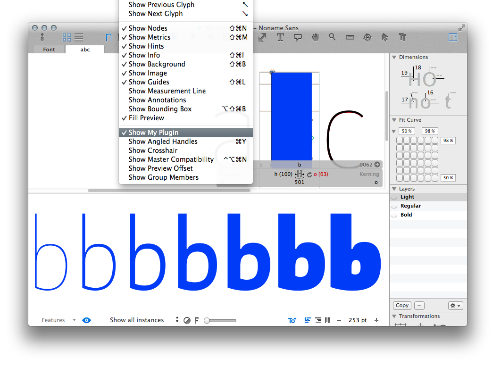
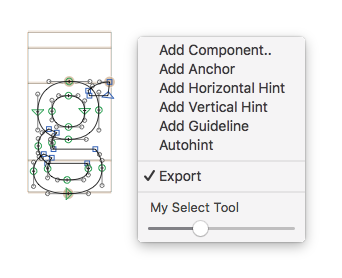

Welcome to Glyphs.app’s plug-in documentation! This document covers only some details of the process. If you are new to the subject, we recommend you start with [reading our tutorial](https://glyphsapp.com/tutorials/plugins), which points you back here at the appropriate moment.

## Reporter Plug-in

A reporter plug-in gets activated in the View menu of Glyphs.app and is designed to draw on top and behind the glyphs in the Edit View, as well as change the drawing behaviour of inactive glyphs and the preview panel.




# User code

A functional plug-in can be as small as this (in `Contents/Resources/plugin.py`):

```python
# encoding: utf-8
from __future__ import division, print_function, unicode_literals
from GlyphsApp.plugins import *

class ____PluginClassName____(ReporterPlugin):
	
	@objc.python_method
	def settings(self):

		# The name as it will appear in the View menu
		self.menuName = 'My Plugin'

	@objc.python_method
	def foreground(self, layer):

		# Draw a blue rectangle on top of the glyph as big as the glyph’s bounding box
		NSColor.blueColor().set()
		NSBezierPath.fillRect_(layer.bounds)
```


From there you can add the following methods:

#### settings()

In this method you set all attributes that describe the plug-in, such as its name keyboard short cut etc.


```python
	@objc.python_method
	def settings(self):

		# The name as it will appear in the View menu
		# You may use a simple string or Glyphs.localize() for localizations (see http://docu.glyphsapp.com#localize)
		self.menuName = Glyphs.localize({'en': u'My Plugin', 'de': u'Mein Plugin'})

		# A keyboard shortcut for activating/deactivating the plug-in
		self.keyboardShortcut = 'p'

		# Modifier keys used for the keyboard shortcut
		# Set to any combination of:
		# NSShiftKeyMask | NSControlKeyMask | NSCommandKeyMask | NSAlternateKeyMask
		self.keyboardShortcutModifier = NSControlKeyMask

		# A list of general context menu items described as a dictionary of following keys:
		# 'name': the text displayed in the menu
		# 'action': the method to call
		self.generalContextMenus = [
			{"name": "Layer info in Macro Window", "action": self.printInfo},
		]
```

Be careful with keyboard shortcuts. If you are not sure, do not set any. It is better to avoid shortcut conflicts and accidental triggers. The user can still set their own shortcuts in preferences.


#### start()

This method gets called when the plug-in gets initialized upon Glyphs.app start.
You put all your initialization code here.

```python
	@objc.python_method
	def start(self):

		# Your init code goes here...
```

#### foreground()

Use this method to draw things on top the glyph outlines in the Edit View.

```python
	@objc.python_method
	def foreground(self, layer):

		# Draw a blue rectangle on top of the glyph as big as the glyph’s bounding box
		NSColor.blueColor().set()
		NSBezierPath.fillRect_(layer.bounds)
```

#### background()

Use this method to draw things behind the glyph outlines in the Edit View.

```python
	@objc.python_method
	def background(self, layer):

		# Draw a red rectangle on behind the glyph as big as the glyph’s bounding box
		NSColor.redColor().set()
		NSBezierPath.fillRect_(layer.bounds)
```

#### inactiveLayerForeground() and inactiveLayerBackground()

Use these methods to draw in inactive glyphs (the glyphs left and right of the active glyph in the Edit View). These methods deprecate the older `inactiveLayers()` method. While `inactiveLayerForeground()` draws in top of the Edit View rendering, `inactiveLayerBackground()` draws behind it.

```python
	@objc.python_method
	def inactiveLayerForeground(self, layer):

		# Draw outlines in blue
		if layer.paths:
			NSColor.blueColor().set()
			layer.bezierPath.fill()

		# Draw components in red
		if layer.components:
			NSColor.redColor().set()
			for component in layer.components:
				component.bezierPath.fill()
```

Hint: The inactive-layer methods *add* drawings to the inactive glyphs. Or in technical terms, Glyphs draws the *main outline* and these methods add their drawing to it. If, however, you want to draw the complete inactive glyph yourself, i.e., prevent Glyphs from drawing the main outline and thus, start from a clean sheet, simply add this method:

```python
	def needsExtraMainOutlineDrawingForInactiveLayer_(self, layer):
		return False
```

The return value `False` tells Glyphs that the inactive layer does not need an extra main outline to be drawn according to the settings in the *View* menu. But you also have to take care of the whole outline drawing, otherwise the glyphs will be invisible.

#### preview()

Use this method to add drawings for glyphs in the preview panel.

Please note that when you preview is set to "Show all instances" due to the live interpolation of the preview these layers don’t contain components, but only paths.

```python
	@objc.python_method
	def preview(self, layer):

		# Draw in blue
		NSColor.blueColor().set()
		if layer.paths:
			layer.bezierPath.fill()
		if layer.components:
			for component in layer.components:
				component.bezierPath.fill()
```

#### foregroundInViewCoords()

Use this method to draw things on top of the glyph outlines in the Edit View.

The difference to the `foreground()` method above is that all coordinates that you use for drawing here are view coordinates that correspond to screen pixels and are relative to all visible glyph’s bounding box, whereas the `foreground()` method uses em units relative to the active glyph’s origin (0,0) as values.

So you can use this method to position things in the Edit View that are not directly related to individual glyphs, like positioning text into a corner of the Edit View. Note that you need to multiply text sizes with the `scale` factor, as seen in the example below.

See the GSEditViewController attributes `viewPort`, `bounds`, and `selectedLayerOrigin` in the [Python API Docu](http://docu.glyphsapp.com/#gseditviewcontroller) for further information.

```python
	@objc.python_method
	def foregroundInViewCoords(self):

		tab = Glyphs.font.currentTab

		# Draw a blue rectangle all across the Edit View's visible area
		NSColor.blueColor().set()
		NSBezierPath.strokeRect_(Glyphs.font.currentTab.viewPort)

		# Draw a red rectangle across all the glyphs' bounding box
		NSColor.redColor().set()
		NSBezierPath.strokeRect_(Glyphs.font.currentTab.bounds)

		# Text 'here' at active glyphs' origin
		self.drawTextAtPoint('here', tab.selectedLayerOrigin, 10 * tab.scale)

		# Text 'corner' in top-left corner of Edit View
		self.drawTextAtPoint('corner', tab.viewPort.origin, 10 * tab.scale)
```

#### backgroundInViewCoords()

Same as above, into the background behind the glyphs.

#### conditionalContextMenus()

Use this method to create and return a list of conditional context menu items.
These context menu items could be based on the user’s selection of objects in the Edit View and will appear first in the menu.

Return a list of context menu items described as a dictionary (see `self.generalContextMenus` in `settings()` above)

```python
	@objc.python_method
	def conditionalContextMenus(self):

		# Empty list of context menu items
		contextMenus = []

		# Execute only if layers are actually selected
		if Glyphs.font.selectedLayers:
			layer = Glyphs.font.selectedLayers[0]
			
			# Exactly one object is selected and it’s an anchor
			if len(layer.selection) == 1 and type(layer.selection[0]) == GSAnchor:
					
				# Add context menu item
				contextMenus.append({"name": "Randomly move anchor", "action": self.randomlyMoveAnchor})

		# Return list of context menu items
		return contextMenus
```

# Tips on Drawing

Glyphs.app uses the Mac’s own Cocoa methods for drawing. These sometimes behave slightly different from other Python objects, and surely they have different names. In order to make use of the Cocoa objects, you may need to include them into your Python plug-in by declaring `from AppKit import *` at the top. Though, the most important ones are already included in `plugins.py`.

Here are a few examples:

```python
	@objc.python_method
	def foreground(self, layer):

		# Setting colors:
		# sets RGBA values between 0.0 and 1.0:
		NSColor.colorWithCalibratedRed_green_blue_alpha_(1.0, 0.2, 1.0, 0.4).set()
		
		# predefined colors: blackColor, blueColor, brownColor, clearColor, cyanColor,
		# darkGrayColor, grayColor, greenColor, lightGrayColor, magentaColor, orangeColor,
		# purpleColor, redColor, whiteColor, yellowColor
		NSColor.redColor().set() 


		# Drawing paths:
		myPath = NSBezierPath.alloc().init()  # initialize a path object
		myPath.appendBezierPath_(subpath)   # add subpath
		myPath.fill()   # fill with the current NSColor (see above)
		myPath.stroke() # stroke with the current NSColor (see above)
		
		# All layers, paths, and components have a .bezierPath property that
		# returns that path as an NSBezierPath object that you can use for drawing:
		layer.bezierPath.fill()
		layer.paths[0].bezierPath.fill()
		layer.components[0].bezierPath.fill()
```

For more detailed information make sure to read into the Cocoa documentation:
https://developer.apple.com/library/mac/documentation/Cocoa/Reference/ApplicationKit/Classes/NSBezierPath_Class/Reference/Reference.html
https://developer.apple.com/library/mac/documentation/cocoa/reference/applicationkit/classes/NSColor_Class/Reference/Reference.html

> **Hint:** For better dark mode compatibility, it is a good idea to use a *semantic* color, i.e., colors predefined by the system. E.g., `NSColor.controlAccentColor().set()`. Read all about them here:
> https://developer.apple.com/documentation/appkit/nscolor/ui_element_colors?language=objc

### Do not draw when text or pan tools are active

Useful method that returns `True` or `False` depending on the state the your edit view is in:

```python
	@objc.python_method
	def conditionsAreMetForDrawing(self):
		"""
		Don't activate if text or pan (hand) tool are active.
		"""
		currentController = self.controller.view().window().windowController()
		if currentController:
			tool = currentController.toolDrawDelegate()
			textToolIsActive = tool.isKindOfClass_(NSClassFromString("GlyphsToolText"))
			handToolIsActive = tool.isKindOfClass_(NSClassFromString("GlyphsToolHand"))
			if not textToolIsActive and not handToolIsActive: 
				return True
		return False
```

Add this method to your `plugin.py` and call it with something like:

```python
	if self.conditionsAreMetForDrawing():
		# your code goes here...
```


# Other useful methods

#### drawTextAtPoint()

Draw a string of text at a given position.

Mandatory arguments:
- `text` (A string of text)
- `position` (`NSPoint` object of position)

Optional arguments:
- `fontSize` (Size of text in points. Default: 10)
- `align` (Alignment of text. Default: `bottomleft`. Choose from: `topleft`, `topcenter`, `topright`, `left`, `center`, `right`, `bottomleft`, `bottomcenter`, `bottomright`)
- `fontColor` (`NSColor` object. Default: black)

```python

	def foreground(self, layer):
		# Draw name of glyph at 0,0
		self.drawTextAtPoint(layer.parent.name, NSPoint(0, 0))
```

#### getScale()

Determine the current scale of the Edit view. Useful for keeping the apparent size while zooming. To do that, *divide* your measurement by `self.getScale()`.

Glyphs scales its drawings a little differently at small and large zoom stages. To match the way the app compensates zoom magnification, *multiply* your measurements with `self.getScale()**-0.9`:

```python
	
	NSColor.orangeColor().set()
	openPaths = layer.openBezierPath
	openPaths.setLineWidth_(5.0 * self.getScale() ** -0.9)
	openPaths.stroke()
```

#### getHandleSize()

Will return the size of handles and nodes, as set by the user in the app preferences. To exactly match the way Glyphs draws handles, you can use the following method. It takes into account that BCPs are drawn a little smaller, and that selected nodes are a little bigger:

```python
	from GlyphsApp import OFFCURVE
	
	@objc.python_method
	def drawHandleForNode(self, node):
		# calculate handle size:
		handleSize = self.getHandleSize()*self.getScale()**-0.9 # scaled diameter
	
		# offcurves are a little smaller:
		if node.type == OFFCURVE:
			handleSize *= 0.8
	
		# selected handles are a little bigger:
		if node.selected:
			handleSize *= 1.45
	
		# draw disc inside a rectangle around point position:
		position = node.position
		rect = NSRect()
		rect.origin = NSPoint(position.x-handleSize/2, position.y-handleSize/2)
		rect.size = NSSize(handleSize, handleSize)
		NSBezierPath.bezierPathWithOvalInRect_(rect).fill()
```


## Dialogs in contextual menus

You may place `NSView` dialogs in the general or conditional context menus for quick access to settings of your tool.

In fact, we highly encourage you to do so, because we want to keep Glyphs’ user interface as beautiful and uncluttered as it is. Many of Glyphs’ users appreciate that. Now, it’s of course your decision to create a floating tool window, but we ask you to trust and follow our ideas on that and hide dialogs from the view of the user that need not be constantly accessible. A right-click with the mouse will then show that dialog in the context menu.



When creating the menu items in the code, instead of handing over *name* and *action* attributes, you hand over just a *view* that contains a reference to the `NSView` object.

As with other dialogs, we have two choices to create them: Use Xcode’s Xcode or Tal Leming’s [Vanilla](https://vanilla.robotools.dev/en/) library.

### Xcode

Create a dialog with interface elements in Xcode like you’ve read about [here](https://github.com/schriftgestalt/GlyphsSDK/tree/master/Python%20Templates). In short: add the plugin.py with *File > Add Files...* (Cmd-Opt-A), set the *Custom Class* in the *Identity Inspector* of *File’s Owner* to the name of your plug-in class, ctrl-drag from and to *File’s Owner* to connect outlets and actions. Save your .xib and compile it to a .nib.

In `plugin.py`, an *IBOutlet* needs to be created at the root of the plug-in class for the dialog (and more for more controls that you want to access from Python), and our class needs an *IBAction* method to receive input from interface elements.

You will find the .xib/.nib files of this example [here](https://github.com/schriftgestalt/GlyphsSDK/tree/master/Python%20Templates/Sample%20dialogs) as `SliderView`. Place them in the `Resources` folder in the plug-in package, right next to where the `plugin.py` is located.


```python
# encoding: utf-8
from __future__ import division, print_function, unicode_literals
from GlyphsApp.plugins import *

class ____PluginClassName____(SelectTool):

	# The reference to the dialog
	sliderMenuView = objc.IBOutlet() # the view area placed inside the context menu
	slider = objc.IBOutlet()         # the slider placed inside sliderMenuView
	
	@objc.python_method
	def settings(self):
		self.name = 'My Select Tool'
		
		# Load .nib file from package
		self.loadNib("SliderView", __file__)
		
		# Add the view to the context menu
		self.generalContextMenus = [
			{"view": self.sliderMenuView}
		]
		
		# Prepare slider
		self.slider.setMinValue_(0.0)
		self.slider.setMaxValue_(1.0)
	
	# Prints the slider’s value
	@objc.IBAction
	def slider_(self, sender):
		print('Slider value:', sender.floatValue())
	
	@objc.python_method
	def __file__(self):
		return __file__
```

### Vanilla

As opposed to Xcode, dialogs get created entirely in code only using Vanilla, which might be advantageous for you if Xcode looks too daunting.

We need to create a so called [Group](https://vanilla.robotools.dev/en/latest/objects/Group.html) that contains a set of objects. Of this group, we can get hold of the wrapped `NSView` object to display in Glyphs. Note that due to Vanilla internals, we have to create a window first, although that window isn’t getting any attention anymore later on, and it must contain a `Group()` of the same size. Note that stretching the `Group` to the far corners of the windows using `(0, 0, -0, -0)` may not work, so explicitly define its size identical to the containing window.

```python
# encoding: utf-8
from __future__ import division, print_function, unicode_literals
from GlyphsApp.plugins import *
from vanilla import *

class ____PluginClassName____(SelectTool):

	@objc.python_method
	def settings(self):
		self.name = 'My Select Tool'
		
		# Create Vanilla window and group with controls
		viewWidth = 150
		viewHeight = 40
		self.sliderMenuView = Window((viewWidth, viewHeight))
		self.sliderMenuView.group = Group((0, 0, viewWidth, viewHeight))
		self.sliderMenuView.group.text = TextBox((10, 0, -10, -10), self.name)
		self.sliderMenuView.group.slider = Slider((10, 18, -10, 23), callback=self.sliderCallback)
		
		# Define the menu
		self.generalContextMenus = [
			{"view": self.sliderMenuView.group.getNSView()}
		]
		
	# Prints the slider’s value
	@objc.python_method
	def sliderCallback(self, sender):
		print('Slider value:', sender.get())
```
