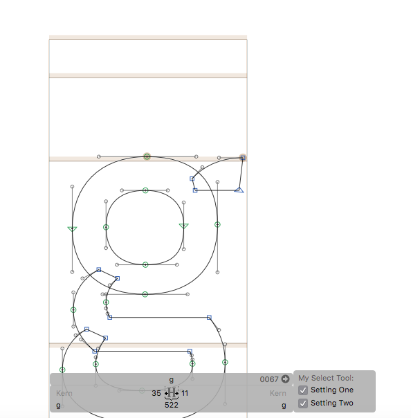

Welcome to Glyphs.app’s plug-in documentation! This document covers only some details of the process. If you are new to the subject, we recommend you start with [reading our tutorial](https://glyphsapp.com/tutorials/plugins), which points you back here at the appropriate moment.

## Select Tool

The Select Tool Plugin creates a replacement for the standard select tool and lets you extend its functionality.

You can add context menus (that appear on the user’s mouse right-click), both general context menus (they always appear) as well as conditional context menus (they only appear under a certain condition defined in your code).

In its naked version, the plug-in behaves exactly like the built-in select tool.


## User code

A functional plug-in can be as small as this (in `Contents/Resources/plugin.py`):

```python
# encoding: utf-8

from GlyphsApp.plugins import *

class ____PluginClassName____(SelectTool):
	
	@objc.python_method
	def settings(self):
		self.name = 'My Select Tool'
		self.contextMenus = [
			{"name": "Layer info in Macro Window", "action": self.printInfo},
		]
	
	@objc.python_method
	def printInfo(self):
		"""
		Example for a method triggered by a context menu item.
		Fill in your own method name and code.
		Remove this method if you do not want any extra context menu items.
		"""

		# Execute only if layers are actually selected
		if Glyphs.font.selectedLayers:
			layer = Glyphs.font.selectedLayers[0]
		
			# Do stuff:
			print("Current layer:", layer.parent.name, layer.name)
			print("  Number of paths:", len(layer.paths))
			print("  Number of components:", len(layer.components))
			print("  Number of anchors:", len(layer.anchors))
```


From there you can add the following methods:

#### settings()

In this method you set all attributes that describe the plug-in, such as its name and icon etc.


```python
	@objc.python_method
	def settings(self):

		# The name as it will appear in the toolbar as a tooltip
		# You may use a simple string or Glyphs.localize() for localizations (see http://docu.glyphsapp.com#localize)
		self.name = Glyphs.localize({'en': u'My Select Tool', 'de': u'Mein Auswahlwerkzeug'})

		# A keyboard shortcut for adctivating/deactivating the plug-in
		self.keyboardShortcut = 'p'

		# Position of the tool icon in the toolbar
		self.toolbarPosition = 100

		# A list of general context menu items described as a dictionary of following keys:
		# 'name': the text displayed in the menu
		# 'action': the method to call
		self.generalContextMenus = [
			{"name": "Layer info in Macro Window", "action": self.printInfo},
		]
```

#### start()

This method gets called when the plug-in gets initialized upon Glyphs.app start.
You put all your initialization code here.

```python
	@objc.python_method
	def start(self):

		# Your init code goes here...
```

#### activate()

This method gets called when the tool gets activated through the toolbar.

```python
	@objc.python_method
	def activate(self):

		# Your init code goes here...
```

#### deactivate()

This method gets called when the tool gets deactivated through the toolbar (another tool gets activated).

```python
	@objc.python_method
	def deactivate(self):

		# Your code goes here...
```

#### foreground()

Use this method to draw things on top the glyph outlines in the Edit View. It works like in the Reporter plug-in.

```python
	@objc.python_method
	def foreground(self, layer):

		# Draw a blue rectangle on top of the glyph as big as the glyph’s bounding box
		NSColor.blueColor().set()
		NSBezierPath.fillRect_(layer.bounds)
```

#### background()

Use this method to draw things behind the glyph outlines in the Edit View. It works like in the Reporter plug-in.

```python
	@objc.python_method
	def background(self, layer):

		# Draw a red rectangle behind the glyph as big as the glyph’s bounding box
		NSColor.redColor().set()
		NSBezierPath.fillRect_(layer.bounds)
```

#### conditionalContextMenus()

Use this method to create and return a list of conditional context menu items.
These context menu items could be based on the user’s selection of objects in the Edit View and will appear first in the menu.

Return a list of context menu items described as a dictionary (see `self.generalContextMenus` in `settings()` above)

```python
	@objc.python_method
	def conditionalContextMenus(self):

		# Empty list of context menu items
		contextMenus = []

		# Execute only if layers are actually selected
		if Glyphs.font.selectedLayers:
			layer = Glyphs.font.selectedLayers[0]
			
			# Exactly one object is selected and it’s an anchor
			if len(layer.selection) == 1 and type(layer.selection[0]) == GSAnchor:
					
				# Add context menu item
				contextMenus.append({"name": "Randomly move anchor", "action": self.randomlyMoveAnchor})

		# Return list of context menu items
		return contextMenus
```

## Dialogs in contextual menus

You may place `NSView` dialogs in the general or conditional context menus for quick access to settings of your tool.

In fact, we highly encourage you to do so, because we want to keep Glyphs’ user interface as beautiful and uncluttered as it is. Many of Glyphs’ users appreciate that. Now, it’s of course your decision to create a floating tool window, but we ask you to trust and follow our ideas on that and hide dialogs from the view of the user that need not be constantly accessible. A right-click with the mouse will then show that dialog in the context menu.


When creating the menu items in the code, instead of handing over *name* and *action* attributes, you hand over just a *view* that contains a reference to the `NSView` object.

As with other dialogs, we have two choices to create them: Use Xcode’s Interface Builder or Tal Leming’s [Vanilla](https://github.com/typesupply/vanilla) library.

### Interface Builder

Create a dialog in Interface Builder like you’ve read about [here](https://github.com/schriftgestalt/GlyphsSDK/tree/master/Python%20Templates). An *IBOutlet* needs to be created at the root of the plug-in class for it (and more for more controls that you want to access from Python), and our class needs an *IBAction* method to receive input from the dialog.

You will find the .xib/.nib files of this example [here](https://github.com/schriftgestalt/GlyphsSDK/tree/master/Python%20Templates/Sample%20dialogs) as `SliderView`. Place them in the `Resources` folder in the plug-in package, where the main `plugin.py` is located.


```python
# encoding: utf-8

from GlyphsApp.plugins import *

class ____PluginClassName____(SelectTool):

	# The reference to the dialog
	sliderMenuView = objc.IBOutlet()
	
	def settings(self):
		self.name = 'My Select Tool'

		# Load .nib file from package (without .extension)
		self.loadNib("SliderView")

		# Define the menu
		self.generalContextMenus = [
			{"view": self.sliderMenuView}
		]

	# Prints the slider’s value
	@objc.IBAction
	def slider_(self, sender):
		print('Slider value:', sender.floatValue())
```

### Vanilla

As opposed to Interface Builder, dialogs get created entirely in code only using Vanilla, which might be advantageous for you if Xcode looks too daunting.

We need to create a so called [Group](http://ts-vanilla.readthedocs.org/en/latest/objects/Group.html) that contains a set of objects. Of this group, we can get hold of the wrapped `NSView` object to display in Glyphs. Note that due to Vanilla internals, we have to create a window first, although that window isn’t getting any attention anymore later on, and it must contain a `Group()` of the same size. Note that stretching the `Group` to the far corners of the windows using `(0, 0, -0, -0)` may not work, so define its size identical to the window.

```python
# encoding: utf-8

from GlyphsApp.plugins import *
from vanilla import *

class ____PluginClassName____(SelectTool):

	def settings(self):
		self.name = 'My Select Tool'

		# Create Vanilla window and group with controls
		viewWidth = 150
		viewHeight = 40
		self.sliderMenuView = Window((viewWidth, viewHeight))
		self.sliderMenuView.group = Group((0, 0, viewWidth, viewHeight))
		self.sliderMenuView.group.text = TextBox((10, 0, -10, -10), self.name)
		self.sliderMenuView.group.slider = Slider((10, 18, -10, 23), callback=self.sliderCallback)

		# Define the menu
		self.generalContextMenus = [
			{"view": self.sliderMenuView.group.getNSView()}
		]

	# Prints the slider’s value
	def sliderCallback(self, sender):
		print('Slider value:', sender.get())
```

## Dialogs in inspector views

If you must continuously display a dialog with your plug-in and it need not contain many controls, consider using an inspector (the little gray info boxes at the bottom of the Edit View).

The inspector view, if present, needs to be hard-wired to the variable `inspectorDialogView`.



### Interface Builder

Create a dialog in Interface Builder like you’ve read about [here](https://github.com/schriftgestalt/GlyphsSDK/tree/master/Python%20Templates). An *IBOutlet* needs to be created at the root of the plug-in class for it (and more for more controls that you want to access from Python), and our class needs an *IBAction* method to receive input from the dialog.

If you want the dialog to blend in with the same gray background, the View needs to be of the `GSInspectorView` class (Identity inspector in Interface Builder)

You will find the .xib/.nib files of this example [here](https://github.com/schriftgestalt/GlyphsSDK/tree/master/Python%20Templates/Sample%20dialogs) as `InspectorView`. Place them in the `Resources` folder in the plug-in package, where the main `plugin.py` is located.


```python
# encoding: utf-8

from GlyphsApp.plugins import *

class ____PluginClassName____(SelectTool):
	
	inspectorDialogView = objc.IBOutlet()
	checkBox1 = objc.IBOutlet()
	checkBox2 = objc.IBOutlet()
	
	def settings(self):
		self.name = Glyphs.localize({'en': 'My Select Tool', 'de': 'Mein Auswahlwerkzeug'})
		
		# Load .nib file from package (without .extension)
		self.loadNib("InspectorView")
		
	@objc.IBAction
	def checkBox1Receiver_( self, sender ):
		Message("Action", "You have clicked the checkbox")

	@objc.IBAction
	def checkBox2Receiver_( self, sender ):
		Message("Action", "You have clicked the checkbox")
	
```

### Vanilla

As opposed to Interface Builder, dialogs get created entirely in code only using Vanilla, which might be advantageous for you if Xcode looks too daunting.

We need to create a so called [Group](http://ts-vanilla.readthedocs.org/en/latest/objects/Group.html) that contains a set of objects. Of this group, we can get hold of the wrapped `NSView` object to display in Glyphs. Note that due to Vanilla internals, we have to create a window first, although that window isn’t getting any attention anymore later on, and it must contain a `Group()` of the same size. Note that stretching the `Group` to the far corners of the windows using `(0, 0, -0, -0)` may not work, so explicitly define its size identical to the containing window.

The `NSView`object that we hand over to Glyphs to display needs to be of the `GSInspectorView` class. In order to achieve this using Vanilla, we need to create a patched Vanilla-style `Group` class and tell it to use a `GSInspectorView` object instead of the regular `NSView`. `GSInspectorView` is already a descendant of `NSView`, so Vanilla can very well use that instead. If all of this sounds like gibberish to, just follow the instruction below, and go on to learn about object-oriented programming later.

```python
# encoding: utf-8

from GlyphsApp.plugins import *
from vanilla import *
from vanilla.vanillaGroup import Group

# Our own patched Vanilla Group class
class PatchedGroup(Group):
    nsViewClass = GSInspectorView

class ____PluginClassName____(SelectTool):

	def settings(self):
		self.name = 'My Select Tool'

		# Create Vanilla window and group with controls
		viewWidth = 150
		viewHeight = 40
		self.sliderMenuView = Window((viewWidth, viewHeight))
		# Using PatchedGroup() here instead of Group()
		self.sliderMenuView.group = PatchedGroup((0, 0, viewWidth, viewHeight))
		self.sliderMenuView.group.text = TextBox((10, 0, -10, -10), self.name)
		self.sliderMenuView.group.slider = Slider((10, 18, -10, 23), callback=self.sliderCallback)

		# Define the menu
		self.generalContextMenus = [
			{"view": self.sliderMenuView.group.getNSView()}
		]

	# Prints the slider’s value
	def sliderCallback(self, sender):
		print('Slider value:', sender.get())
```
